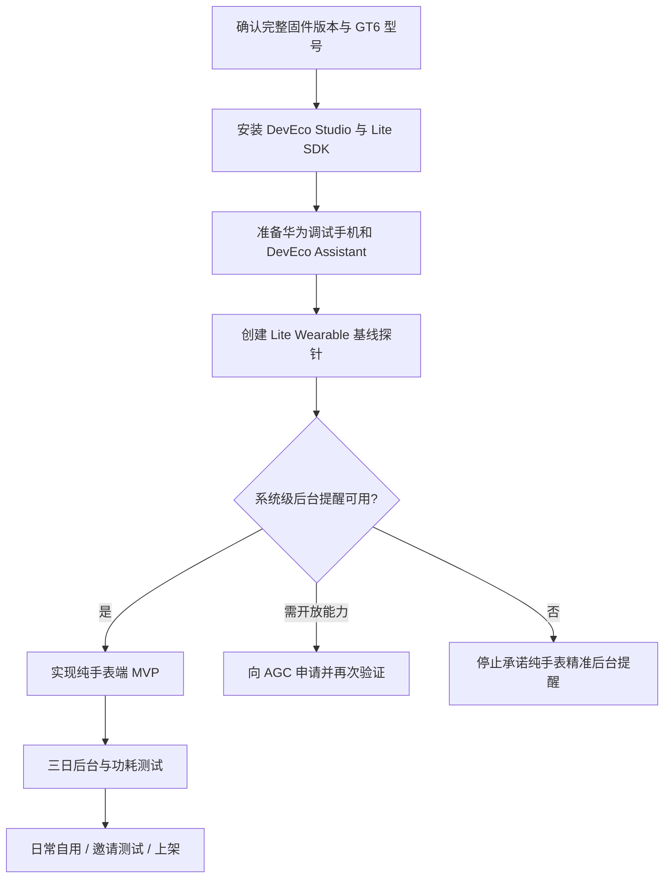

# Move25 for HUAWEI WATCH GT 6：开发文档总索引

> 文档版本：v1.0  
> 编制日期：2026-08-05  
> 目标设备：HUAWEI WATCH GT 6，当前手表系统 HarmonyOS 6.1.0  
> 目标应用形态：优先纯手表端独立应用（Standalone App）  
> 推荐工程类型：Lite Wearable / JS FA / HML / CSS / JavaScript

## 1. 项目目标

开发一款功能明确、极简、低功耗的久坐打断应用：

- 在设定的上班时间段内运行；
- 默认每完成 25 分钟工作后，提醒起身活动 5 分钟；
- 活动提醒包含走动、伸展、肩颈放松和远眺提示；
- 核心逻辑、设置、日程和状态尽可能全部保存在手表端；
- 日常运行不依赖 vivo、iPhone 或鸿蒙手机；
- 不使用网络、账号、云端、广告、健康数据和持续传感器；
- 不通过持续 JavaScript 计时保活；
- 优先把长期提醒交给系统级低功耗调度能力。

## 2. 最重要的工程结论

1. **WATCH GT 系列属于轻量级智能穿戴路线。** 华为 2026 年官方文档明确指出，WATCH GT、WATCH D、FIT 系列应使用兼容 JS 的类 Web 开发范式；标准智能穿戴（例如 WATCH 5）才使用 ArkTS。见 [S1]。
2. **当前推荐基线不是 ArkTS Stage。** 应从 DevEco Studio 的 `[Lite] Empty Ability` 工程开始，使用 JS FA、HML、CSS 和 `config.json`。
3. **跨手机生态的日常安装路径成立。** GT6 与 HarmonyOS、Android 9+、iOS 13+ 配对时，都支持通过华为运动健康 App 使用应用市场。见 [S2]。
4. **开发调试与日常使用必须区分。** 日常可继续使用 vivo X200；但华为官方 Lite Wearable 调测链路要求通过 HUAWEI DevEco Assistant 获取手表 UDID，并与华为手机配对，因此开发阶段应准备一部华为手机。见 [S3]。
5. **纯手表方案存在一个硬门槛：后台提醒能力。** 标准 HarmonyOS 的代理提醒 API 确实能在应用退出后由系统代理提醒，但需要申请开放能力；目前没有足够的官方证据证明该标准 API 可直接用于 GT6 的 Lite JS FA 工程。必须先完成能力探针。见 [S4]。
6. **“柠檬喝水”只能作为产品参考。** 华为官方说明它可在手表内设置并由手表提醒喝水，但这不能证明普通开发者可获得相同底层接口。见 [S5]。

## 3. 文档目录

| 文件 | 用途 |
|---|---|
| `01_需求解构与范围.md` | 将原始需求拆成明确、可测试的需求和边界 |
| `02_产品需求文档_PRD.md` | 产品目标、用户故事、功能规格、验收标准 |
| `03_技术可行性与技术栈.md` | GT6 技术路线、已证实事实、未知项和可行性门禁 |
| `04_系统架构设计.md` | 模块、数据流、目录结构、提醒适配层 |
| `05_日程提醒与低功耗设计.md` | 25+5 算法、调度策略、电量控制和容错 |
| `06_UI_UX设计规范.md` | 圆形屏幕信息架构、页面、文案、交互和视觉风格 |
| `07_数据模型与状态机.md` | 设置、运行状态、本地存储键、状态转换 |
| `08_能力探针规格.md` | 编译期、权限、运行期和真机后台提醒验证 |
| `09_开发环境签名与真机调试.md` | DevEco、AGC、UDID、证书、HAP、DevEco Assistant |
| `10_实现计划与任务拆分.md` | 从探针到可发布版本的迭代计划和任务清单 |
| `11_测试计划与验收标准.md` | 功能、时间边界、后台可靠性、功耗和兼容性测试 |
| `12_发布隐私与维护.md` | 应用市场发布、隐私说明、版本管理和维护流程 |
| `13_Vibe_Coding提示词库.md` | 分阶段给 AI 编程助手使用的约束型 Prompt |
| `14_风险登记与决策记录.md` | 关键风险、触发条件、缓解措施和技术决策 |
| `15_代码规范与仓库约定.md` | Lite JS 工程代码规范、分支、提交和日志规范 |
| `16_来源索引.md` | 本文档包使用的官方资料和辅助证据 |
| `Move25_GT6_开发总册.md` | 上述核心内容的单文件合并版 |

## 4. 推荐执行顺序

## 5. 成功定义

项目成功不是“界面能显示倒计时”，而是同时满足：

- 手表锁屏后提醒仍触发；
- 应用返回表盘后提醒仍触发；
- 应用进程被回收后提醒仍触发；
- 手机蓝牙断开后提醒仍触发；
- 无常驻轮询、无持续传感器、无网络；
- 正常工作日中提醒不漂移、不重复、不跨午休；
- 一整天运行对续航的影响可接受；
- 更换配对手机后，无需重写或重新配置手机端应用。

## 6. 当前结论等级

| 结论 | 等级 |
|---|---|
| GT6 属于 Lite Wearable，采用 JS 类 Web 范式 | 官方确认 |
| GT6 支持 Android、iOS、HarmonyOS 配对下的应用市场 | 官方确认 |
| `@system.storage` 可用于 Lite Wearable FA 本地存储 | 官方确认 |
| `@system.vibrator` 可用于 Lite Wearable | 官方确认 |
| GT6 可运行 JS FA/HML/CSS 应用 | 官方分类 + GT6 真机项目佐证 |
| 标准 `reminderAgentManager` 可用于 GT6 Lite JS FA | 未确认，必须探针 |
| “柠檬喝水”使用公开三方提醒 API | 未确认 |
| vivo X200 可完成 Lite Wearable 真机调试全流程 | 未确认，不应依赖 |

## 7. 文档使用约定

- `[Sx]` 表示资料来源编号，详见 `16_来源索引.md`。
- 标记为 **已确认** 的能力可以进入正式设计。
- 标记为 **待探针** 的能力不得让 AI 编造实现。
- 标记为 **阻塞项** 的能力未通过前，不应开发依赖它的大量 UI 或统计功能。
