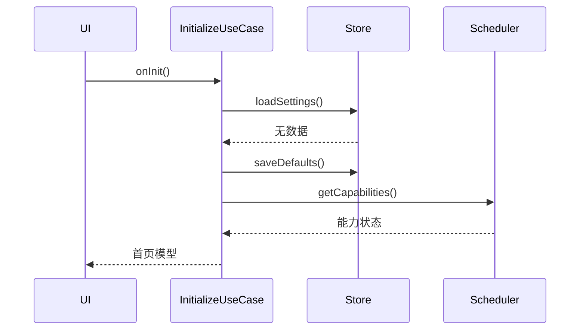
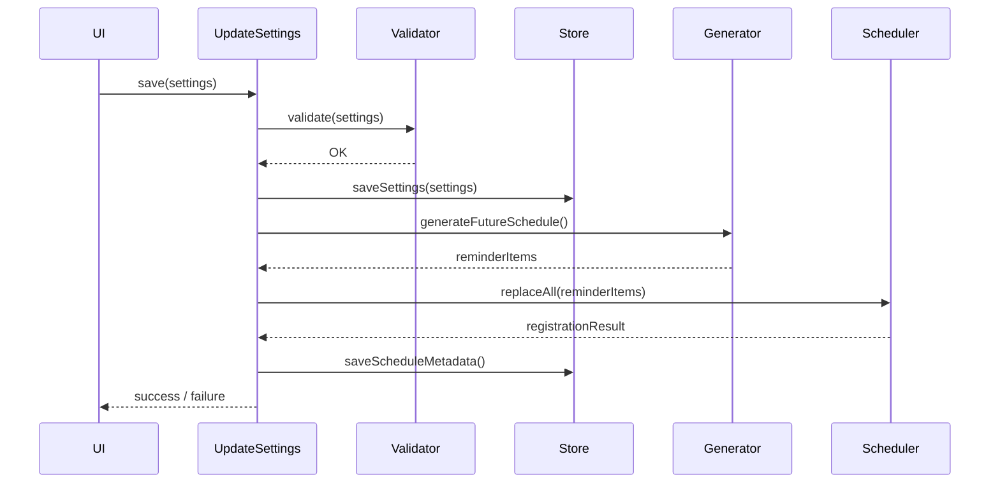
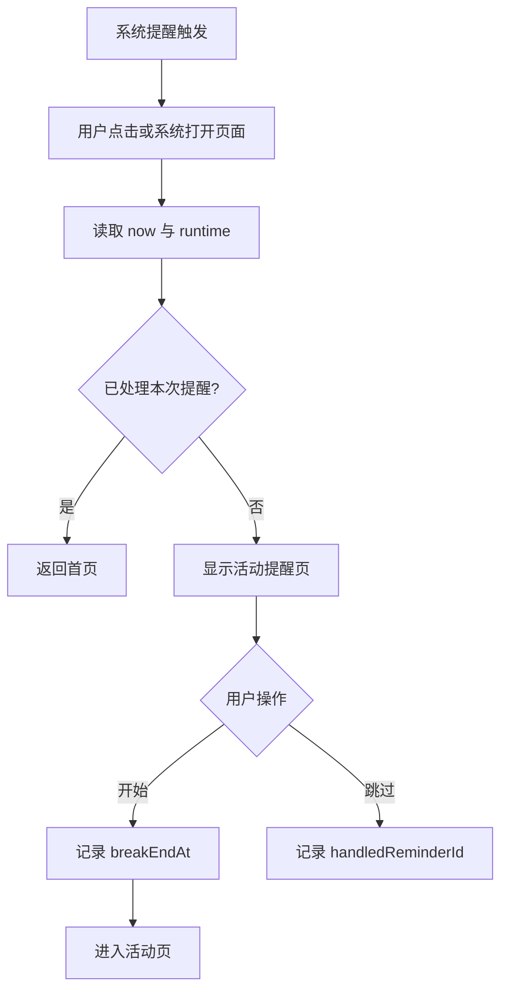

# 04｜系统架构设计

## 1. 架构目标

- 核心功能全部运行在 GT6；
- 系统提醒与业务逻辑解耦；
- 日程算法可在电脑上独立测试；
- 任何设备 API 只出现在适配器层；
- 应用平时不常驻；
- 设置和状态可在进程重建后恢复；
- 如果提醒 API 发生变化，只修改一个模块。

## 2. 逻辑架构

```mermaid
flowchart TB
    UI[HML/CSS 页面层] --> VM[页面控制器 JS]
    VM --> UC[Use Cases / 业务用例]
    UC --> SG[ScheduleGenerator 日程生成器]
    UC --> SM[StateMachine 状态机]
    UC --> RS[ReminderScheduler 接口]
    UC --> ST[SettingsStore 接口]
    UC --> CT[Clock 时间接口]
    RS --> RA[GT6 Reminder Adapter]
    ST --> SA[@system.storage Adapter]
    RA --> OS[手表系统低功耗提醒能力]
    SA --> FS[手表本地持久化]
```

## 3. 模块职责

### 3.1 UI 页面层

职责：

- 显示状态；
- 接收点击和选择；
- 不直接计算日程；
- 不直接调用系统提醒；
- 不保存业务数据。

### 3.2 页面控制器

职责：

- 将页面事件映射到业务用例；
- 页面显示时重新计算可见倒计时；
- 页面隐藏后停止 UI 刷新；
- 将错误转换为用户可理解文案。

### 3.3 ScheduleGenerator

纯 JavaScript 模块，不导入任何系统 API。

输入：

```javascript
{
  date,
  workDays,
  workBlocks,
  focusMinutes,
  breakMinutes,
  exclusions
}
```

输出：

```javascript
[
  {
    id: '2026-08-05T09:25:00+08:00_BREAK_START',
    type: 'BREAK_START',
    triggerAt: 1785893100000,
    workBlockIndex: 0,
    cycleIndex: 0
  }
]
```

### 3.4 ReminderScheduler

业务层只依赖接口：

```javascript
export default {
  getCapabilities: function () {},
  replaceAll: function (items, callbacks) {},
  cancelAll: function (callbacks) {},
  cancelByIds: function (ids, callbacks) {},
  scheduleBreakEnd: function (item, callbacks) {},
  listRegistered: function (callbacks) {}
};
```

正式实现不得在能力未确认前写死模块名。

### 3.5 SettingsStore

封装 `@system.storage`：

```javascript
export default {
  loadSettings: function (callbacks) {},
  saveSettings: function (settings, callbacks) {},
  loadRuntime: function (callbacks) {},
  saveRuntime: function (runtime, callbacks) {},
  clearAll: function (callbacks) {}
};
```

### 3.6 StateMachine

负责：

- 当前是否在工作日和工作时间；
- 是否暂停；
- 是否存在活动会话；
- 下次提醒；
- 跳过逻辑；
- 错误状态。

### 3.7 Clock

所有时间读取经统一封装，便于测试：

```javascript
export default {
  now: function () {
    return Date.now();
  }
};
```

测试环境可以注入 FakeClock。

## 4. 推荐目录结构

```text
entry/
└── src/main/
    ├── config.json
    └── js/
        └── MainAbility/
            ├── app.js
            ├── pages/
            │   ├── home/
            │   │   ├── home.hml
            │   │   ├── home.css
            │   │   └── home.js
            │   ├── reminder/
            │   ├── break/
            │   ├── settings/
            │   ├── workdays/
            │   ├── workblocks/
            │   ├── pause/
            │   └── diagnostics/
            ├── domain/
            │   ├── schedule-generator.js
            │   ├── schedule-validator.js
            │   ├── state-machine.js
            │   ├── reminder-item.js
            │   └── stretch-content.js
            ├── application/
            │   ├── initialize-app.js
            │   ├── update-settings.js
            │   ├── rebuild-schedule.js
            │   ├── start-break.js
            │   ├── skip-reminder.js
            │   └── pause-reminders.js
            ├── infrastructure/
            │   ├── settings-store.js
            │   ├── runtime-store.js
            │   ├── reminder-adapter.js
            │   ├── vibrator-adapter.js
            │   ├── clock.js
            │   └── logger.js
            ├── common/
            │   ├── constants.js
            │   ├── errors.js
            │   ├── date-utils.js
            │   └── validation.js
            └── resources/
                ├── icons/
                └── sounds/
```

如果 Lite 工程打包器不支持过深目录或模块解析，应保持职责不变但缩短路径。

## 5. 运行数据流

### 5.1 首次启动



### 5.2 用户保存设置



### 5.3 提醒触发后

由于底层能力未知，设计两种入口：

1. 系统提醒点击后打开 reminder 页面；
2. 如果系统能传入提醒参数，读取提醒 ID；
3. 如果不能传参，根据当前时间匹配最近提醒。



## 6. 配置与运行时分离

### Settings

用户主动配置，长期保存：

```javascript
{
  schemaVersion: 1,
  enabled: true,
  workDays: [1, 2, 3, 4, 5],
  workBlocks: [
    { startMinutes: 540, endMinutes: 720 },
    { startMinutes: 810, endMinutes: 1080 }
  ],
  focusMinutes: 25,
  breakMinutes: 5,
  vibrationEnabled: true,
  soundEnabled: false
}
```

### Runtime

会自动变化：

```javascript
{
  pausedUntil: null,
  pausedForDate: null,
  skipReminderId: null,
  activeBreakEndAt: null,
  lastHandledReminderId: null,
  scheduleRevision: 12,
  registeredReminderIds: [],
  lastScheduleBuiltAt: null,
  lastError: null
}
```

## 7. 错误模型

统一错误结构：

```javascript
{
  code: 'REMINDER_PERMISSION_DENIED',
  source: 'ReminderAdapter',
  message: 'System denied reminder registration',
  rawCode: 201,
  occurredAt: 1785890000000,
  recoverable: true
}
```

业务层只处理自定义错误码，不依赖厂商原始字符串。

## 8. 调度一致性

修改设置时采用“替换全部”而非增量拼接：

1. 生成新的调度版本；
2. 取消旧提醒；
3. 注册新提醒；
4. 保存新提醒 ID；
5. 若注册部分失败，进入错误状态并允许重试。

如果系统 API 支持事务或更新，后续再优化；第一版追求明确和可诊断。

## 9. 能力降级

```javascript
{
  supportsSystemReminder: false,
  supportsRecurringReminder: false,
  supportsReminderAction: false,
  supportsCustomSound: false,
  supportsBreakEndReminder: false
}
```

UI 应根据能力隐藏功能，而不是显示不可用按钮。

### 降级优先级

1. 无自定义声音：只震动；
2. 无通知动作按钮：点击提醒进入应用；
3. 无周重复：注册未来若干天一次性提醒；
4. 无活动结束后台提醒：只在重新打开时显示完成；
5. 无任何后台提醒：项目进入阻塞，不使用前台保活代替。

## 10. 安全和隐私架构

- 无网络权限；
- 无健康权限；
- 无位置权限；
- 无账户；
- 无跨设备数据；
- 无第三方 SDK；
- 日志不记录用户隐私；
- 调试日志在 Release 构建中关闭或最小化。
