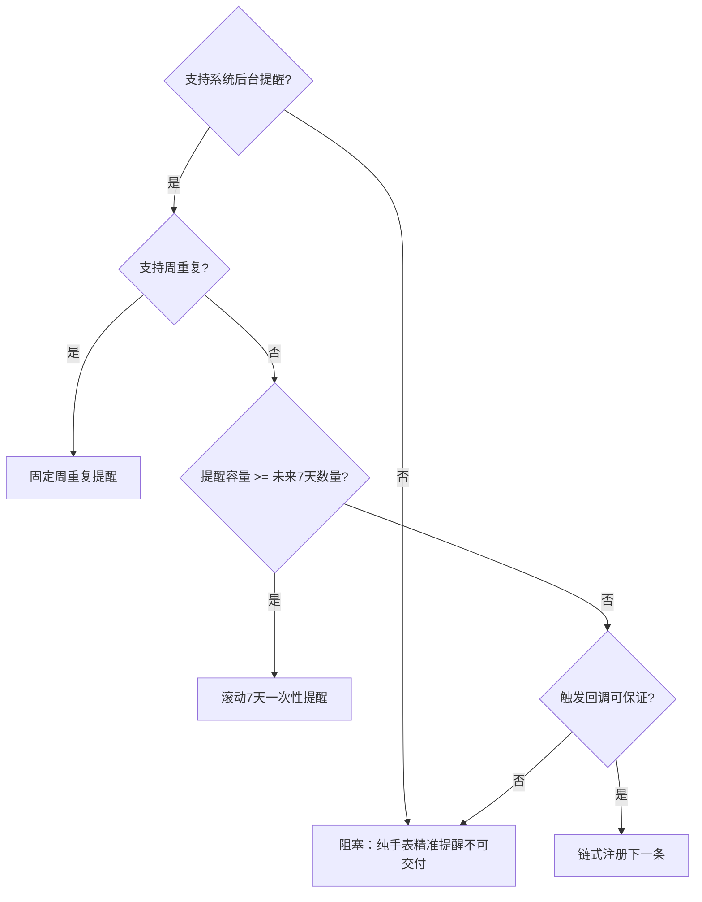

# 05｜日程提醒与低功耗设计

## 1. 核心原则

真正省电且可靠的设计不是让应用“活着数 25 分钟”，而是：

1. 计算绝对提醒时间；
2. 一次性提交给系统；
3. 应用退出；
4. 系统在目标时间触发；
5. 页面只在用户查看时渲染倒计时。

## 2. 周期定义

默认一个完整周期：

```text
25 分钟工作 + 5 分钟活动 = 30 分钟
```

对一个工作块 `[start, end]`，第 `n` 个周期：

```text
cycleStart = start + n × (focus + break)
breakStart = cycleStart + focus
breakEnd = breakStart + break
```

仅当：

```text
breakEnd <= end
```

才创建该提醒。

## 3. 纯算法伪代码

```javascript
function buildBreakStarts(date, blocks, focusMinutes, breakMinutes) {
  var result = [];
  var cycleMs = (focusMinutes + breakMinutes) * 60000;
  var focusMs = focusMinutes * 60000;
  var breakMs = breakMinutes * 60000;

  for (var i = 0; i < blocks.length; i++) {
    var blockStart = toTimestamp(date, blocks[i].startMinutes);
    var blockEnd = toTimestamp(date, blocks[i].endMinutes);
    var cycleStart = blockStart;
    var cycleIndex = 0;

    while (cycleStart + focusMs + breakMs <= blockEnd) {
      var breakStart = cycleStart + focusMs;
      result.push({
        type: 'BREAK_START',
        triggerAt: breakStart,
        blockIndex: i,
        cycleIndex: cycleIndex
      });
      cycleStart += cycleMs;
      cycleIndex += 1;
    }
  }

  return result;
}
```

不要用“上次实际响铃时间 + 30 分钟”，否则系统延迟会累积漂移。

## 4. 日程策略选择

### 4.1 策略 A：按星期重复的固定提醒

如果系统支持：

- 周一至周五；
- 固定时分；
- 多个独立规则；

则默认设置需要约 15 个周重复规则。

优点：

- 注册数量少；
- 长期不续期；
- 不需要每天运行应用；
- 最省电。

缺点：

- 节假日不会自动跳过；
- 修改时间需完整重建；
- 需验证是否支持工作日掩码。

### 4.2 策略 B：滚动未来 7 天一次性提醒

默认最多 75 条活动开始提醒。

优点：

- 可跳过具体日期；
- 容易处理暂停和例外；
- 时间语义清晰。

缺点：

- 可能超过系统单应用提醒数量；
- 需要续期；
- 如果应用长期不打开，未来计划可能耗尽。

### 4.3 策略 C：只注册下一条

每次触发后再注册下一条。

优点：

- 系统中始终只有少量提醒。

缺点：

- 如果系统只展示提醒而不执行应用回调，链条会断；
- 用户清除提醒可能导致后续不再注册；
- 可靠性依赖未确认的回调语义。

仅在 API 明确保证触发回调时使用。

### 4.4 策略 D：前台定时器

禁止用于长期提醒。只允许：

- 活动页可见时更新数字；
- 能力探针中的短时 UI 演示；
- 单元测试。

## 5. 推荐策略决策树



## 6. 活动倒计时设计

### 6.1 正确方式

用户点击开始时：

```javascript
runtime.activeBreakEndAt = Date.now() + breakMinutes * 60000;
```

页面显示：

```javascript
remaining = Math.max(0, activeBreakEndAt - Date.now());
```

### 6.2 息屏行为

- 不阻止息屏；
- 页面隐藏时清理前台刷新计时器；
- 页面重新显示时重新计算剩余时间；
- 不依赖每秒计数累加。

### 6.3 活动结束提醒

优先级：

1. 如果系统支持临时后台提醒，注册一条 5 分钟结束提醒；
2. 如果不支持，只保存结束时间；
3. 用户再次打开时，如果已经结束，显示“活动完成”；
4. 不为实现结束提示而保持屏幕常亮。

## 7. 功耗预算来源

GT6 官方标称 46 mm 版本常规使用最长约 12 天、轻度使用最长约 21 天；官方测试模型显示通知数量和亮屏时间会进入续航测试条件。[S11]

因此应用的主要额外耗电来源不是简单时间计算，而是：

- 每次提醒导致的亮屏；
- 振动；
- 用户查看页面；
- 动画和持续刷新；
- 音频；
- 任何常驻后台任务。

默认每天 15 次提醒，属于可感知但仍可控制的频率。应尽量避免每次活动结束再次系统亮屏，否则提醒次数可能翻倍。

## 8. 低功耗规则

### LP-01：无后台轮询

- 不使用每秒、每分钟定期检查当前时间；
- 不创建常驻 Service；
- 不设置 `keepAlive`。

### LP-02：无传感器

不持续读取：

- 加速度计；
- 心率；
- 步数；
- 佩戴状态；
- 环境光。

### LP-03：无网络和手机通信

- 无 HTTP；
- 无 WebSocket；
- 无 Wear Engine；
- 无云端；
- 无同步。

### LP-04：允许正常息屏

- 活动页不常亮；
- 不使用 AOD；
- 不循环动画；
- 不播放 5 分钟音频。

### LP-05：静态资源最小化

- 图标优先简单矢量或小型 PNG；
- 不使用大背景图；
- 不使用视频；
- 不使用高帧率动画；
- 总包体保持小型。

### LP-06：UI 刷新最小化

- 首页不需要秒级倒计时；
- 首页显示“约 18 分钟”即可按页面进入时刷新；
- 活动页前台可每秒刷新，但页面隐藏立即停止。

### LP-07：日志最小化

- Debug 记录详细日志；
- Release 只保留错误和调度摘要；
- 日志数量设上限；
- 不持续写存储。

## 9. 提醒频率优化

默认每天 15 次活动开始提醒。

建议：

- 默认不提醒活动结束；
- 一次短震动；
- 声音关闭；
- 不自动重复鸣响；
- “稍后提醒”功能不进入首版，避免额外提醒链；
- 用户跳过后不再次补响。

## 10. 免打扰与系统策略

应用必须尊重系统：

- 免打扰；
- 静音；
- 低电量；
- 睡眠模式；
- 系统提醒节流。

不能承诺绕过免打扰，也不应申请高优先级系统权限来强行打扰。

## 11. 时间变化处理

### 11.1 手动改时间

下次打开应用时：

- 校验注册计划；
- 丢弃过期项；
- 重新生成未来计划。

### 11.2 时区变化

设置中的工作时间是“本地墙钟时间”，不是固定 UTC 时间。

策略：

- 存储分钟数，如 09:00 = 540；
- 每次生成具体日期提醒时按当前本地时区构造；
- 检测时区变化后重建。

### 11.3 夏令时

中国大陆通常不涉及，但产品逻辑仍应使用本地日期构造，避免简单 `timestamp + 24h` 生成下一天。

## 12. 功耗测试方法

### 基线

- 关闭 Move25；
- 保持相同表盘、通知和健康设置；
- 记录 24 小时电量变化。

### 实验

- 开启 Move25；
- 默认 15 次提醒；
- 不频繁打开应用；
- 记录 24 小时电量变化。

### 对照要求

- 连续至少 3 个工作日；
- 每日相同佩戴时长；
- 记录运动/GPS使用；
- 记录 AOD、电话、音乐等干扰因素；
- 不从单日百分比直接得出精确结论。

## 13. 低功耗验收

- 无后台 JS 周期任务；
- 页面隐藏后无秒级刷新；
- 无网络和传感器权限；
- 每个工作日系统亮屏次数不超过必要提醒次数；
- 三日测试中无异常发热；
- 额外耗电主观上不显著破坏 GT6 长续航体验；
- 若额外耗电过高，优先减少亮屏、声音和活动结束提醒，而不是牺牲提醒可靠性。
