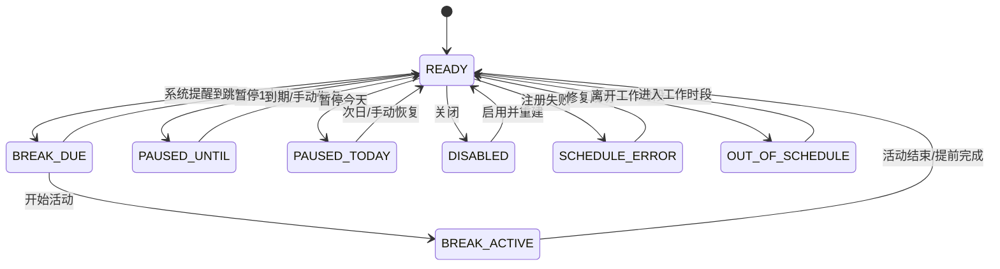

# 07｜数据模型与状态机

## 1. 数据设计目标

- 数据量极小；
- 结构可升级；
- 不依赖数据库；
- 不保存敏感健康数据；
- 进程重启后可恢复；
- 易于诊断调度错误。

## 2. 存储技术

使用：

```javascript
import storage from '@system.storage';
```

该模块被华为当前文档明确标记为 Lite Wearable 长期维护、FA 模型可用。[S6]

## 3. 存储键

```text
move25.settings.v1
move25.runtime.v1
move25.schedule.v1
move25.diagnostics.v1
```

将对象序列化为 JSON 字符串，读取时必须捕获解析异常。

## 4. Settings 模型

```javascript
var DEFAULT_SETTINGS = {
  schemaVersion: 1,
  enabled: true,
  workDays: [1, 2, 3, 4, 5],
  workBlocks: [
    { startMinutes: 540, endMinutes: 720 },
    { startMinutes: 810, endMinutes: 1080 }
  ],
  focusMinutes: 25,
  breakMinutes: 5,
  vibrationEnabled: true,
  soundEnabled: false,
  breakEndReminderEnabled: false,
  contentRotationEnabled: true
};
```

### 4.1 时间表示

存“从午夜起的分钟数”：

- 09:00 = 540；
- 12:00 = 720；
- 13:30 = 810；
- 18:00 = 1080。

优点：

- 与日期和时区分离；
- 容易验证；
- 不需要字符串解析贯穿业务层。

### 4.2 工作日表示

建议：

```text
0 = 星期日
1 = 星期一
...
6 = 星期六
```

与 JavaScript `Date.getDay()` 一致。

## 5. Runtime 模型

```javascript
var DEFAULT_RUNTIME = {
  schemaVersion: 1,
  pausedUntil: null,
  pausedForDateKey: null,
  skipReminderId: null,
  activeBreakEndAt: null,
  activeBreakStartedAt: null,
  lastHandledReminderId: null,
  lastOpenedAt: null,
  lastTimeZoneOffset: null,
  lastBootObservationAt: null
};
```

### 5.1 日期键

使用本地日期字符串：

```text
2026-08-05
```

不要用 UTC 日期作为“今天”，以免跨时区误判。

## 6. ScheduleMetadata 模型

```javascript
var DEFAULT_SCHEDULE_META = {
  schemaVersion: 1,
  revision: 0,
  strategy: 'UNKNOWN',
  generatedAt: null,
  rangeStart: null,
  rangeEnd: null,
  registeredIds: [],
  itemCount: 0,
  settingsHash: null,
  lastRegistrationSuccessAt: null,
  lastRegistrationFailureAt: null
};
```

`settingsHash` 可以是稳定字符串，不必使用加密哈希：

```text
enabled|workDays|blocks|focus|break
```

用于判断设置是否变化。

## 7. ReminderItem 模型

```javascript
{
  logicalId: '2026-08-05_09:25_BREAK_START',
  systemId: null,
  type: 'BREAK_START',
  triggerAt: 1785893100000,
  localDateKey: '2026-08-05',
  localMinuteOfDay: 565,
  blockIndex: 0,
  cycleIndex: 0,
  scheduleRevision: 12
}
```

逻辑 ID 必须稳定，以防重复处理。

## 8. Diagnostics 模型

只保留最近若干条：

```javascript
{
  entries: [
    {
      level: 'ERROR',
      code: 'REMINDER_REGISTER_FAILED',
      message: 'Permission denied',
      rawCode: 201,
      at: 1785890000000
    }
  ],
  maxEntries: 30
}
```

Release 不保存高频 UI 日志。

## 9. 应用状态机

### 9.1 状态定义

```text
DISABLED
OUT_OF_SCHEDULE
READY
PAUSED_UNTIL
PAUSED_TODAY
BREAK_DUE
BREAK_ACTIVE
SCHEDULE_ERROR
```

### 9.2 状态优先级

按以下顺序判断：

1. `enabled == false` → DISABLED；
2. 调度能力或注册失败 → SCHEDULE_ERROR；
3. 当前活动尚未结束 → BREAK_ACTIVE；
4. 今日暂停 → PAUSED_TODAY；
5. `pausedUntil > now` → PAUSED_UNTIL；
6. 当前存在待处理提醒 → BREAK_DUE；
7. 当前不是工作日或工作时间 → OUT_OF_SCHEDULE；
8. 其他 → READY。

### 9.3 状态图



## 10. 事件模型

```text
APP_OPENED
APP_HIDDEN
SETTINGS_SAVED
SCHEDULE_REBUILT
REMINDER_TRIGGERED
BREAK_STARTED
BREAK_COMPLETED
REMINDER_SKIPPED
PAUSE_ONE_HOUR
PAUSE_TODAY
RESUME
SYSTEM_TIME_CHANGED
TIMEZONE_CHANGED
STORAGE_CORRUPTED
REMINDER_ERROR
```

## 11. 关键状态转换规则

### 11.1 开始活动

前置条件：

- 当前为 BREAK_DUE，或用户点击“立即活动”；
- 当前没有活动会话。

操作：

- 写入 `activeBreakStartedAt`；
- 写入 `activeBreakEndAt`；
- 标记当前提醒已处理；
- 如支持，注册活动结束系统提醒；
- 进入 BREAK_ACTIVE。

### 11.2 活动结束

满足任一：

- `now >= activeBreakEndAt`；
- 用户提前完成。

操作：

- 清除活动时间；
- 取消临时结束提醒；
- 返回 READY 或 OUT_OF_SCHEDULE。

### 11.3 暂停今天

- 设置 `pausedForDateKey = today`；
- 取消当天剩余提醒，或在触发时过滤；
- 次日本地日期变化后自动清除。

### 11.4 跳过下一次

- 找到未来最近一条逻辑提醒；
- 写入 `skipReminderId`；
- 如果系统支持取消单条，取消该系统 ID；
- 生成调度时跳过该逻辑 ID；
- 下一条之后清除跳过标记。

## 12. 数据校验

### SettingsValidator

必须检查：

- `workDays` 是 0–6 的无重复数组；
- 至少一个工作日；
- 每个工作块 `0 <= start < end <= 1440`；
- 工作块不重叠；
- `focusMinutes > 0`；
- `breakMinutes > 0`；
- 工作块至少可容纳一个完整周期；
- 第一版拒绝跨午夜。

## 13. 数据迁移

读取时：

```text
无 schemaVersion → 当作旧版本或损坏
schemaVersion == 1 → 正常
schemaVersion > 当前 → 显示不兼容并保留原数据
```

首版可只实现 v1，但必须预留版本字段。

## 14. 存储失败处理

- 保存设置失败时不重建提醒；
- 注册成功但保存元数据失败时，记录严重错误；
- JSON 解析失败时备份原字符串到诊断键，恢复默认设置；
- 不在每秒倒计时中写存储；
- 只在状态变化时写入。
