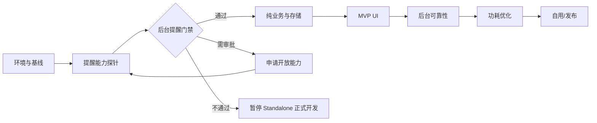

# 10｜实现计划与任务拆分

## 1. 总体路线

## 2. Phase 0：项目初始化

### 任务

- 创建仓库；
- 创建 `[Lite] Empty Ability`；
- 记录环境；
- 配置 `.gitignore`；
- 建立文档目录；
- 构建空白 HAP；
- 安装到 GT6。

### 完成标准

- 真机能打开 Hello World；
- 无额外权限；
- Git 工作树干净；
- 可读取日志。

## 3. Phase 1：G0 基线探针

### 任务

- 接入 `@system.storage`；
- 接入 `@system.vibrator`；
- 加入 VIBRATE 权限；
- 页面显示环境信息；
- 验证持久化；
- 验证短振动。

### 完成标准

- 退出后数据保留；
- 真机振动；
- 无崩溃；
- 诊断信息可读。

## 4. Phase 2：后台提醒探针

### 任务

- 在独立分支验证候选模块；
- 检查 SDK 声明；
- 申请必要开放能力；
- 注册 60 秒提醒；
- 测试取消；
- 测试表盘、熄屏、退出、断连和重启；
- 输出 `PROBE_RESULTS.md`。

### 门禁

没有通过后台场景，不进入正式 UI。

## 5. Phase 3：纯业务层

### 任务

- Settings 默认值；
- 设置校验；
- 日期工具；
- 日程生成器；
- 状态机；
- 动作内容轮换；
- FakeClock；
- 纯 JS 测试样例。

### 测试案例

- 09:00–12:00 生成 6 条；
- 13:30–18:00 生成 9 条；
- 周末生成 0 条；
- 午休不生成；
- 无法容纳完整周期的短工作块生成 0 条；
- 自定义 50+10 正确；
- 工作块重叠校验失败。

## 6. Phase 4：存储与初始化

### 任务

- SettingsStore；
- RuntimeStore；
- ScheduleMetadata；
- 默认数据迁移；
- 损坏 JSON 恢复；
- 初始化用例；
- 清除设置。

### 完成标准

- 所有状态重启后恢复；
- 不在秒级刷新中写存储；
- 损坏数据不会导致应用无法启动。

## 7. Phase 5：提醒适配器

### 任务

- 定义能力结构；
- `replaceAll`；
- `cancelAll`；
- `cancelByIds`；
- `listRegistered`；
- 调度策略选择；
- 原始错误码映射；
- 注册数量限制处理；
- 设置变化重建。

### 完成标准

- 业务层无系统模块 import；
- 修改设置不会残留旧提醒；
- 重建失败可诊断；
- 不重复注册同一逻辑提醒。

## 8. Phase 6：MVP 页面

顺序：

1. 首页；
2. 提醒页；
3. 活动页；
4. 暂停菜单；
5. 设置页；
6. 诊断页。

每页完成后：

- 模拟器验证；
- 真机裁切验证；
- 单手操作验证；
- 页面隐藏清理计时器。

## 9. Phase 7：完整业务

### 任务

- 启用/停用；
- 周工作日；
- 两个时间块；
- 时长预设；
- 下一次提醒；
- 立即活动；
- 跳过；
- 暂停 1 小时；
- 暂停今天；
- 活动恢复；
- 动作轮换；
- 重新建立提醒。

## 10. Phase 8：可靠性

- 连续运行 3 个工作日；
- 记录每条计划与实际触发；
- 测试手机断连；
- 测试应用退出；
- 测试手表重启；
- 测试修改时间；
- 测试低电量和免打扰；
- 测试重新配对后的数据行为。

## 11. Phase 9：功耗优化

### 排查顺序

1. 是否存在后台轮询；
2. 页面隐藏后 timer 是否清理；
3. 是否有不必要的活动结束提醒；
4. 是否有动画；
5. 是否频繁写存储；
6. 是否存在网络/传感器依赖；
7. 每日亮屏次数；
8. 日志量。

## 12. Phase 10：发布准备

- 图标；
- 名称；
- 简介；
- 截图；
- 隐私说明；
- 权限用途；
- 兼容设备；
- 已知限制；
- 测试报告；
- 版本说明；
- 邀请测试。

## 13. 任务优先级

### P0

- 正确 Lite 技术栈；
- HAP 安装；
- 后台提醒；
- 本地存储；
- 设置和日程；
- 震动；
- 功耗基本合格。

### P1

- 暂停；
- 跳过；
- 诊断；
- 动作轮换；
- 活动恢复。

### P2

- 声音；
- 统计；
- 主题；
- 卡片；
- 复杂动画。

## 14. Definition of Done

一个功能只有同时满足以下条件才算完成：

- 代码已提交；
- 编译通过；
- 模拟器或纯逻辑测试通过；
- GT6 真机验证；
- 对应文档更新；
- 错误情况有处理；
- 不引入额外权限；
- 不增加持续后台耗电；
- AI 生成代码已人工核对 API 来源。
