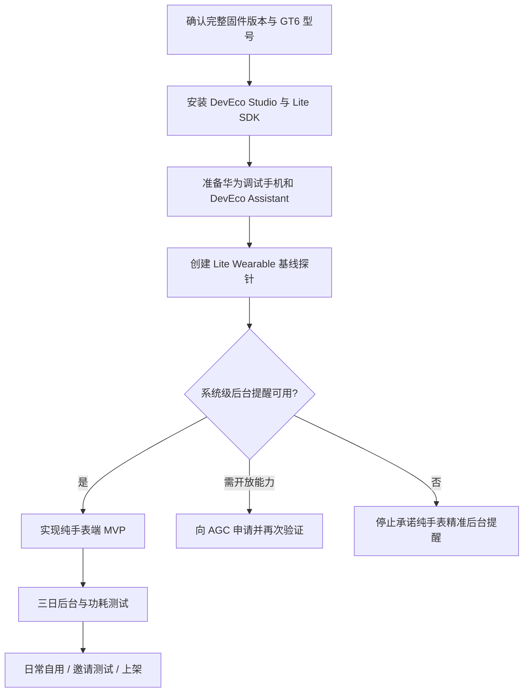
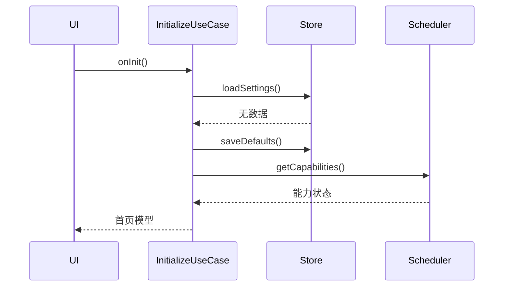
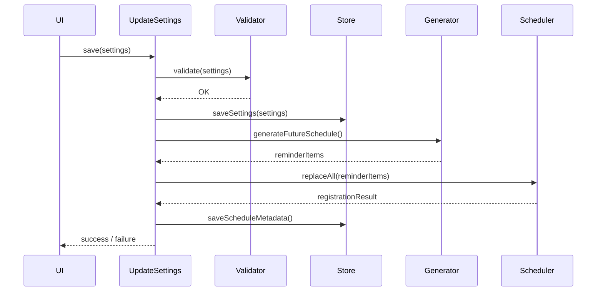
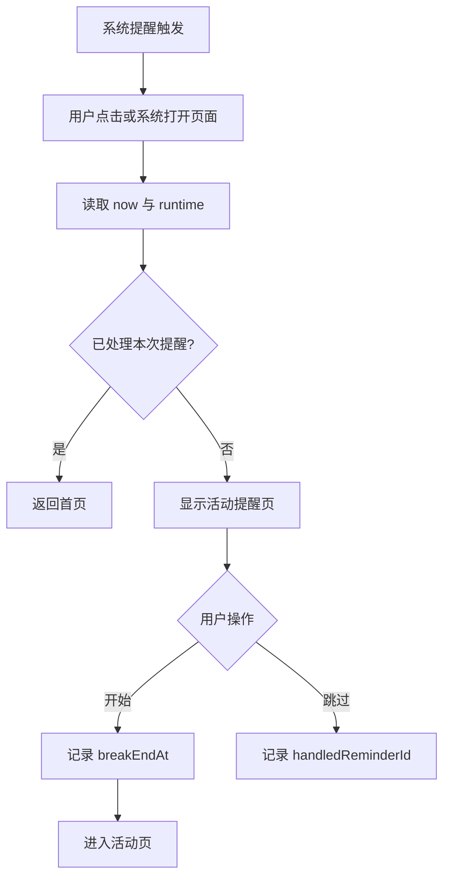
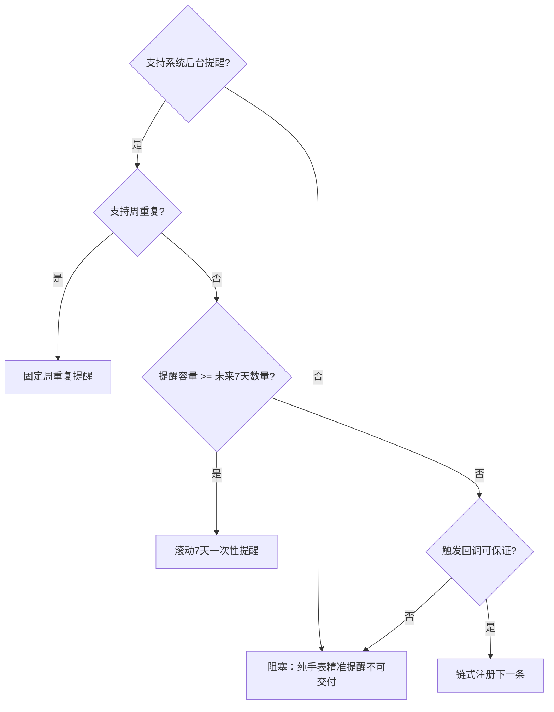
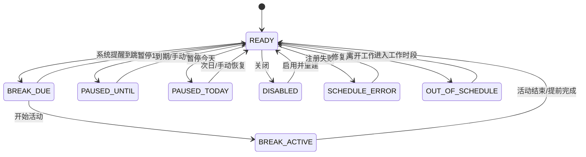
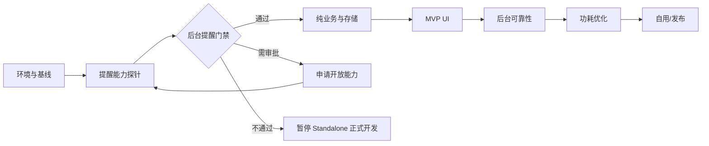

# Move25 for HUAWEI WATCH GT 6｜开发文档总册

> 由文档包自动合并。各章节的独立文件更便于维护。


---

<!-- 来源文件: 00_README.md -->

# Move25 for HUAWEI WATCH GT 6：开发文档总索引

> 文档版本：v1.0  
> 编制日期：2026-08-05  
> 目标设备：HUAWEI WATCH GT 6，当前手表系统 HarmonyOS 6.1.0  
> 目标应用形态：优先纯手表端独立应用（Standalone App）  
> 推荐工程类型：Lite Wearable / JS FA / HML / CSS / JavaScript

## 1. 项目目标

开发一款功能明确、极简、低功耗的久坐打断应用：

- 在设定的上班时间段内运行；
- 默认每完成 25 分钟工作后，提醒起身活动 5 分钟；
- 活动提醒包含走动、伸展、肩颈放松和远眺提示；
- 核心逻辑、设置、日程和状态尽可能全部保存在手表端；
- 日常运行不依赖 vivo、iPhone 或鸿蒙手机；
- 不使用网络、账号、云端、广告、健康数据和持续传感器；
- 不通过持续 JavaScript 计时保活；
- 优先把长期提醒交给系统级低功耗调度能力。

## 2. 最重要的工程结论

1. **WATCH GT 系列属于轻量级智能穿戴路线。** 华为 2026 年官方文档明确指出，WATCH GT、WATCH D、FIT 系列应使用兼容 JS 的类 Web 开发范式；标准智能穿戴（例如 WATCH 5）才使用 ArkTS。见 [S1]。
2. **当前推荐基线不是 ArkTS Stage。** 应从 DevEco Studio 的 `[Lite] Empty Ability` 工程开始，使用 JS FA、HML、CSS 和 `config.json`。
3. **跨手机生态的日常安装路径成立。** GT6 与 HarmonyOS、Android 9+、iOS 13+ 配对时，都支持通过华为运动健康 App 使用应用市场。见 [S2]。
4. **开发调试与日常使用必须区分。** 日常可继续使用 vivo X200；但华为官方 Lite Wearable 调测链路要求通过 HUAWEI DevEco Assistant 获取手表 UDID，并与华为手机配对，因此开发阶段应准备一部华为手机。见 [S3]。
5. **纯手表方案存在一个硬门槛：后台提醒能力。** 标准 HarmonyOS 的代理提醒 API 确实能在应用退出后由系统代理提醒，但需要申请开放能力；目前没有足够的官方证据证明该标准 API 可直接用于 GT6 的 Lite JS FA 工程。必须先完成能力探针。见 [S4]。
6. **“柠檬喝水”只能作为产品参考。** 华为官方说明它可在手表内设置并由手表提醒喝水，但这不能证明普通开发者可获得相同底层接口。见 [S5]。

## 3. 文档目录

| 文件 | 用途 |
|---|---|
| `01_需求解构与范围.md` | 将原始需求拆成明确、可测试的需求和边界 |
| `02_产品需求文档_PRD.md` | 产品目标、用户故事、功能规格、验收标准 |
| `03_技术可行性与技术栈.md` | GT6 技术路线、已证实事实、未知项和可行性门禁 |
| `04_系统架构设计.md` | 模块、数据流、目录结构、提醒适配层 |
| `05_日程提醒与低功耗设计.md` | 25+5 算法、调度策略、电量控制和容错 |
| `06_UI_UX设计规范.md` | 圆形屏幕信息架构、页面、文案、交互和视觉风格 |
| `07_数据模型与状态机.md` | 设置、运行状态、本地存储键、状态转换 |
| `08_能力探针规格.md` | 编译期、权限、运行期和真机后台提醒验证 |
| `09_开发环境签名与真机调试.md` | DevEco、AGC、UDID、证书、HAP、DevEco Assistant |
| `10_实现计划与任务拆分.md` | 从探针到可发布版本的迭代计划和任务清单 |
| `11_测试计划与验收标准.md` | 功能、时间边界、后台可靠性、功耗和兼容性测试 |
| `12_发布隐私与维护.md` | 应用市场发布、隐私说明、版本管理和维护流程 |
| `13_Vibe_Coding提示词库.md` | 分阶段给 AI 编程助手使用的约束型 Prompt |
| `14_风险登记与决策记录.md` | 关键风险、触发条件、缓解措施和技术决策 |
| `15_代码规范与仓库约定.md` | Lite JS 工程代码规范、分支、提交和日志规范 |
| `16_来源索引.md` | 本文档包使用的官方资料和辅助证据 |
| `Move25_GT6_开发总册.md` | 上述核心内容的单文件合并版 |

## 4. 推荐执行顺序



## 5. 成功定义

项目成功不是“界面能显示倒计时”，而是同时满足：

- 手表锁屏后提醒仍触发；
- 应用返回表盘后提醒仍触发；
- 应用进程被回收后提醒仍触发；
- 手机蓝牙断开后提醒仍触发；
- 无常驻轮询、无持续传感器、无网络；
- 正常工作日中提醒不漂移、不重复、不跨午休；
- 一整天运行对续航的影响可接受；
- 更换配对手机后，无需重写或重新配置手机端应用。

## 6. 当前结论等级

| 结论 | 等级 |
|---|---|
| GT6 属于 Lite Wearable，采用 JS 类 Web 范式 | 官方确认 |
| GT6 支持 Android、iOS、HarmonyOS 配对下的应用市场 | 官方确认 |
| `@system.storage` 可用于 Lite Wearable FA 本地存储 | 官方确认 |
| `@system.vibrator` 可用于 Lite Wearable | 官方确认 |
| GT6 可运行 JS FA/HML/CSS 应用 | 官方分类 + GT6 真机项目佐证 |
| 标准 `reminderAgentManager` 可用于 GT6 Lite JS FA | 未确认，必须探针 |
| “柠檬喝水”使用公开三方提醒 API | 未确认 |
| vivo X200 可完成 Lite Wearable 真机调试全流程 | 未确认，不应依赖 |

## 7. 文档使用约定

- `[Sx]` 表示资料来源编号，详见 `16_来源索引.md`。
- 标记为 **已确认** 的能力可以进入正式设计。
- 标记为 **待探针** 的能力不得让 AI 编造实现。
- 标记为 **阻塞项** 的能力未通过前，不应开发依赖它的大量 UI 或统计功能。

---

<!-- 来源文件: 01_需求解构与范围.md -->

# 01｜需求解构与范围

## 1. 原始需求

> 通过 Vibe Coding 开发一款给 HUAWEI WATCH GT 6 使用的鸿蒙软件。在上班时间段内，每工作约 25 分钟提醒不要久坐，起身活动 5 分钟，并尽可能做伸展运动和放松眼睛。当前手机是 vivo X200，未来可能换成鸿蒙手机或 iPhone。希望尽可能一次性完成手表端全部功能，并尽可能降低耗电，可参考“柠檬喝水”的极简体验。

## 2. 需求中的核心矛盾

### 2.1 “跨手机生态”与“方便开发调试”不是同一问题

- **日常使用目标**：核心功能不依赖 Android、iOS 或 HarmonyOS 手机。
- **开发调试现实**：Lite Wearable 的官方设备注册和 HAP 推送流程以华为手机、华为运动健康、HUAWEI DevEco Assistant 为标准链路。[S3]

结论：

- 应用架构选择纯手表端；
- 开发阶段额外准备华为手机；
- vivo X200 继续作为日常手机，不进入核心运行架构。

### 2.2 “每 25 分钟提醒”存在两种解释

#### 解释 A：固定每 25 分钟响一次

```text
09:25、09:50、10:15、10:40……
```

这会把 5 分钟活动时间包含在下一段 25 分钟中，不符合常见的“25 分钟工作 + 5 分钟活动”。

#### 解释 B：每个周期为 25 分钟工作 + 5 分钟活动

```text
09:00–09:25 工作
09:25–09:30 活动
09:30–09:55 工作
09:55–10:00 活动
```

**本项目默认采用解释 B**。因此活动开始提醒之间相隔 30 分钟，而不是 25 分钟。

可以在后续版本提供“固定间隔模式”，但第一版不做，以避免规则歧义。

## 3. 用户真正需要解决的问题

用户不是需要一个完整番茄钟系统，也不是需要健康分析平台，而是需要：

1. 在容易忘记的办公状态中得到腕上打断；
2. 不用拿起手机；
3. 不需要每次手动启动计时；
4. 手表锁屏、应用退出后仍然可靠；
5. 提醒足够温和，不在办公室造成声音干扰；
6. 操作不超过一到两次点击；
7. 不明显缩短 GT6 续航；
8. 更换手机后继续工作。

## 4. 产品原则

### 4.1 独立优先

- 核心设置、时间表、状态全部存手表；
- 不要求手机安装配套 App；
- 不要求蓝牙始终连接；
- 不要求联网。

### 4.2 可靠性优先于视觉动画

- 后台提醒可靠性是 P0；
- 漂亮进度环是 P2；
- 如果系统调度不可用，不能用前台计时器伪装成可靠方案。

### 4.3 低功耗优先

- 不持续运行 JS；
- 不监听传感器；
- 不常亮屏幕；
- 不持续刷新倒计时；
- 不做网络同步；
- 不做高频日志。

### 4.4 克制优先

参考“柠檬喝水”的产品风格，但只参考：

- 功能单一；
- 设置简单；
- 文案温和；
- 提醒明确；
- 无复杂报表；
- 视觉统一。

“柠檬喝水”能在手表侧设置并由手表提醒，是已公开的产品事实；其具体后台技术方案并未公开，不能直接复制技术假设。[S5]

## 5. MVP 范围

### 5.1 P0：必须有

- 启用/停用；
- 默认周一至周五；
- 至少支持两个工作时间块；
- 默认 09:00–12:00、13:30–18:00；
- 默认 25 分钟工作、5 分钟活动；
- 活动开始震动提醒；
- 显示“走动、伸展、远眺”；
- “开始活动”“跳过”；
- 活动结束的时间管理；
- “暂停 1 小时”“暂停今天”；
- 本地持久化；
- 修改设置后重建日程；
- 手表独立运行；
- 后台可靠性验证。

### 5.2 P1：应有

- 工作日自定义；
- 工作和活动时长预设；
- “跳过下一次”；
- 下次提醒时间；
- 动作建议轮换；
- 少量当日完成计数；
- 错误状态页；
- 一键恢复默认设置。

### 5.3 P2：可选

- 柔和提示音；
- 每周完成摘要；
- 节假日手动例外；
- 多套视觉主题；
- 表冠调整数字；
- 手表卡片或快捷入口。

### 5.4 明确不做

- 登录、账号和云同步；
- 广告；
- 手机配套 App；
- 持续加速度计识别是否坐着；
- 心率、步数或健康数据读取；
- AI 动作识别；
- 自动读取日历会议；
- 节假日联网服务；
- 跨设备统计；
- AOD 常亮倒计时；
- 长动画、视频或大型图片资源；
- 以 `setInterval` 或 `setTimeout` 承担长期后台提醒。

## 6. 功能性需求

### FR-01：启用状态

- 用户可启用或关闭提醒；
- 关闭时取消应用管理的未来提醒；
- 再启用时按当前设置重建提醒。

### FR-02：工作日

- 默认周一至周五；
- 支持逐日开关；
- 当天不是工作日时，首页显示“不在工作日”。

### FR-03：工作时间块

- 默认两个时间块；
- 不允许结束时间早于或等于开始时间；
- 不允许两个时间块重叠；
- 第一版不支持跨午夜。

### FR-04：周期

- 默认：25 分钟工作 + 5 分钟活动；
- 完整周期必须能容纳在当前工作块内；
- 不允许活动段跨越工作块结束时间。

### FR-05：提醒

提醒触发时：

- 一次短震动或系统默认提醒反馈；
- 标题：“该活动了”；
- 主文案：“起身活动 5 分钟”；
- 辅助文案：“伸展身体，看看远处”；
- 用户可进入活动页或跳过。

### FR-06：活动会话

- 点击“开始活动”后记录绝对结束时间；
- 页面只在前台可见时刷新；
- 息屏后不持续执行每秒计时；
- 重开页面时通过 `breakEndAt - now` 恢复剩余时间；
- 活动结束反馈是否由系统提醒完成，取决于探针结果。

### FR-07：暂停

支持：

- 暂停 1 小时；
- 暂停今天；
- 立即恢复；
- 跳过下一次。

### FR-08：本地存储

至少保存：

- 设置；
- 启用状态；
- 暂停截止时间；
- 跳过的提醒标识；
- 当前活动结束时间；
- 最近一次调度版本；
- 最近一次错误。

`@system.storage` 当前官方文档明确说明对 Lite Wearable 长期维护并只可用于 FA 模型。[S6]

## 7. 非功能性需求

### NFR-01：可靠性

- 在表盘、熄屏、应用退出和手机断连状态下，到点提醒仍应触发；
- 如果无法满足，纯手表方案判定为不可交付，而不是降低为前台计时器。

### NFR-02：功耗

- 常态下应用进程不应主动轮询；
- 非用户交互期间 CPU 使用接近零；
- 不启用网络、GPS、蓝牙通信、持续音频和传感器；
- 不阻止系统息屏。

### NFR-03：兼容性

- GT6 作为第一目标设备；
- 不承诺自动兼容 WATCH 5 等标准智能穿戴；
- 日常配对手机可为 Android、iOS、HarmonyOS；
- 实际应用市场可见性以运动健康 App 中展示为准。[S2]

### NFR-04：可维护性

- 系统提醒封装在单一适配器；
- 纯日程算法不依赖设备 API；
- 所有未知 API 必须通过探针或 SDK 声明确认；
- 不允许 AI 使用不存在的包名来“完成”功能。

### NFR-05：隐私

- 默认不收集、不上传任何个人数据；
- 不申请健康、定位、网络、通讯录、麦克风等权限；
- 只申请实际需要的振动和提醒权限。

## 8. 约束条件

- 设备是 GT6，而非标准 Wearable；
- Lite Wearable 功能集受限；
- 后台提醒公开能力未确认；
- 真机调试链路可能需要华为手机；
- 个人开发者权限和开放能力审批可能限制提醒能力；
- 应用市场对不同手机生态的三方功能可能存在差异。[S2][S5]

## 9. 最终范围判定

本项目采用：

> **Standalone-first，Capability-gated**

即：

- 产品架构以纯手表端为目标；
- 但后台提醒是技术门禁；
- 门禁通过后再完成正式产品；
- 门禁不通过时，不继续堆叠 UI，而是转入华为工单、开放能力申请或备选架构评估。

---

<!-- 来源文件: 02_产品需求文档_PRD.md -->

# 02｜产品需求文档（PRD）

## 1. 产品概述

### 1.1 暂定名称

- 中文：腕上休息
- 英文：Move25
- 备选：活动一下、久坐打断、伸展五分钟

### 1.2 一句话描述

在工作时段内，每完成 25 分钟工作，就由手表温和提醒你起身活动 5 分钟、伸展身体并远眺放松眼睛。

### 1.3 目标用户

第一阶段只有一个核心用户：

- 久坐办公；
- 经常忘记起身；
- 使用 HUAWEI WATCH GT 6；
- 不希望手机常驻 App；
- 重视续航；
- 不需要社交、排名或复杂数据分析。

## 2. 产品目标与非目标

### 2.1 产品目标

- 形成每天稳定的久坐打断节奏；
- 在不依赖手机的情况下提醒；
- 让用户 2 秒内理解提醒并采取行动；
- 日常几乎无需打开应用；
- 对续航影响尽可能低。

### 2.2 非目标

- 不判断医学意义上的“真正久坐”；
- 不替代医疗建议；
- 不检测动作是否标准；
- 不成为完整番茄钟、任务管理或健康平台；
- 不追求跨所有华为手表型号一次兼容。

## 3. 关键用户故事

### US-01：首次设置

作为用户，我希望在手表内完成工作日、上午和下午时间段设置，以便不依赖手机。

**验收：**

- 首次打开显示简短引导；
- 默认设置可直接启用；
- 设置保存后，退出应用再进入仍保留。

### US-02：自动提醒

作为用户，我希望到了每轮活动时间，手表即使在表盘或熄屏状态也能震动提醒。

**验收：**

- 到点误差在系统允许范围内；
- 应用不在前台仍触发；
- 手机断连仍触发；
- 不重复触发同一提醒。

### US-03：开始活动

作为用户，我希望点击一次就进入 5 分钟活动模式，并看到简单动作建议。

**验收：**

- 一次点击进入活动页；
- 显示剩余时间；
- 显示最多三条短建议；
- 屏幕可自动熄灭，计时状态不丢失。

### US-04：跳过

作为用户，我可能正在开会，希望跳过本次提醒而不关闭全天计划。

**验收：**

- 点击“跳过”后，不再次骚扰本次；
- 后续周期正常提醒；
- 当日统计可记为跳过，但不强制展示。

### US-05：暂停

作为用户，我希望在长会议或请假时暂停一小时或暂停今天。

**验收：**

- 暂停状态在首页明确显示；
- 暂停期间不触发提醒；
- 到期自动恢复；
- 用户可提前恢复。

### US-06：更换手机

作为用户，我希望从 vivo 换到 iPhone 或鸿蒙手机后，手表上的核心提醒逻辑继续工作。

**验收：**

- 核心设置位于手表；
- 无手机端数据库；
- 无手机端后台服务；
- 正式应用仍可通过运动健康应用市场安装或恢复，具体可见性以平台实际展示为准。[S2]

## 4. 默认业务规则

```yaml
enabled: true
workDays: [1, 2, 3, 4, 5]
workBlocks:
  - start: "09:00"
    end: "12:00"
  - start: "13:30"
    end: "18:00"
focusMinutes: 25
breakMinutes: 5
breakEndReminder: false
sound: false
vibration: true
```

### 4.1 默认提醒时间

上午：

- 09:25
- 09:55
- 10:25
- 10:55
- 11:25
- 11:55

下午：

- 13:55
- 14:25
- 14:55
- 15:25
- 15:55
- 16:25
- 16:55
- 17:25
- 17:55

总计：默认工作日每天 15 次活动开始提醒。

## 5. 页面清单

### P-01：首页

显示：

- 当前状态；
- 下一次活动时间；
- 距离下一次提醒的大致时间；
- 立即活动；
- 暂停；
- 设置入口。

首页不需要持续每秒刷新。可按分钟或页面重新显示时计算。

### P-02：活动提醒页

显示：

- “该活动了”；
- “起身活动 5 分钟”；
- “伸展身体 · 看向远处”；
- 开始活动；
- 跳过。

### P-03：活动进行页

显示：

- 剩余时间；
- 一组动作建议；
- 提前完成；
- 屏幕可正常息屏。

### P-04：设置首页

- 工作日；
- 上午时段；
- 下午时段；
- 工作时长；
- 活动时长；
- 震动；
- 声音（若能力可用）；
- 恢复默认。

### P-05：工作日选择

七个逐日开关，默认周一至周五。

### P-06：时间设置

优先使用系统已有时间选择组件；如 Lite 组件能力不足，使用小时和分钟预设列表。

### P-07：暂停菜单

- 暂停 1 小时；
- 暂停今天；
- 跳过下一次；
- 取消。

### P-08：关于与诊断

- 版本号；
- 当前调度状态；
- 最近一次成功注册时间；
- 最近错误码；
- 重新建立提醒；
- 清除全部设置。

## 6. 提醒文案规范

### 6.1 活动开始

**标题：** 该活动了  
**正文：** 起身活动 5 分钟  
**辅助：** 伸展身体，看看远处

### 6.2 眼睛提示

- 看向 6 米外
- 持续约 20 秒
- 放松眨眼

不在手表上显示医学或复杂解释。

### 6.3 动作组

#### A：走动

- 走动 2 分钟
- 提踵 15 次
- 放松手腕

#### B：肩颈

- 肩膀向后打开
- 缓慢左右转头
- 放松下巴

#### C：胸髋

- 打开胸部
- 伸展髋部
- 左右弓步

#### D：眼睛

- 看向远处
- 缓慢眨眼
- 暂停看屏幕

#### E：混合

- 站起来
- 深呼吸 5 次
- 看向窗外

## 7. 交互规则

- 主动作按钮始终只有一个视觉重点；
- 危险操作（清除、停用）需要二次确认；
- “跳过”不需要二次确认；
- 页面文本不超过三层层级；
- 每页主要操作不超过三个；
- 不把可点击元素放在圆形屏幕最边缘；
- 不要求用户在手表上键盘输入。

## 8. 异常处理

### 8.1 提醒注册失败

首页显示：

> 提醒尚未建立  
> 请打开诊断并重新尝试

同时记录：

- 错误码；
- 错误消息；
- 发生时间；
- 调度策略；
- 当前设置版本。

### 8.2 系统时间变更

应用下次启动或收到相关生命周期事件时：

- 重新读取当前时间；
- 清理已过期日程；
- 重建未来提醒。

### 8.3 重启后提醒丢失

若探针证明系统重启后提醒不保留：

- 在应用下次启动时重建；
- 发布说明中明确限制；
- 不虚构“永久后台恢复”。

## 9. 成功指标

第一版不做云分析，使用本地和人工测试指标：

- 计划提醒触发成功率 ≥ 99%（三日真机测试）；
- 无重复提醒；
- 无跨午休提醒；
- 手机断连状态成功；
- 任务退出状态成功；
- 一天额外耗电在可接受范围内；
- 用户从提醒到点击“开始”不超过两步；
- 所有设置可在手表上完成。

## 10. 发布版本划分

### v0.1 Probe

仅验证存储、振动、提醒模块和后台触发。

### v0.2 Internal MVP

默认时间表、提醒、活动页、暂停和本地存储。

### v0.3 Daily Driver

完整设置、诊断、异常恢复、三日稳定性和功耗优化。

### v1.0

完成发布材料、隐私说明、兼容性声明和邀请测试。

---

<!-- 来源文件: 03_技术可行性与技术栈.md -->

# 03｜技术可行性与技术栈

## 1. 结论摘要

推荐方案是：

> **GT6 Lite Wearable 纯手表端应用，使用 JS FA + HML + CSS；先做后台提醒能力探针，通过后再实现正式业务。**

该方案在跨手机生态、隐私、离线能力和低功耗目标上最优，但其可行性取决于 GT6 对普通第三方 Lite Wearable 应用开放的系统级定时提醒能力。

## 2. 设备分类：已由官方确认

华为 2026-07-30 更新的官方文档明确说明：

- 智能穿戴（例如 WATCH 5）支持 ArkTS；
- 轻量级智能穿戴包括 HUAWEI WATCH GT、WATCH D、FIT 系列；
- 轻量级智能穿戴应参考兼容 JS 的类 Web 开发范式；
- Lite Wearable 在 HarmonyOS 5+ 上仅支持 JS 和部分 ArkUI，不支持 ArkWeb。[S1]

因此，本项目不得选择：

- 标准 Wearable；
- ArkTS Stage；
- `UIAbility`；
- `EntryAbility.ets`；
- `module.json5` 作为 Lite 项目主配置；
- 默认使用 `@kit.*` 标准系统 Kit。

推荐基线：

| 项目 | 选择 |
|---|---|
| 设备类型 | Lite Wearable |
| 工程模板 | `[Lite] Empty Ability` |
| 应用模型 | JS FA |
| UI | HML + CSS |
| 业务语言 | JavaScript |
| 配置文件 | `config.json` |
| 本地存储 | `@system.storage` |
| 振动 | `@system.vibrator` |
| 系统提醒 | 待 SDK/真机探针确认 |

## 3. GT6 真机佐证

非官方但有价值的 GT6 真机开源项目报告了以下组合：

- HUAWEI WATCH GT 6；
- HarmonyOS 6.0.0.165；
- DevEco Studio 6.0.1；
- Compatible SDK 5.0.5(17)；
- JS FA；
- HML、CSS、JavaScript；
- 真实 GT6 运行成功。[S7]

这不是华为官方兼容性承诺，但与官方设备分类一致，可作为排查工程问题时的已验证基线。

## 4. DevEco Studio 版本策略

截至 2026-08，华为官方已发布 DevEco Studio 6.1.1 Release；官方建议使用当前版本，系统要求包括 Windows 10/11 64 位、16 GB 内存和约 100 GB 磁盘，或受支持的 macOS 环境。[S8][S9]

### 推荐策略

1. 首先安装最新版 DevEco Studio；
2. 确认能创建 `[Lite] Empty Ability`；
3. 安装项目需要的 Lite Wearable Compatible SDK；
4. 若出现模板、构建或 HAP 安装兼容问题：
   - 记录 IDE 和 SDK 版本；
   - 参考 GT6 真机已验证组合 6.0.1 + 5.0.5(17)；
   - 从官方历史版本页安装对应版本；
   - 不随意混用标准 HarmonyOS API 版本编号和 Lite Compatible SDK 编号。

## 5. 手机生态兼容性

华为官方 GT6 兼容性清单显示：

- HarmonyOS 5.1+；
- HarmonyOS 2–4.3；
- Android 9+；
- iOS 13+；

均支持通过华为运动健康 App 使用应用市场。[S2]

因此：

- 当前 vivo X200 可作为日常配对手机；
- 未来换 iPhone 或鸿蒙手机，不需要改变纯手表端核心逻辑；
- 某些三方应用能力可能因手机生态不同而受限，因此本项目不应依赖手机同步。[S5]

## 6. 开发调试手机

华为官方的 Lite Wearable 设备注册流程要求：

- 在 HUAWEI DevEco Assistant 打开 Lite Wearable；
- 通过 HUAWEI Health 配对手表与华为手机；
- 成功后显示手表型号和 UDID；
- 将 UDID 注册到 AppGallery Connect。[S3]

因此项目需要：

- 一部可用于该流程的华为手机；
- 安装华为运动健康；
- 安装 HUAWEI DevEco Assistant；
- 华为开发者账号；
- AppGallery Connect 项目。

不能把“日常可配对 vivo”推导为“vivo 一定能完成 Lite Wearable 调试签名和 HAP 推送”。

## 7. 已确认可用的 Lite API

### 7.1 本地存储

华为当前官方文档说明：

- `@system.storage` 对 Lite Wearable 长期维护；
- 模块只可用于 FA 模型；
- 支持 `get`、`set`、`delete`、`clear`；
- SystemCapability 为 Lite 偏好存储能力。[S6]

建议：

```javascript
import storage from '@system.storage';
```

只保存小型 JSON 字符串或简单值，不存大量历史日志。

### 7.2 振动

华为官方文档明确标注 `@system.vibrator` 支持 Wearable 和 Lite Wearable，需要：

```text
ohos.permission.VIBRATE
```

可使用短振动和长振动模式。[S10]

建议：

```javascript
import vibrator from '@system.vibrator';
```

第一版只使用短振动；不要在办公室默认播放声音。

## 8. 后台提醒：可行性核心

### 8.1 标准系统能力确实存在

华为标准 HarmonyOS 的 Agent-powered Reminder 可在应用进入后台或进程终止后由系统发送提醒，且当前需要在 AppGallery Connect 的开放能力管理中提出申请。[S4]

### 8.2 但不能直接推导到 GT6 Lite JS FA

当前标准接口通常以以下形式出现：

```text
@ohos.reminderAgentManager
@kit.BackgroundTasksKit
```

这些属于标准 ArkTS/系统 Kit 文档体系。GT6 Lite 项目是 JS FA。需要分别验证：

1. Lite SDK 是否包含对应模块；
2. 编译器是否接受导入；
3. HAP 是否可安装；
4. GT6 是否有对应 SystemCapability；
5. 权限是否能授予普通第三方；
6. AGC 开放能力是否适用于 Lite Wearable；
7. 应用退出、熄屏和断连后是否触发。

### 8.3 不允许的做法

- 用 `try { require('@ohos...') }` 假装运行时探测不存在的系统包；
- 把无法解析的模块放进正式工程；
- 用 `setInterval` 代替系统提醒；
- 用前台倒计时通过一次测试后宣称支持后台；
- 看到“柠檬喝水”就断言有公开 API。

## 9. “柠檬喝水”的参考价值

华为官方说明该应用：

- 可从手表应用市场安装；
- 可在手表应用内设置喝水量；
- 可由手表提醒喝水；
- 连接运动健康时可以同步数据；
- 手机同步功能仅支持华为手机。[S5]

可借鉴：

- 单一用途；
- 极简设置；
- 温和提醒；
- 手表内独立操作；
- 功能克制。

不能推断：

- 它完全不依赖手机；
- 它使用公开 reminderAgent API；
- 普通个人开发者权限相同；
- 它的自定义提示音能力对 GT6 全部开放。

## 10. 技术方案分级

### 方案 A：纯手表系统调度

**目标方案。**

优点：

- 跨手机生态；
- 离线；
- 低功耗；
- 日常可靠性高。

门禁：系统级定时提醒必须通过。

### 方案 B：手表预置日程 + 系统周期提醒

如果系统只支持固定闹钟或周重复提醒，可预注册工作日时间点。仍是纯手表方案。

### 方案 C：手机调度 + 手表接收通知

技术上可行但违背“跨手机生态和手表独立”的优先目标。只作为纯手表能力不可用时的备选，不进入首版实现。

### 方案 D：前台 JavaScript 计时

只能做 UI 演示或活动页前台显示，不能用于正式后台提醒。

## 11. 可行性门禁

纯手表项目进入正式开发前，必须通过：

| 门禁 | 标准 |
|---|---|
| G0 Lite 工程 | 能构建、签名、安装和启动 |
| G1 存储 | 退出应用后设置仍保存 |
| G2 振动 | 真机短振动成功 |
| G3 提醒模块 | 当前 Lite SDK 可编译并安装 |
| G4 权限 | 提醒注册成功，返回有效 ID 或成功状态 |
| G5 后台 | 表盘和熄屏状态仍触发 |
| G6 进程独立 | 应用退出/进程回收后仍触发 |
| G7 手机独立 | 关闭手机蓝牙后仍触发 |
| G8 续航 | 无后台轮询，功耗可接受 |

G3–G7 任一失败，都必须先解决，不能继续宣称 Standalone 完整可行。

## 12. 最终技术栈

```yaml
product: Move25
primaryDevice: HUAWEI WATCH GT 6
applicationType: Lite Wearable
applicationModel: JS FA
ui:
  markup: HML
  style: CSS
  logic: JavaScript
config: config.json
storage: '@system.storage'
vibration: '@system.vibrator'
reminder: capability-probed adapter
network: none
phoneApp: none
cloud: none
sensors: none
```

---

<!-- 来源文件: 04_系统架构设计.md -->

# 04｜系统架构设计

## 1. 架构目标

- 核心功能全部运行在 GT6；
- 系统提醒与业务逻辑解耦；
- 日程算法可在电脑上独立测试；
- 任何设备 API 只出现在适配器层；
- 应用平时不常驻；
- 设置和状态可在进程重建后恢复；
- 如果提醒 API 发生变化，只修改一个模块。

## 2. 逻辑架构

```mermaid
flowchart TB
    UI[HML/CSS 页面层] --> VM[页面控制器 JS]
    VM --> UC[Use Cases / 业务用例]
    UC --> SG[ScheduleGenerator 日程生成器]
    UC --> SM[StateMachine 状态机]
    UC --> RS[ReminderScheduler 接口]
    UC --> ST[SettingsStore 接口]
    UC --> CT[Clock 时间接口]
    RS --> RA[GT6 Reminder Adapter]
    ST --> SA[@system.storage Adapter]
    RA --> OS[手表系统低功耗提醒能力]
    SA --> FS[手表本地持久化]
```

## 3. 模块职责

### 3.1 UI 页面层

职责：

- 显示状态；
- 接收点击和选择；
- 不直接计算日程；
- 不直接调用系统提醒；
- 不保存业务数据。

### 3.2 页面控制器

职责：

- 将页面事件映射到业务用例；
- 页面显示时重新计算可见倒计时；
- 页面隐藏后停止 UI 刷新；
- 将错误转换为用户可理解文案。

### 3.3 ScheduleGenerator

纯 JavaScript 模块，不导入任何系统 API。

输入：

```javascript
{
  date,
  workDays,
  workBlocks,
  focusMinutes,
  breakMinutes,
  exclusions
}
```

输出：

```javascript
[
  {
    id: '2026-08-05T09:25:00+08:00_BREAK_START',
    type: 'BREAK_START',
    triggerAt: 1785893100000,
    workBlockIndex: 0,
    cycleIndex: 0
  }
]
```

### 3.4 ReminderScheduler

业务层只依赖接口：

```javascript
export default {
  getCapabilities: function () {},
  replaceAll: function (items, callbacks) {},
  cancelAll: function (callbacks) {},
  cancelByIds: function (ids, callbacks) {},
  scheduleBreakEnd: function (item, callbacks) {},
  listRegistered: function (callbacks) {}
};
```

正式实现不得在能力未确认前写死模块名。

### 3.5 SettingsStore

封装 `@system.storage`：

```javascript
export default {
  loadSettings: function (callbacks) {},
  saveSettings: function (settings, callbacks) {},
  loadRuntime: function (callbacks) {},
  saveRuntime: function (runtime, callbacks) {},
  clearAll: function (callbacks) {}
};
```

### 3.6 StateMachine

负责：

- 当前是否在工作日和工作时间；
- 是否暂停；
- 是否存在活动会话；
- 下次提醒；
- 跳过逻辑；
- 错误状态。

### 3.7 Clock

所有时间读取经统一封装，便于测试：

```javascript
export default {
  now: function () {
    return Date.now();
  }
};
```

测试环境可以注入 FakeClock。

## 4. 推荐目录结构

```text
entry/
└── src/main/
    ├── config.json
    └── js/
        └── MainAbility/
            ├── app.js
            ├── pages/
            │   ├── home/
            │   │   ├── home.hml
            │   │   ├── home.css
            │   │   └── home.js
            │   ├── reminder/
            │   ├── break/
            │   ├── settings/
            │   ├── workdays/
            │   ├── workblocks/
            │   ├── pause/
            │   └── diagnostics/
            ├── domain/
            │   ├── schedule-generator.js
            │   ├── schedule-validator.js
            │   ├── state-machine.js
            │   ├── reminder-item.js
            │   └── stretch-content.js
            ├── application/
            │   ├── initialize-app.js
            │   ├── update-settings.js
            │   ├── rebuild-schedule.js
            │   ├── start-break.js
            │   ├── skip-reminder.js
            │   └── pause-reminders.js
            ├── infrastructure/
            │   ├── settings-store.js
            │   ├── runtime-store.js
            │   ├── reminder-adapter.js
            │   ├── vibrator-adapter.js
            │   ├── clock.js
            │   └── logger.js
            ├── common/
            │   ├── constants.js
            │   ├── errors.js
            │   ├── date-utils.js
            │   └── validation.js
            └── resources/
                ├── icons/
                └── sounds/
```

如果 Lite 工程打包器不支持过深目录或模块解析，应保持职责不变但缩短路径。

## 5. 运行数据流

### 5.1 首次启动



### 5.2 用户保存设置



### 5.3 提醒触发后

由于底层能力未知，设计两种入口：

1. 系统提醒点击后打开 reminder 页面；
2. 如果系统能传入提醒参数，读取提醒 ID；
3. 如果不能传参，根据当前时间匹配最近提醒。



## 6. 配置与运行时分离

### Settings

用户主动配置，长期保存：

```javascript
{
  schemaVersion: 1,
  enabled: true,
  workDays: [1, 2, 3, 4, 5],
  workBlocks: [
    { startMinutes: 540, endMinutes: 720 },
    { startMinutes: 810, endMinutes: 1080 }
  ],
  focusMinutes: 25,
  breakMinutes: 5,
  vibrationEnabled: true,
  soundEnabled: false
}
```

### Runtime

会自动变化：

```javascript
{
  pausedUntil: null,
  pausedForDate: null,
  skipReminderId: null,
  activeBreakEndAt: null,
  lastHandledReminderId: null,
  scheduleRevision: 12,
  registeredReminderIds: [],
  lastScheduleBuiltAt: null,
  lastError: null
}
```

## 7. 错误模型

统一错误结构：

```javascript
{
  code: 'REMINDER_PERMISSION_DENIED',
  source: 'ReminderAdapter',
  message: 'System denied reminder registration',
  rawCode: 201,
  occurredAt: 1785890000000,
  recoverable: true
}
```

业务层只处理自定义错误码，不依赖厂商原始字符串。

## 8. 调度一致性

修改设置时采用“替换全部”而非增量拼接：

1. 生成新的调度版本；
2. 取消旧提醒；
3. 注册新提醒；
4. 保存新提醒 ID；
5. 若注册部分失败，进入错误状态并允许重试。

如果系统 API 支持事务或更新，后续再优化；第一版追求明确和可诊断。

## 9. 能力降级

```javascript
{
  supportsSystemReminder: false,
  supportsRecurringReminder: false,
  supportsReminderAction: false,
  supportsCustomSound: false,
  supportsBreakEndReminder: false
}
```

UI 应根据能力隐藏功能，而不是显示不可用按钮。

### 降级优先级

1. 无自定义声音：只震动；
2. 无通知动作按钮：点击提醒进入应用；
3. 无周重复：注册未来若干天一次性提醒；
4. 无活动结束后台提醒：只在重新打开时显示完成；
5. 无任何后台提醒：项目进入阻塞，不使用前台保活代替。

## 10. 安全和隐私架构

- 无网络权限；
- 无健康权限；
- 无位置权限；
- 无账户；
- 无跨设备数据；
- 无第三方 SDK；
- 日志不记录用户隐私；
- 调试日志在 Release 构建中关闭或最小化。

---

<!-- 来源文件: 05_日程提醒与低功耗设计.md -->

# 05｜日程提醒与低功耗设计

## 1. 核心原则

真正省电且可靠的设计不是让应用“活着数 25 分钟”，而是：

1. 计算绝对提醒时间；
2. 一次性提交给系统；
3. 应用退出；
4. 系统在目标时间触发；
5. 页面只在用户查看时渲染倒计时。

## 2. 周期定义

默认一个完整周期：

```text
25 分钟工作 + 5 分钟活动 = 30 分钟
```

对一个工作块 `[start, end]`，第 `n` 个周期：

```text
cycleStart = start + n × (focus + break)
breakStart = cycleStart + focus
breakEnd = breakStart + break
```

仅当：

```text
breakEnd <= end
```

才创建该提醒。

## 3. 纯算法伪代码

```javascript
function buildBreakStarts(date, blocks, focusMinutes, breakMinutes) {
  var result = [];
  var cycleMs = (focusMinutes + breakMinutes) * 60000;
  var focusMs = focusMinutes * 60000;
  var breakMs = breakMinutes * 60000;

  for (var i = 0; i < blocks.length; i++) {
    var blockStart = toTimestamp(date, blocks[i].startMinutes);
    var blockEnd = toTimestamp(date, blocks[i].endMinutes);
    var cycleStart = blockStart;
    var cycleIndex = 0;

    while (cycleStart + focusMs + breakMs <= blockEnd) {
      var breakStart = cycleStart + focusMs;
      result.push({
        type: 'BREAK_START',
        triggerAt: breakStart,
        blockIndex: i,
        cycleIndex: cycleIndex
      });
      cycleStart += cycleMs;
      cycleIndex += 1;
    }
  }

  return result;
}
```

不要用“上次实际响铃时间 + 30 分钟”，否则系统延迟会累积漂移。

## 4. 日程策略选择

### 4.1 策略 A：按星期重复的固定提醒

如果系统支持：

- 周一至周五；
- 固定时分；
- 多个独立规则；

则默认设置需要约 15 个周重复规则。

优点：

- 注册数量少；
- 长期不续期；
- 不需要每天运行应用；
- 最省电。

缺点：

- 节假日不会自动跳过；
- 修改时间需完整重建；
- 需验证是否支持工作日掩码。

### 4.2 策略 B：滚动未来 7 天一次性提醒

默认最多 75 条活动开始提醒。

优点：

- 可跳过具体日期；
- 容易处理暂停和例外；
- 时间语义清晰。

缺点：

- 可能超过系统单应用提醒数量；
- 需要续期；
- 如果应用长期不打开，未来计划可能耗尽。

### 4.3 策略 C：只注册下一条

每次触发后再注册下一条。

优点：

- 系统中始终只有少量提醒。

缺点：

- 如果系统只展示提醒而不执行应用回调，链条会断；
- 用户清除提醒可能导致后续不再注册；
- 可靠性依赖未确认的回调语义。

仅在 API 明确保证触发回调时使用。

### 4.4 策略 D：前台定时器

禁止用于长期提醒。只允许：

- 活动页可见时更新数字；
- 能力探针中的短时 UI 演示；
- 单元测试。

## 5. 推荐策略决策树



## 6. 活动倒计时设计

### 6.1 正确方式

用户点击开始时：

```javascript
runtime.activeBreakEndAt = Date.now() + breakMinutes * 60000;
```

页面显示：

```javascript
remaining = Math.max(0, activeBreakEndAt - Date.now());
```

### 6.2 息屏行为

- 不阻止息屏；
- 页面隐藏时清理前台刷新计时器；
- 页面重新显示时重新计算剩余时间；
- 不依赖每秒计数累加。

### 6.3 活动结束提醒

优先级：

1. 如果系统支持临时后台提醒，注册一条 5 分钟结束提醒；
2. 如果不支持，只保存结束时间；
3. 用户再次打开时，如果已经结束，显示“活动完成”；
4. 不为实现结束提示而保持屏幕常亮。

## 7. 功耗预算来源

GT6 官方标称 46 mm 版本常规使用最长约 12 天、轻度使用最长约 21 天；官方测试模型显示通知数量和亮屏时间会进入续航测试条件。[S11]

因此应用的主要额外耗电来源不是简单时间计算，而是：

- 每次提醒导致的亮屏；
- 振动；
- 用户查看页面；
- 动画和持续刷新；
- 音频；
- 任何常驻后台任务。

默认每天 15 次提醒，属于可感知但仍可控制的频率。应尽量避免每次活动结束再次系统亮屏，否则提醒次数可能翻倍。

## 8. 低功耗规则

### LP-01：无后台轮询

- 不使用每秒、每分钟定期检查当前时间；
- 不创建常驻 Service；
- 不设置 `keepAlive`。

### LP-02：无传感器

不持续读取：

- 加速度计；
- 心率；
- 步数；
- 佩戴状态；
- 环境光。

### LP-03：无网络和手机通信

- 无 HTTP；
- 无 WebSocket；
- 无 Wear Engine；
- 无云端；
- 无同步。

### LP-04：允许正常息屏

- 活动页不常亮；
- 不使用 AOD；
- 不循环动画；
- 不播放 5 分钟音频。

### LP-05：静态资源最小化

- 图标优先简单矢量或小型 PNG；
- 不使用大背景图；
- 不使用视频；
- 不使用高帧率动画；
- 总包体保持小型。

### LP-06：UI 刷新最小化

- 首页不需要秒级倒计时；
- 首页显示“约 18 分钟”即可按页面进入时刷新；
- 活动页前台可每秒刷新，但页面隐藏立即停止。

### LP-07：日志最小化

- Debug 记录详细日志；
- Release 只保留错误和调度摘要；
- 日志数量设上限；
- 不持续写存储。

## 9. 提醒频率优化

默认每天 15 次活动开始提醒。

建议：

- 默认不提醒活动结束；
- 一次短震动；
- 声音关闭；
- 不自动重复鸣响；
- “稍后提醒”功能不进入首版，避免额外提醒链；
- 用户跳过后不再次补响。

## 10. 免打扰与系统策略

应用必须尊重系统：

- 免打扰；
- 静音；
- 低电量；
- 睡眠模式；
- 系统提醒节流。

不能承诺绕过免打扰，也不应申请高优先级系统权限来强行打扰。

## 11. 时间变化处理

### 11.1 手动改时间

下次打开应用时：

- 校验注册计划；
- 丢弃过期项；
- 重新生成未来计划。

### 11.2 时区变化

设置中的工作时间是“本地墙钟时间”，不是固定 UTC 时间。

策略：

- 存储分钟数，如 09:00 = 540；
- 每次生成具体日期提醒时按当前本地时区构造；
- 检测时区变化后重建。

### 11.3 夏令时

中国大陆通常不涉及，但产品逻辑仍应使用本地日期构造，避免简单 `timestamp + 24h` 生成下一天。

## 12. 功耗测试方法

### 基线

- 关闭 Move25；
- 保持相同表盘、通知和健康设置；
- 记录 24 小时电量变化。

### 实验

- 开启 Move25；
- 默认 15 次提醒；
- 不频繁打开应用；
- 记录 24 小时电量变化。

### 对照要求

- 连续至少 3 个工作日；
- 每日相同佩戴时长；
- 记录运动/GPS使用；
- 记录 AOD、电话、音乐等干扰因素；
- 不从单日百分比直接得出精确结论。

## 13. 低功耗验收

- 无后台 JS 周期任务；
- 页面隐藏后无秒级刷新；
- 无网络和传感器权限；
- 每个工作日系统亮屏次数不超过必要提醒次数；
- 三日测试中无异常发热；
- 额外耗电主观上不显著破坏 GT6 长续航体验；
- 若额外耗电过高，优先减少亮屏、声音和活动结束提醒，而不是牺牲提醒可靠性。

---

<!-- 来源文件: 06_UI_UX设计规范.md -->

# 06｜UI / UX 设计规范

## 1. 设计定位

Move25 不是健康数据仪表盘，而是一个腕上行为提示器。设计目标：

- 2 秒理解；
- 1 次点击进入行动；
- 屏幕信息少；
- 不制造焦虑；
- 不依赖长文本；
- 黑色背景优先；
- 温和、克制、稳定。

## 2. 设计参考原则

参考“柠檬喝水”的产品哲学：

- 单一问题；
- 少量设置；
- 友好文案；
- 无广告和复杂报表的方向；
- 提醒不具惩罚性。

注意：公开资料只确认其在手表内设置和提醒能力，视觉细节和底层技术不应被当作官方规范。[S5]

## 3. 圆形屏幕适配原则

华为官方穿戴开发入口强调轻量交互、小屏即时信息和设备适配。[S12]

### 3.1 安全区域

- 关键信息放在中心区域；
- 不把按钮文字贴近圆形边缘；
- 页面顶部和底部保持足够留白；
- 长列表允许滚动；
- 不使用四角绝对定位作为主布局；
- 所有触控目标应足够大。

### 3.2 尺寸策略

不要把产品逻辑写死为某一个分辨率。使用：

- 百分比宽高；
- Flex 布局；
- 居中对齐；
- DevEco 预览器和 GT6 真机校准；
- 必要时使用设计宽度缩放。

### 3.3 信息密度

一屏最多：

- 1 个主标题；
- 1 个核心数字；
- 1–3 条短说明；
- 1 个主按钮；
- 1 个次按钮或次入口。

## 4. 视觉风格

### 4.1 色彩

默认：

- 背景：纯黑；
- 主文字：白；
- 次文字：中灰；
- 强调：柔和绿色或蓝绿色；
- 警告：低饱和橙色；
- 错误：红色只用于诊断。

不要：

- 大面积高亮白底；
- 闪烁；
- 高饱和红色催促；
- 复杂渐变；
- 长时间动画。

### 4.2 字体层级

- 核心时间：最大；
- 页面标题：中等；
- 动作说明：清晰但不抢主数字；
- 诊断信息：较小并可滚动。

### 4.3 图标

- 使用少量线性图标；
- 不要求复杂插画；
- 图标必须在黑底上清晰；
- 提醒页可使用简单“站立/伸展”符号；
- 图标不可成为理解操作的唯一手段。

## 5. 信息架构

```text
首页
├─ 立即活动
├─ 暂停
├─ 设置
│  ├─ 工作日
│  ├─ 上午时间
│  ├─ 下午时间
│  ├─ 工作时长
│  ├─ 活动时长
│  ├─ 震动/声音
│  └─ 恢复默认
└─ 关于与诊断
```

提醒触发后直接进入独立提醒页或系统提醒卡片，不需要从首页多级进入。

## 6. 页面详细规格

## 6.1 首页

### 状态：正常启用

```text
       下次活动

         14:25

       约 18 分钟

      [立即活动]

   暂停          设置
```

规则：

- “约 18 分钟”可以分钟级显示；
- 页面停留时不必每秒刷新；
- 下次提醒来自已生成日程，不是简单加 30 分钟。

### 状态：暂停

```text
       今日已暂停

      明天 09:25 恢复

       [立即恢复]

      设置       关于
```

### 状态：非工作时间

```text
       当前不提醒

      下次：明天 09:25

       [立即活动]
```

### 状态：调度错误

```text
       提醒未建立

      请重新建立日程

       [立即修复]

        查看诊断
```

## 6.2 活动提醒页

```text
        该活动了

     起身活动 5 分钟

   伸展身体 · 看向远处

       [开始活动]

          跳过
```

- 不显示责备文案；
- 不显示“你已经坐太久”；
- 主按钮突出；
- 跳过为次操作。

## 6.3 活动页

```text
          04:32

         肩颈放松

      肩膀向后打开
      缓慢左右转头
      看向 6 米外

        [提前完成]
```

规则：

- 前台可每秒更新；
- 页面隐藏时停止更新；
- 再次打开时恢复；
- 不强制常亮；
- 动作建议只显示，不检测完成度。

## 6.4 设置页

```text
         提醒设置

       工作日  周一至周五
       上午    09:00–12:00
       下午    13:30–18:00
       工作    25 分钟
       活动    5 分钟
       震动    开
       声音    关
```

- 设置项使用列表；
- 保存策略可为即时保存，但涉及日程重建时需要显示进度和结果；
- 如果保存失败，不丢弃用户刚输入的值。

## 6.5 诊断页

```text
       诊断

提醒能力：可用 / 不可用
调度策略：周重复 / 7日滚动
已注册：15 条
上次重建：13:40
最近错误：无

[重新建立提醒]
[复制/查看日志]
```

Lite Wearable 不一定支持复制文本。若不支持，提供滚动查看和清除日志。

## 7. 动作内容轮换

### 轮换规则

- 依据 `cycleIndex % groupCount`；
- 不依赖随机数，方便预测和测试；
- 用户跳过不改变下一组也可以；
- 动作组保存在代码中，不从网络加载。

### 安全措辞

- 使用“缓慢”“舒适范围内”；
- 避免快速绕颈；
- 不要求疼痛状态下坚持；
- 不作治疗宣称。

## 8. 震动与声音

### 默认反馈

- 活动开始：短震动；
- 用户点击：无额外震动或极短触觉反馈；
- 活动结束：默认不触发系统提醒，或仅短震动（能力通过后可选）；
- 错误：不震动。

### 声音

- 默认关闭；
- 自定义声音仅在确认 Lite API、后台播放和审核规则后加入；
- 尊重静音和免打扰；
- 不循环播放。

## 9. 可访问性

- 文字与背景高对比；
- 不只依靠颜色区分状态；
- 主按钮有文字；
- 数字时间字体足够大；
- 不在短时间内自动消失关键提示；
- 尽量减少小型触控元素。

## 10. 文案风格

推荐：

- 该活动了
- 起身走一走
- 看看远处
- 今天已暂停
- 下次提醒 14:25
- 提醒未建立

避免：

- 你又久坐了
- 必须马上站起来
- 今日健康目标失败
- 你没有完成任务
- 久坐会导致严重疾病

应用的作用是促进习惯，不是制造负罪感。

## 11. UI 验收清单

- 所有主按钮在圆形屏幕安全区域内；
- 无文字被圆边裁切；
- 长文案不会覆盖按钮；
- 黑底下可清楚阅读；
- 不需要键盘输入；
- 单手可以完成主要操作；
- 首页不持续秒级刷新；
- 活动页熄屏后状态可恢复；
- 暂停和停用状态视觉区分明确；
- 错误状态有可执行修复入口。

---

<!-- 来源文件: 07_数据模型与状态机.md -->

# 07｜数据模型与状态机

## 1. 数据设计目标

- 数据量极小；
- 结构可升级；
- 不依赖数据库；
- 不保存敏感健康数据；
- 进程重启后可恢复；
- 易于诊断调度错误。

## 2. 存储技术

使用：

```javascript
import storage from '@system.storage';
```

该模块被华为当前文档明确标记为 Lite Wearable 长期维护、FA 模型可用。[S6]

## 3. 存储键

```text
move25.settings.v1
move25.runtime.v1
move25.schedule.v1
move25.diagnostics.v1
```

将对象序列化为 JSON 字符串，读取时必须捕获解析异常。

## 4. Settings 模型

```javascript
var DEFAULT_SETTINGS = {
  schemaVersion: 1,
  enabled: true,
  workDays: [1, 2, 3, 4, 5],
  workBlocks: [
    { startMinutes: 540, endMinutes: 720 },
    { startMinutes: 810, endMinutes: 1080 }
  ],
  focusMinutes: 25,
  breakMinutes: 5,
  vibrationEnabled: true,
  soundEnabled: false,
  breakEndReminderEnabled: false,
  contentRotationEnabled: true
};
```

### 4.1 时间表示

存“从午夜起的分钟数”：

- 09:00 = 540；
- 12:00 = 720；
- 13:30 = 810；
- 18:00 = 1080。

优点：

- 与日期和时区分离；
- 容易验证；
- 不需要字符串解析贯穿业务层。

### 4.2 工作日表示

建议：

```text
0 = 星期日
1 = 星期一
...
6 = 星期六
```

与 JavaScript `Date.getDay()` 一致。

## 5. Runtime 模型

```javascript
var DEFAULT_RUNTIME = {
  schemaVersion: 1,
  pausedUntil: null,
  pausedForDateKey: null,
  skipReminderId: null,
  activeBreakEndAt: null,
  activeBreakStartedAt: null,
  lastHandledReminderId: null,
  lastOpenedAt: null,
  lastTimeZoneOffset: null,
  lastBootObservationAt: null
};
```

### 5.1 日期键

使用本地日期字符串：

```text
2026-08-05
```

不要用 UTC 日期作为“今天”，以免跨时区误判。

## 6. ScheduleMetadata 模型

```javascript
var DEFAULT_SCHEDULE_META = {
  schemaVersion: 1,
  revision: 0,
  strategy: 'UNKNOWN',
  generatedAt: null,
  rangeStart: null,
  rangeEnd: null,
  registeredIds: [],
  itemCount: 0,
  settingsHash: null,
  lastRegistrationSuccessAt: null,
  lastRegistrationFailureAt: null
};
```

`settingsHash` 可以是稳定字符串，不必使用加密哈希：

```text
enabled|workDays|blocks|focus|break
```

用于判断设置是否变化。

## 7. ReminderItem 模型

```javascript
{
  logicalId: '2026-08-05_09:25_BREAK_START',
  systemId: null,
  type: 'BREAK_START',
  triggerAt: 1785893100000,
  localDateKey: '2026-08-05',
  localMinuteOfDay: 565,
  blockIndex: 0,
  cycleIndex: 0,
  scheduleRevision: 12
}
```

逻辑 ID 必须稳定，以防重复处理。

## 8. Diagnostics 模型

只保留最近若干条：

```javascript
{
  entries: [
    {
      level: 'ERROR',
      code: 'REMINDER_REGISTER_FAILED',
      message: 'Permission denied',
      rawCode: 201,
      at: 1785890000000
    }
  ],
  maxEntries: 30
}
```

Release 不保存高频 UI 日志。

## 9. 应用状态机

### 9.1 状态定义

```text
DISABLED
OUT_OF_SCHEDULE
READY
PAUSED_UNTIL
PAUSED_TODAY
BREAK_DUE
BREAK_ACTIVE
SCHEDULE_ERROR
```

### 9.2 状态优先级

按以下顺序判断：

1. `enabled == false` → DISABLED；
2. 调度能力或注册失败 → SCHEDULE_ERROR；
3. 当前活动尚未结束 → BREAK_ACTIVE；
4. 今日暂停 → PAUSED_TODAY；
5. `pausedUntil > now` → PAUSED_UNTIL；
6. 当前存在待处理提醒 → BREAK_DUE；
7. 当前不是工作日或工作时间 → OUT_OF_SCHEDULE；
8. 其他 → READY。

### 9.3 状态图



## 10. 事件模型

```text
APP_OPENED
APP_HIDDEN
SETTINGS_SAVED
SCHEDULE_REBUILT
REMINDER_TRIGGERED
BREAK_STARTED
BREAK_COMPLETED
REMINDER_SKIPPED
PAUSE_ONE_HOUR
PAUSE_TODAY
RESUME
SYSTEM_TIME_CHANGED
TIMEZONE_CHANGED
STORAGE_CORRUPTED
REMINDER_ERROR
```

## 11. 关键状态转换规则

### 11.1 开始活动

前置条件：

- 当前为 BREAK_DUE，或用户点击“立即活动”；
- 当前没有活动会话。

操作：

- 写入 `activeBreakStartedAt`；
- 写入 `activeBreakEndAt`；
- 标记当前提醒已处理；
- 如支持，注册活动结束系统提醒；
- 进入 BREAK_ACTIVE。

### 11.2 活动结束

满足任一：

- `now >= activeBreakEndAt`；
- 用户提前完成。

操作：

- 清除活动时间；
- 取消临时结束提醒；
- 返回 READY 或 OUT_OF_SCHEDULE。

### 11.3 暂停今天

- 设置 `pausedForDateKey = today`；
- 取消当天剩余提醒，或在触发时过滤；
- 次日本地日期变化后自动清除。

### 11.4 跳过下一次

- 找到未来最近一条逻辑提醒；
- 写入 `skipReminderId`；
- 如果系统支持取消单条，取消该系统 ID；
- 生成调度时跳过该逻辑 ID；
- 下一条之后清除跳过标记。

## 12. 数据校验

### SettingsValidator

必须检查：

- `workDays` 是 0–6 的无重复数组；
- 至少一个工作日；
- 每个工作块 `0 <= start < end <= 1440`；
- 工作块不重叠；
- `focusMinutes > 0`；
- `breakMinutes > 0`；
- 工作块至少可容纳一个完整周期；
- 第一版拒绝跨午夜。

## 13. 数据迁移

读取时：

```text
无 schemaVersion → 当作旧版本或损坏
schemaVersion == 1 → 正常
schemaVersion > 当前 → 显示不兼容并保留原数据
```

首版可只实现 v1，但必须预留版本字段。

## 14. 存储失败处理

- 保存设置失败时不重建提醒；
- 注册成功但保存元数据失败时，记录严重错误；
- JSON 解析失败时备份原字符串到诊断键，恢复默认设置；
- 不在每秒倒计时中写存储；
- 只在状态变化时写入。

---

<!-- 来源文件: 08_能力探针规格.md -->

# 08｜GT6 后台提醒能力探针规格

## 1. 探针目的

本探针不是正式 App，而是回答唯一核心问题：

> 普通第三方 Lite Wearable JS FA 应用，能否在 HUAWEI WATCH GT 6 上注册由系统管理的定时提醒，并在应用退出、手表熄屏和手机断连后触发？

## 2. 为什么必须分阶段

如果把不存在的系统模块、权限、通知、振动和完整 UI 同时放进一个工程，失败时无法判断是：

- 模块不存在；
- 编译器不支持；
- HAP 格式错误；
- 签名错误；
- 权限未授权；
- 开放能力未申请；
- GT6 固件不支持；
- 应用进程被挂起；
- 代码参数错误。

因此探针拆为 G0–G4。

## 3. G0：Lite 工程基线

### 3.1 目标

- 创建 `[Lite] Empty Ability`；
- 能编译签名 HAP；
- 能通过 DevEco Assistant 安装；
- 页面可打开；
- 日志可查看。

### 3.2 工程识别

正确工程应出现类似：

```text
entry/src/main/js/MainAbility/
config.json
*.hml
*.css
*.js
```

如果出现：

```text
EntryAbility.ets
Index.ets
module.json5
```

说明创建成标准 Wearable/Stage 工程，应停止。

### 3.3 G0 页面

```text
Move25 Probe

设备：GT6
工程：Lite JS FA
版本：0.1

[写入测试值]
[读取测试值]
[短震动]
[清除测试值]
```

### 3.4 已验证 API

存储：

```javascript
import storage from '@system.storage';
```

振动：

```javascript
import vibrator from '@system.vibrator';
```

权限：

```json
{
  "name": "ohos.permission.VIBRATE"
}
```

这两个能力有当前官方 Lite Wearable 文档支持。[S6][S10]

### 3.5 G0 通过标准

- HAP 成功安装；
- 页面不崩溃；
- 写入后退出应用，再进入可读取；
- 短振动成功；
- 日志能定位错误。

## 4. G1：编译期模块探针

### 4.1 原则

不要在同一工程中用 `try/catch require()` 探测不存在的系统模块。系统包通常在构建期解析，模块不存在会直接导致构建失败。

### 4.2 分支

```text
main/g0-baseline
probe/reminder-ohos
probe/reminder-kit
probe/other-official-candidate
```

每个分支只增加一个静态导入候选。

### 4.3 记录项

- 模块名；
- IDE 版本；
- Lite Compatible SDK；
- 编译错误全文；
- API 自动补全结果；
- 声明文件路径；
- 设备类型标记；
- SystemCapability；
- 最低版本；
- 是否只适用于标准 Wearable。

### 4.4 结果判断

| 结果 | 结论 |
|---|---|
| 无法解析模块 | 当前 Lite SDK 未公开该模块 |
| 可编译但无 Lite 设备标记 | 高风险，不进入真机正式设计 |
| 可编译且有 Lite 标记 | 进入 G2 |
| 只有 ArkTS Kit 形式可编译 | 检查是否创建错工程或 SDK 混用 |

## 5. G2：权限与开放能力探针

标准 HarmonyOS 代理提醒当前需要在 AppGallery Connect 申请开放能力。[S4]

如果候选 API 编译通过：

1. 阅读当前 API 文档；
2. 确认权限名称；
3. 在 AGC 中申请对应开放能力；
4. 更新调试 Profile；
5. 只注册一条 60 秒后的最小提醒；
6. 不加入声音、自定义按钮或全屏跳转；
7. 记录完整错误码。

### 最小提醒要求

- 倒计时 60 秒；
- 标题：Move25 Probe；
- 正文：Timer fired；
- 默认系统反馈；
- 一个关闭操作；
- 返回系统 ID 或成功状态。

## 6. G3：后台可靠性探针

每个场景单独重新注册，不连续复用同一条提醒。

| 场景 | 操作 | 通过标准 |
|---|---|---|
| 前台 | 点击 60 秒提醒，停留页面 | 到点触发 |
| 返回表盘 | 注册后退出到表盘 | 到点触发 |
| 熄屏 | 注册后立即息屏 | 震动/亮屏/提醒触发 |
| 应用退出 | 从最近任务移除 | 到点触发 |
| 手机断连 | 关闭手机蓝牙 | 到点触发 |
| 手机关机 | 关闭配对手机 | 到点触发 |
| 手表重启 | 注册后重启 | 记录是否保留 |
| 低电量 | 启用省电模式 | 记录行为 |
| 免打扰 | 开启免打扰 | 确认遵守系统策略 |

## 7. G4：容量和周期能力探针

测试：

- 最多可注册数量；
- 是否支持取消单条；
- 是否支持取消全部；
- 是否支持查询已注册；
- 是否支持更新；
- 是否支持周重复；
- 是否支持多个每日时点；
- 是否支持活动结束临时提醒；
- 是否会对高频提醒节流。

不要一开始注册 75 条。建议顺序：

```text
1 → 5 → 15 → 30 → 75
```

每次检查返回值和系统行为。

## 8. 探针 UI

### G0

- 存储；
- 振动；
- 环境信息。

### G1/G2

- 能力状态；
- 注册 60 秒；
- 注册 5 分钟；
- 取消当前；
- 取消全部；
- 查看有效提醒；
- 最近错误。

### 诊断信息

```text
IDE: 6.x.x
Compatible SDK: x.x.x
Device: WATCH GT 6
Firmware: 完整版本
Module: xxx
Capability: xxx
Permission: xxx
Open capability: approved/pending/not applied
Last result: code/message
```

## 9. 不应申请的权限

基线探针不申请：

- `NOTIFICATION_CONTROLLER`；
- 网络；
- 健康；
- 位置；
- 麦克风；
- 后台常驻；
- 与探针无关的系统级权限。

只有候选提醒模块确认后，才加入对应最小权限。

## 10. 探针结果模板

```markdown
# GT6 Reminder Probe Result

- Device: HUAWEI WATCH GT 6
- Firmware: ...
- Phone used for debugging: ...
- DevEco Studio: ...
- Compatible SDK: ...
- Template: [Lite] Empty Ability
- Model: JS FA

## Compile-time
- Module: ...
- Import works: yes/no
- Lite Wearable declared: yes/no/unknown
- SystemCapability: ...

## Permission
- Permission: ...
- AGC capability requested: yes/no
- Approval: ...

## Runtime
- Registration: success/failure
- System reminder ID: ...
- Error code: ...

## Background matrix
- Foreground: pass/fail
- Watch face: pass/fail
- Screen off: pass/fail
- App removed: pass/fail
- Phone disconnected: pass/fail
- Watch reboot: pass/fail/cleared

## Decision
- Standalone architecture: approved/rejected/pending
```

## 11. 成功决策

只有以下全部通过，才能正式批准纯手表架构：

- 模块来自实际 Lite SDK；
- HAP 可安装；
- 注册成功；
- 熄屏触发；
- 应用退出触发；
- 手机断连触发；
- 功耗没有依赖常驻代码。

## 12. 失败后的处理

### 模块不存在

- 保存编译证据；
- 搜索当前 Lite API 表；
- 提交华为开发者在线工单；
- 明确询问 GT6 Lite JS FA 普通三方后台定时接口。

### 权限拒绝

- 检查 AGC 开放能力；
- 检查 Profile；
- 检查应用类别和场景；
- 不直接认定为私有 API。

### 后台不触发

- 检查是否只是通知展示 API；
- 检查提醒类型；
- 检查系统管控和省电；
- 若确认普通三方不可用，停止 Standalone 完整实现。

---

<!-- 来源文件: 09_开发环境签名与真机调试.md -->

# 09｜开发环境、签名与真机调试

## 1. 所需清单

### 1.1 硬件

- HUAWEI WATCH GT 6；
- 当前 vivo X200（日常配对可继续使用）；
- 一部华为手机（开发调试建议必备）；
- Windows 或 macOS 开发电脑；
- 手表原装充电器；
- 稳定网络。

### 1.2 账号与服务

- 华为开发者账号；
- 完成必要的开发者实名认证；
- AppGallery Connect 项目；
- 应用 ID；
- 调试证书；
- 调试 Profile；
- GT6 UDID；
- 如提醒能力需要：AGC 开放能力申请。

### 1.3 软件

- DevEco Studio；
- Lite Wearable SDK；
- HUAWEI DevEco Assistant；
- 华为运动健康；
- Git；
- 可选 Vibe Coding 工具：DevEco 内置 AI、Cursor、Cline、Claude Code 等。

## 2. DevEco Studio

截至 2026-08，官方 DevEco Studio 6.1.1 Release 已发布。[S8]

官方系统需求参考：[S9]

### Windows 建议

- Windows 10/11 64 位；
- 16 GB 内存以上；
- 100 GB 可用磁盘以上；
- 1280×800 或更高分辨率。

### macOS 建议

以官方当前支持列表为准。安装前检查最新版页面，不从第三方网站下载 IDE。

## 3. 版本固定策略

在仓库根目录创建：

```text
ENVIRONMENT.md
```

记录：

```yaml
DevEcoStudio: 6.x.x
LiteCompatibleSDK: x.x.x
BuildTools: ...
Device: HUAWEI WATCH GT 6
Firmware: 完整版本号
DevEcoAssistant: ...
HuaweiHealth: ...
DebugPhone: ...
```

如果最新版无法构建或安装，参考 GT6 非官方真机成功组合：DevEco Studio 6.0.1 + Compatible SDK 5.0.5(17)。[S7]

注意：该组合是社区实测，不是永久官方要求。

## 4. 创建正确工程

### 步骤

1. 打开 DevEco Studio；
2. Create Project；
3. 选择 `[Lite] Empty Ability`；
4. 语言/模型按模板默认的 JS FA；
5. Bundle Name 使用稳定反向域名；
6. 保存到 Git 仓库；
7. 首次构建不添加任何额外权限。

### 工程检查

正确：

```text
entry/src/main/js/MainAbility
config.json
HML
CSS
JavaScript
```

错误：

```text
Index.ets
EntryAbility.ets
module.json5
ArkTS Stage
```

## 5. Bundle Name 建议

个人项目示例：

```text
com.<yourname>.move25
com.<yourdomain>.move25
```

探针：

```text
com.<yourname>.move25.probe
```

不要使用 `com.example` 进入正式发布。

## 6. AppGallery Connect 项目

建立：

- Project：Move25；
- App：Move25 Lite Wearable；
- 平台：按 AGC 当前 HarmonyOS/Lite Wearable 流程；
- Bundle Name 必须与工程一致；
- 记录 App ID 和相关标识。

AppGallery Connect 是华为官方覆盖开发、分发和运营的应用全生命周期平台。[S13]

## 7. 获取 GT6 UDID

华为官方设备注册流程：[S3]

1. 在华为手机安装 HUAWEI DevEco Assistant；
2. 打开 Lite Wearable 页签；
3. 点击 Connect；
4. 跳转到华为运动健康；
5. 添加并配对 GT6；
6. 配对成功后 DevEco Assistant 显示型号和 UDID；
7. 复制 UDID；
8. 在 AGC 注册调试设备。

不采用手机拨号工程菜单等非官方方式。

## 8. 调试证书和 Profile

具体字段以当前 AGC 界面为准。逻辑流程：

```text
生成/上传签名证书
        ↓
在 AGC 注册 GT6 UDID
        ↓
创建包含该设备的调试 Profile
        ↓
下载 Profile
        ↓
配置 DevEco Studio Signing Config
        ↓
构建 signed HAP
```

### 安全要求

不得提交到 Git：

- 私钥；
- keystore；
- 密码；
- `.p7b` Profile；
- 调试 HAP；
- 真实 UDID；
- AGC 机密信息。

`.gitignore` 应覆盖：

```text
*.p12
*.p7b
*.cer
*.jks
*.keystore
*.hap
*.app
local.properties
signing/
secrets/
```

## 9. 构建 HAP

使用 DevEco Studio 当前菜单构建签名 HAP。构建后：

- 确认文件名；
- 确认签名；
- 记录 Git Commit；
- 生成 SHA-256 校验值；
- 将 HAP 传到华为调试手机。

## 10. 安装到 GT6

通过 HUAWEI DevEco Assistant：

1. 确认 GT6 已连接；
2. 选择 Lite Wearable 设备；
3. 选择安装应用；
4. 选取 signed HAP；
5. 等待推送和安装；
6. 在手表应用列表打开；
7. 查看安装和运行日志。

官方公开流程通过 DevEco Assistant 配对并读取 UDID，社区华为开发者文章也展示了 GT Lite HAP 经手机推送的路径。[S3][S14]

## 11. 模拟器用途

模拟器适合：

- 页面布局；
- 路由；
- 基本交互；
- 纯算法；
- 存储基础逻辑。

模拟器不能证明：

- 真机后台提醒；
- 熄屏唤醒；
- 真实振动；
- 进程回收；
- 手机断连；
- 实际功耗；
- GT6 固件权限。

## 12. Vibe Coding 工具配置

### 必须提供给 AI 的上下文

- 目标是 GT6 Lite Wearable；
- JS FA；
- HML/CSS/JavaScript；
- 当前工程树；
- 当前 SDK 中真实声明文件；
- 编译错误；
- 禁止 ArkTS Stage；
- 禁止猜测 API。

### 推荐工作方式

1. 让 AI 一次只改一个模块；
2. 每次修改后立即构建；
3. 编译失败时提供完整错误和相关文件；
4. 不让 AI 批量改 `config.json`；
5. 不接受“理论上可用”作为完成；
6. 将真机结果写回 `PROBE_RESULTS.md`。

## 13. 日常手机切换

正式纯手表应用不使用手机配套逻辑。更换配对手机时：

- 通过华为运动健康重新配对；
- 应用是否自动保留取决于手表重置/配对流程；
- 必要时从运动健康应用市场重新安装；
- GT6 官方兼容性表显示 Android、iOS、HarmonyOS 均支持应用市场。[S2]

应在发布说明中提醒：重新配对或恢复出厂设置可能清除手表本地应用数据，需要重新设置。

## 14. 环境验收

- [ ] 正确 Lite 项目可创建；
- [ ] Git 仓库已初始化；
- [ ] G0 可构建；
- [ ] 华为手机已与 GT6 配对；
- [ ] DevEco Assistant 显示 UDID；
- [ ] AGC 已注册设备；
- [ ] 调试签名 HAP 可安装；
- [ ] 日志可读取；
- [ ] 版本信息已记录；
- [ ] 密钥未进入仓库。

---

<!-- 来源文件: 10_实现计划与任务拆分.md -->

# 10｜实现计划与任务拆分

## 1. 总体路线



## 2. Phase 0：项目初始化

### 任务

- 创建仓库；
- 创建 `[Lite] Empty Ability`；
- 记录环境；
- 配置 `.gitignore`；
- 建立文档目录；
- 构建空白 HAP；
- 安装到 GT6。

### 完成标准

- 真机能打开 Hello World；
- 无额外权限；
- Git 工作树干净；
- 可读取日志。

## 3. Phase 1：G0 基线探针

### 任务

- 接入 `@system.storage`；
- 接入 `@system.vibrator`；
- 加入 VIBRATE 权限；
- 页面显示环境信息；
- 验证持久化；
- 验证短振动。

### 完成标准

- 退出后数据保留；
- 真机振动；
- 无崩溃；
- 诊断信息可读。

## 4. Phase 2：后台提醒探针

### 任务

- 在独立分支验证候选模块；
- 检查 SDK 声明；
- 申请必要开放能力；
- 注册 60 秒提醒；
- 测试取消；
- 测试表盘、熄屏、退出、断连和重启；
- 输出 `PROBE_RESULTS.md`。

### 门禁

没有通过后台场景，不进入正式 UI。

## 5. Phase 3：纯业务层

### 任务

- Settings 默认值；
- 设置校验；
- 日期工具；
- 日程生成器；
- 状态机；
- 动作内容轮换；
- FakeClock；
- 纯 JS 测试样例。

### 测试案例

- 09:00–12:00 生成 6 条；
- 13:30–18:00 生成 9 条；
- 周末生成 0 条；
- 午休不生成；
- 无法容纳完整周期的短工作块生成 0 条；
- 自定义 50+10 正确；
- 工作块重叠校验失败。

## 6. Phase 4：存储与初始化

### 任务

- SettingsStore；
- RuntimeStore；
- ScheduleMetadata；
- 默认数据迁移；
- 损坏 JSON 恢复；
- 初始化用例；
- 清除设置。

### 完成标准

- 所有状态重启后恢复；
- 不在秒级刷新中写存储；
- 损坏数据不会导致应用无法启动。

## 7. Phase 5：提醒适配器

### 任务

- 定义能力结构；
- `replaceAll`；
- `cancelAll`；
- `cancelByIds`；
- `listRegistered`；
- 调度策略选择；
- 原始错误码映射；
- 注册数量限制处理；
- 设置变化重建。

### 完成标准

- 业务层无系统模块 import；
- 修改设置不会残留旧提醒；
- 重建失败可诊断；
- 不重复注册同一逻辑提醒。

## 8. Phase 6：MVP 页面

顺序：

1. 首页；
2. 提醒页；
3. 活动页；
4. 暂停菜单；
5. 设置页；
6. 诊断页。

每页完成后：

- 模拟器验证；
- 真机裁切验证；
- 单手操作验证；
- 页面隐藏清理计时器。

## 9. Phase 7：完整业务

### 任务

- 启用/停用；
- 周工作日；
- 两个时间块；
- 时长预设；
- 下一次提醒；
- 立即活动；
- 跳过；
- 暂停 1 小时；
- 暂停今天；
- 活动恢复；
- 动作轮换；
- 重新建立提醒。

## 10. Phase 8：可靠性

- 连续运行 3 个工作日；
- 记录每条计划与实际触发；
- 测试手机断连；
- 测试应用退出；
- 测试手表重启；
- 测试修改时间；
- 测试低电量和免打扰；
- 测试重新配对后的数据行为。

## 11. Phase 9：功耗优化

### 排查顺序

1. 是否存在后台轮询；
2. 页面隐藏后 timer 是否清理；
3. 是否有不必要的活动结束提醒；
4. 是否有动画；
5. 是否频繁写存储；
6. 是否存在网络/传感器依赖；
7. 每日亮屏次数；
8. 日志量。

## 12. Phase 10：发布准备

- 图标；
- 名称；
- 简介；
- 截图；
- 隐私说明；
- 权限用途；
- 兼容设备；
- 已知限制；
- 测试报告；
- 版本说明；
- 邀请测试。

## 13. 任务优先级

### P0

- 正确 Lite 技术栈；
- HAP 安装；
- 后台提醒；
- 本地存储；
- 设置和日程；
- 震动；
- 功耗基本合格。

### P1

- 暂停；
- 跳过；
- 诊断；
- 动作轮换；
- 活动恢复。

### P2

- 声音；
- 统计；
- 主题；
- 卡片；
- 复杂动画。

## 14. Definition of Done

一个功能只有同时满足以下条件才算完成：

- 代码已提交；
- 编译通过；
- 模拟器或纯逻辑测试通过；
- GT6 真机验证；
- 对应文档更新；
- 错误情况有处理；
- 不引入额外权限；
- 不增加持续后台耗电；
- AI 生成代码已人工核对 API 来源。

---

<!-- 来源文件: 11_测试计划与验收标准.md -->

# 11｜测试计划与验收标准

## 1. 测试目标

- 证明提醒可靠；
- 证明不依赖手机；
- 证明时间算法正确；
- 证明没有重复、漂移和跨时段；
- 证明状态可恢复；
- 证明耗电可接受；
- 证明圆形屏幕可用。

## 2. 测试环境记录

每轮测试记录：

```yaml
Date:
Device: HUAWEI WATCH GT 6
Firmware:
WatchSize: 41mm/46mm
Phone:
PhoneOS:
HuaweiHealthVersion:
DevEcoAssistantVersion:
AppVersion:
BuildCommit:
DevEcoStudio:
CompatibleSDK:
BatteryStart:
AOD:
DND:
PowerSaving:
Bluetooth:
```

## 3. 单元测试：日程生成

| 编号 | 输入 | 预期 |
|---|---|---|
| SCH-001 | 周三，09:00–12:00，25+5 | 6 条 |
| SCH-002 | 周三，13:30–18:00，25+5 | 9 条 |
| SCH-003 | 周六，默认工作日 | 0 条 |
| SCH-004 | 09:00–09:29，25+5 | 0 条 |
| SCH-005 | 09:00–09:30，25+5 | 09:25 一条 |
| SCH-006 | 两时间块 | 不跨中间间隔 |
| SCH-007 | 50+10，09:00–12:00 | 3 条：09:50、10:50、11:50 |
| SCH-008 | 重叠工作块 | 校验失败 |
| SCH-009 | 跨午夜 | 首版校验失败 |
| SCH-010 | 空工作日 | 校验失败或明确禁用 |

## 4. 设置测试

- 首次启动默认设置；
- 修改工作日；
- 修改时段；
- 修改时长；
- 关闭震动；
- 恢复默认；
- 退出后恢复；
- 强制终止后恢复；
- 存储损坏恢复；
- 设置保存失败不重建提醒。

## 5. 提醒注册测试

- 首次启用建立提醒；
- 关闭取消提醒；
- 再启用不重复；
- 修改设置取消旧提醒；
- 注册部分失败；
- 取消失败；
- 查询已注册；
- 达到数量上限；
- 重建后逻辑 ID 不重复。

## 6. 后台可靠性矩阵

| 编号 | 状态 | 预期 |
|---|---|---|
| BG-001 | 应用前台 | 到点提醒 |
| BG-002 | 返回表盘 | 到点提醒 |
| BG-003 | 手表熄屏 | 到点震动/提醒 |
| BG-004 | 应用从最近任务移除 | 到点提醒 |
| BG-005 | 手机蓝牙关闭 | 到点提醒 |
| BG-006 | 手机关机 | 到点提醒 |
| BG-007 | 手表重启 | 记录保留或丢失，并按设计恢复 |
| BG-008 | 低电量模式 | 行为符合文档和产品说明 |
| BG-009 | 免打扰 | 尊重系统策略 |
| BG-010 | 手表未佩戴 | 记录系统实际行为，不强行绕过 |

纯手表方案最少要求 BG-002 至 BG-006 通过。

## 7. 时间边界测试

- 08:59 不提醒；
- 09:00 状态切换；
- 09:25 提醒；
- 11:55 最后一条；
- 12:00 活动结束；
- 12:00–13:30 不提醒；
- 13:55 第一条下午提醒；
- 17:55 最后一条；
- 18:00 结束；
- 周五到周六；
- 周日到周一；
- 月末；
- 年末；
- 闰日；
- 手动调快时间；
- 手动调慢时间；
- 时区变化。

## 8. 活动会话测试

- 点击开始；
- 熄屏；
- 2 分钟后亮屏，剩余正确；
- 应用退出后重新进入，剩余正确；
- 5 分钟后进入显示完成；
- 提前完成；
- 再次点击开始不会创建重叠活动；
- 到点但未点击时不自动保持屏幕；
- 跳过后不进入活动状态。

## 9. 暂停测试

### 暂停一小时

- 未来一小时无提醒；
- 到期恢复；
- 跨午休正确；
- 提前恢复；
- 重启后仍知道暂停截止时间。

### 暂停今天

- 当日剩余无提醒；
- 次日恢复；
- 跨周末正确；
- 手动改日期后重新判断。

### 跳过下一次

- 仅跳过一条；
- 后续正常；
- 设置重建时不复活已跳过提醒；
- 跳过后诊断显示正确。

## 10. UI 真机测试

- 41/46 mm 实际型号适配；
- 所有文本无裁切；
- 按钮不贴边；
- 滚动顺畅；
- 主按钮可单手点击；
- 强光和暗光可读；
- 黑底无大面积白闪；
- 页面进入速度可接受；
- 无高频动画掉帧；
- 旋转表冠行为符合预期（若使用）。

## 11. 存储测试

- 写、读、删、清；
- JSON 格式错误；
- 缺少字段；
- schemaVersion 老版本；
- 存储空间或调用失败；
- 快速连续保存；
- 设置与运行时不同步。

## 12. 功耗测试

### 12.1 基线测试

连续 24 小时关闭 Move25，记录：

- 起止电量；
- 亮屏时间；
- 运动/GPS；
- 通话、音乐和通知；
- AOD；
- 睡眠监测。

### 12.2 应用测试

连续 3 个工作日开启默认日程，记录同样数据。

### 12.3 观察

- 是否异常发热；
- 是否频繁自行亮屏；
- 是否在非工作时间运行；
- 是否有后台日志暴增；
- 是否在活动页熄屏后仍占用 CPU；
- 是否因声音明显增加耗电。

## 13. 兼容性测试

### 日常配对手机

- vivo X200 / Android；
- 华为 HarmonyOS 手机；
- iPhone。

重点不是手机端功能，而是：

- 应用是否可从运动健康应用市场安装；
- 配对后手表应用是否继续独立运行；
- 手机断连是否影响提醒；
- 换手机是否需要重装或重新设置。

GT6 官方兼容性表确认三类手机平台都支持应用市场，但三方具体功能仍应以实际展示和测试为准。[S2]

## 14. 稳定性测试

- 连续运行 72 小时；
- 每日 15 次提醒；
- 多次打开关闭；
- 多次保存设置；
- 手表重启；
- 手机断连重连；
- 无崩溃；
- 无重复提醒；
- 无调度链中断。

## 15. 发布验收标准

### P0 必须全部通过

- [ ] GT6 Lite 工程正确；
- [ ] 后台提醒门禁通过；
- [ ] 手机断连提醒通过；
- [ ] 设置持久化；
- [ ] 时间算法全部通过；
- [ ] 无跨午休和工作结束；
- [ ] 暂停和跳过正确；
- [ ] 无常驻轮询；
- [ ] 无不必要权限；
- [ ] 72 小时无严重错误；
- [ ] 真机 UI 无裁切；
- [ ] 隐私文档完成。

### 可接受限制

- 手表重启后需要打开一次应用重建提醒，但必须明确说明；
- 自定义声音暂不支持；
- iOS 下重新安装流程与 Android 不同；
- 节假日需手动暂停；
- 不自动检测用户是否实际活动。

---

<!-- 来源文件: 12_发布隐私与维护.md -->

# 12｜发布、隐私与维护

## 1. 分发策略

优先顺序：

1. 开发调试 HAP；
2. 内部自用；
3. AppGallery Connect 邀请测试；
4. 公开应用市场发布（如有需要）。

GT6 的应用市场入口位于华为运动健康 App；官方兼容性清单显示与 HarmonyOS、Android 和 iOS 手机配对时均支持应用市场。[S2]

## 2. 发布前材料

- 应用名称；
- 图标；
- 应用简介；
- 详细描述；
- 功能截图；
- 支持设备；
- 版本号；
- 隐私政策；
- 权限用途说明；
- 测试报告；
- 已知限制；
- 联系方式；
- 如需要：代理提醒开放能力使用说明。

## 3. 应用市场描述草案

### 简短描述

> 每工作 25 分钟，腕上提醒起身活动 5 分钟。无需账号和网络，轻量、安静、低功耗。

### 详细描述

> Move25 是一款为 HUAWEI WATCH GT 系列设计的极简久坐打断工具。你可以直接在手表上设置工作日、上午和下午工作时间。应用会在每轮 25 分钟工作后提醒你起身活动 5 分钟，并给出简短的走动、伸展和远眺建议。
>
> 应用不需要账号、不连接服务器、不读取健康数据，也不需要手机端配套应用。所有设置保存在手表本地。

不要宣称：

- 治疗颈椎病；
- 预防所有久坐疾病；
- 自动检测坐姿；
- 医疗级健康管理；
- 绝对零耗电。

## 4. 权限最小化

### 预期权限

- 振动：用于到点触觉提醒；
- 系统提醒权限：仅在真实 Lite API 和 AGC 能力确认后申请。

### 不申请

- 网络；
- 定位；
- 运动健康数据；
- 心率；
- 加速度计；
- 通讯录；
- 麦克风；
- 相机；
- 手机通信；
- 广告标识。

## 5. 隐私政策草案

```markdown
# Move25 隐私说明

生效日期：YYYY-MM-DD

Move25 是一款运行在智能手表本地的久坐提醒应用。

## 收集的数据

Move25 不收集、上传或共享任何个人信息。

应用仅在手表本地保存以下设置和运行状态：

- 选择的工作日；
- 工作时间段；
- 工作和活动时长；
- 启用、暂停和跳过状态；
- 应用提醒调度所需的本地标识；
- 最近的技术错误信息。

这些数据不会上传至服务器，也不会提供给第三方。

## 网络和账号

Move25 不使用网络服务，不要求登录或创建账号。

## 健康数据

Move25 不读取心率、步数、睡眠、血氧、位置或其他健康和运动数据。

## 权限

应用可能使用手表振动能力，用于在计划时间提供触觉提醒。若系统要求使用定时提醒权限，该权限仅用于生成用户主动设置的久坐提醒。

## 数据删除

用户可以在应用设置中清除全部本地数据，或通过卸载应用删除数据。

## 联系方式

请填写开发者联系邮箱。
```

正式发布前按当前市场政策审核和调整。

## 6. 兼容性声明

建议写明：

- 首要验证设备：HUAWEI WATCH GT 6；
- 其他 GT、D、FIT 型号不自动承诺；
- 需要通过华为运动健康安装；
- 应用核心运行不依赖手机；
- 更换手机或恢复出厂设置后可能需要重新安装和设置；
- 应用市场可见性以具体设备和地区实际展示为准。

## 7. 版本号策略

```text
0.1.0  能力探针
0.2.0  内部 MVP
0.3.0  稳定自用版
1.0.0  首个公开版
1.0.1  修复
1.1.0  新增非破坏性功能
2.0.0  数据结构或调度策略重大变化
```

内部同时维护构建号。

## 8. 更新策略

每次更新检查：

- 存储 schema 兼容；
- 旧提醒是否需要取消；
- 设置是否保留；
- 系统权限是否变化；
- Lite Compatible SDK 是否变化；
- 手表固件是否改变后台行为；
- iOS/Android/HarmonyOS 运动健康安装可见性。

## 9. 回滚策略

发布前保留：

- 上一个稳定 HAP；
- Git tag；
- 环境版本；
- 测试报告；
- 数据迁移说明。

如果新版本出现重复提醒或高耗电，应优先回滚，而不是远程热修复；应用没有网络能力。

## 10. 运维与支持

由于应用完全离线，运维重点是：

- 设备固件更新后的回归测试；
- DevEco/Lite SDK 版本变化；
- 应用市场审核政策；
- 用户反馈中的提醒丢失、重复和耗电问题；
- 兼容设备名单。

## 11. 问题反馈模板

用户需要提供：

- 手表型号；
- 完整固件版本；
- 应用版本；
- 配对手机型号和系统；
- 提醒设置；
- 问题发生时间；
- 当时是否熄屏、断连、免打扰或省电；
- 诊断页最近错误码。

不要要求用户提供健康数据或账号信息。

## 12. 发布门禁

- [ ] 后台提醒开放能力合规；
- [ ] 权限最小化；
- [ ] 隐私说明与实际代码一致；
- [ ] 无第三方网络 SDK；
- [ ] 无广告；
- [ ] 无未授权音频资源；
- [ ] 无医疗宣传；
- [ ] 测试报告完成；
- [ ] 已知限制明确；
- [ ] 调试密钥和日志未打包。

---

<!-- 来源文件: 13_Vibe_Coding提示词库.md -->

# 13｜Vibe Coding 提示词库

## 1. 使用原则

- 一次只要求 AI 完成一个阶段；
- 每次提供实际工程树和 SDK 信息；
- 不让 AI 根据“鸿蒙手表”泛化到 ArkTS Stage；
- 所有系统 API 必须能在当前 Lite SDK 中找到；
- 编译和真机结果优先于语言模型解释；
- 不把“看起来合理”的代码视为完成。

## 2. 总约束 Prompt

```text
你是一名专门研究 HUAWEI WATCH GT 系列 Lite Wearable 应用开发的高级工程师。

项目目标：为 HUAWEI WATCH GT 6 开发一款纯手表端久坐打断应用 Move25。

强制约束：
1. 目标设备是 HUAWEI WATCH GT 6，属于 Lite Wearable，不是 WATCH 5 标准 Wearable。
2. 使用 DevEco Studio 的 [Lite] Empty Ability。
3. 使用 JS FA、HML、CSS、JavaScript 和 config.json。
4. 禁止生成 ArkTS Stage、UIAbility、EntryAbility.ets、Index.ets 或 module.json5 方案。
5. 禁止把标准 Wearable 的 @kit.* API直接用于 Lite 工程，除非当前 Lite SDK 的声明文件明确支持。
6. 禁止用 setInterval、setTimeout、常驻后台或 keepAlive 实现 25 分钟长期提醒。
7. 应用不使用网络、账号、云、健康数据、GPS、心率、持续加速度计、Wear Engine 或手机配套应用。
8. 所有配置保存在手表本地。
9. 当前已确认的 Lite API包括 @system.storage 和 @system.vibrator；后台提醒接口必须以实际 SDK、AGC 权限和 GT6 真机测试为准。
10. 不得虚构模块名、权限、SystemCapability、最低版本或 GT6 支持状态。
11. 每次调用系统 API时，必须列出来源文件、导入方式、权限、设备支持和错误处理。
12. 如果信息无法确认，请明确写“待 SDK/真机验证”，不要用假代码填充。
13. 只修改本轮要求涉及的文件，不进行无关重构。
14. 输出后给出编译验证步骤和预期错误类型。
```

## 3. Prompt A：检查工程类型

```text
请检查当前工程是否为真正的 HUAWEI Lite Wearable JS FA工程。

输出：
- 工程模型判断；
- 依据的目录和配置字段；
- 是否出现 ArkTS Stage 文件；
- 当前 Compatible SDK；
- config.json 中 deviceType、abilities 和 js 配置；
- 需要修复的最小差异。

不要修改代码。不要根据项目名称推断，必须读取实际文件。
```

## 4. Prompt B：基线探针

```text
请实现 G0 基线探针，只验证：
- 页面启动；
- @system.storage 写入、读取、删除；
- @system.vibrator 短振动；
- 错误码显示。

要求：
- 使用 HML/CSS/JavaScript；
- 只申请 ohos.permission.VIBRATE；
- 保留 DevEco 生成的 config.json 结构；
- 不加入通知、后台提醒、网络或其他权限；
- 不使用 require 动态嗅探系统模块；
- 提供完整变更清单和真机测试步骤。
```

## 5. Prompt C：后台提醒编译探针

```text
请不要直接写正式提醒代码。先检查当前 Lite Wearable SDK 中是否存在可用于系统级定时提醒的公开模块。

请执行：
1. 搜索当前 SDK 的声明文件和文档索引；
2. 列出候选模块的准确名称；
3. 对每个候选模块列出：设备类型、应用模型、最低版本、SystemCapability、权限和是否需要 AGC 开放能力；
4. 将每个候选模块放到独立 Git 分支进行静态导入编译测试；
5. 不使用 try/catch require() 探测不存在的模块；
6. 不允许用标准 ArkTS Stage 示例替代 Lite JS FA 示例。

本轮只输出调查结果、分支计划和最小静态导入，不实现正式 UI。
```

## 6. Prompt D：60 秒提醒运行探针

```text
当前候选提醒模块已经在 Lite 工程中编译通过。请实现一条最小的 60 秒系统提醒。

约束：
- 只使用倒计时提醒；
- 标题 Move25 Probe；
- 正文 Timer fired；
- 不加入自定义声音、全屏跳转、两个按钮或复杂通知；
- 记录成功返回值、系统提醒 ID、错误码和错误消息；
- 提供取消当前、取消全部、查询有效提醒能力（仅在 API 确实支持时）；
- 列出需要的最小权限和 AGC 开放能力；
- 提供前台、表盘、熄屏、应用退出、手机断连和重启测试表。
```

## 7. Prompt E：日程生成器

```text
请实现纯 JavaScript 的 ScheduleGenerator，不调用任何 HarmonyOS 系统 API。

输入：
- 本地日期；
- 工作日数组；
- 多个工作块，每个用 startMinutes/endMinutes；
- focusMinutes；
- breakMinutes；
- 排除日期；
- 暂停截止时间；
- 跳过逻辑提醒 ID。

规则：
- 完整周期为 focus + break；
- breakStart = cycleStart + focus；
- 只有 breakEnd <= workBlockEnd 时才生成；
- 不使用上次实际触发时间推算下一次；
- 输出稳定 logicalId；
- 第一版不支持跨午夜；
- 避免依赖 Node.js API；
- 考虑 Lite JavaScript 运行时兼容性。

同时生成测试用例，验证默认上午6条、下午9条、周末0条和边界工作块。
```

## 8. Prompt F：存储层

```text
请使用 @system.storage 实现 SettingsStore 和 RuntimeStore。

要求：
- 使用回调式 API；
- 对对象做 JSON 序列化；
- 捕获读取失败和 JSON 解析失败；
- 提供默认值；
- 包含 schemaVersion；
- 不在每秒倒计时中写存储；
- 不使用 @ohos.data.preferences；
- 不使用浏览器 localStorage；
- 输出数据键、迁移策略和清除方法。
```

## 9. Prompt G：提醒适配器

```text
请基于已经通过 GT6 真机验证的提醒 API，实现 ReminderScheduler 适配器。

禁止重新选择或猜测其他 API。使用我提供的真实模块名、接口签名、错误码和探针结果。

对外接口：
- getCapabilities
- replaceAll
- cancelAll
- cancelByIds
- listRegistered
- scheduleBreakEnd

要求：
- 业务层不直接导入系统模块；
- 修改设置时清理旧提醒；
- 防止重复注册；
- 保存逻辑 ID 到系统 ID 映射；
- 映射统一错误码；
- 对提醒数量上限进行处理；
- 不使用后台轮询。
```

## 10. Prompt H：首页和活动页

```text
请为 Lite Wearable JS FA 创建极简圆形屏幕 UI。

页面：
1. 首页：状态、下次提醒、立即活动、暂停、设置；
2. 提醒页：该活动了、开始活动、跳过；
3. 活动页：剩余时间、三条动作建议、提前完成。

要求：
- HML + CSS + JavaScript；
- Flex 居中；
- 黑色背景；
- 关键元素远离圆形边缘；
- 不使用 ArkUI Stage 组件；
- 首页不秒级刷新；
- 活动页只在可见时更新；
- 页面隐藏时清理前台 timer；
- 活动结束以绝对时间戳恢复；
- 不阻止息屏；
- 不加入大型图片或持续动画。
```

## 11. Prompt I：测试审查

```text
请作为严格的代码审查员检查当前 Move25 Lite Wearable 项目。

重点寻找：
- 错误使用 ArkTS/Stage API；
- 不存在或未验证的系统模块；
- 长期 setInterval/setTimeout；
- 页面隐藏后未清理 timer；
- 重复提醒；
- 时区和日期错误；
- 工作块跨越和边界错误；
- 频繁存储写入；
- 无关权限；
- 网络或传感器依赖；
- 圆形屏幕裁切；
- 错误码吞掉；
- 私钥、Profile、UDID 或 HAP 被提交。

按严重程度输出 Blocking、High、Medium、Low，并给出最小修复。
```

## 12. Prompt J：华为工单

```text
我正在开发 HUAWEI WATCH GT 6 的 Lite Wearable 独立应用。

环境：
- 设备：HUAWEI WATCH GT 6
- 完整固件：<填写>
- 工程：[Lite] Empty Ability
- 模型：JS FA
- 语言：JavaScript/HML/CSS
- DevEco Studio：<填写>
- Compatible SDK：<填写>
- 开发者账号类型：<填写>

业务场景：
在用户设定的工作时间内，每完成25分钟工作，系统提醒用户活动5分钟。应用不依赖手机，不使用网络、健康数据或持续传感器。

请明确答复：
1. 普通第三方 GT6 Lite Wearable JS FA应用应使用哪个公开 API注册系统级定时提醒？
2. 该 API是否可在应用退出、进程回收和手表熄屏后触发？
3. 是否支持手机断连后的手表本地提醒？
4. 是否支持按星期重复或固定时分的提醒？
5. 单应用提醒数量上限是多少？
6. 需要哪些权限、SystemCapability 和 AppGallery Connect 开放能力？
7. 调试签名是否可验证，还是只有市场签名生效？
8. 手表重启后提醒是否保留？
9. 请提供适用于 Lite Wearable JS FA 的接口文档或示例，不要提供 WATCH 5 ArkTS Stage 示例。
```

## 13. 禁止 AI 输出的内容

除非实际 SDK 已证明，否则拒绝：

- `Index.ets`；
- `EntryAbility.ets`；
- `module.json5`；
- `@kit.BackgroundTasksKit`；
- `@kit.NotificationKit`；
- `reminderAgentManager` 直接作为既定事实；
- `@system.alarm` 从快应用文档移植；
- `setInterval(..., 25 * 60 * 1000)`；
- “开启 keepAlive 即可”；
- “打开开发者模式 Wi-Fi 直连 GT6”而无官方 Lite 依据；
- 无来源的权限和魔法数字；
- 未经验证的全屏通知、自定义按钮和后台音效。

---

<!-- 来源文件: 14_风险登记与决策记录.md -->

# 14｜风险登记与决策记录

## 1. 风险登记表

| ID | 风险 | 概率 | 影响 | 触发信号 | 缓解措施 |
|---|---|---:|---:|---|---|
| R-01 | GT6 Lite 不向普通三方开放后台定时提醒 | 高 | 致命 | 模块不存在或后台不触发 | 先探针；提交工单；申请开放能力；不做前台伪实现 |
| R-02 | 提醒 API 仅适用于标准 Wearable | 高 | 致命 | 只存在 ArkTS/Kit 示例 | 检查 Lite SDK 声明和设备标记 |
| R-03 | AGC 开放能力个人开发者无法获得 | 中 | 高 | 权限拒绝或申请入口不可用 | 明确账号类型；提交使用场景；评估发布签名验证 |
| R-04 | 调试需要华为手机 | 高 | 中 | vivo 无法读取 UDID/推送 HAP | 准备华为调试机；日常架构仍保持独立 |
| R-05 | 手表重启后提醒丢失 | 中 | 高 | 重启测试失败 | 保存日程元数据；下次启动重建；明确限制 |
| R-06 | 系统限制提醒数量 | 中 | 高 | 75 条注册失败 | 优先周重复；缩短滚动窗口；验证容量 |
| R-07 | 提醒频繁导致耗电或打扰 | 中 | 中 | 电量下降、用户疲劳 | 仅活动开始提醒；短震动；声音默认关 |
| R-08 | AI 生成错误技术栈 | 高 | 高 | 出现 ArkTS Stage 文件 | 固定总约束 Prompt；编译和目录审查 |
| R-09 | 时间算法产生漂移 | 中 | 高 | 实际提醒逐渐偏移 | 基于工作块绝对时间生成，不链式累加实际触发时间 |
| R-10 | 重新设置后旧提醒残留 | 中 | 高 | 重复提醒 | replace-all；保存系统 ID；诊断查询 |
| R-11 | 圆形屏幕裁切 | 中 | 中 | 真机按钮/文字不完整 | 安全区域、Flex、真机校准 |
| R-12 | iOS/Android 市场可见性不同 | 中 | 中 | 应用搜索不到 | 以运动健康实际展示为准；发布兼容性声明 |
| R-13 | 自定义声音后台不可用 | 高 | 低 | API 缺失/静音策略限制 | 第一版震动优先，声音降级为可选 |
| R-14 | 存储损坏导致无法启动 | 低 | 中 | JSON 解析异常 | schemaVersion、默认恢复、诊断备份 |
| R-15 | 过度收集数据造成审核问题 | 低 | 高 | 权限过多 | 无网络、无健康、最小权限 |
| R-16 | 固件更新改变后台行为 | 中 | 高 | 更新后提醒丢失 | 版本记录、回归测试、发布兼容范围 |

## 2. 关键技术决策

### ADR-001：选择纯手表端架构

**状态：** 接受，但受后台提醒门禁约束。

**理由：**

- 用户跨 vivo、iPhone 和鸿蒙手机；
- 手机端会引入三套生态差异；
- 核心需求简单，适合本地；
- 无网络和同步可降低功耗与隐私风险。

**后果：**

- 必须在手表上完成设置；
- 必须有系统级提醒；
- 开发调试仍可能需要华为手机。

### ADR-002：GT6 使用 Lite Wearable JS FA

**状态：** 接受。

**依据：** 华为官方 2026 文档明确将 GT 系列列为轻量级智能穿戴，使用兼容 JS 类 Web 范式。[S1]

### ADR-003：周期采用 25+5，而非每 25 分钟固定响

**状态：** 接受。

**理由：** 用户表达包含“工作 25 分钟后活动 5 分钟”，完整周期应为 30 分钟。

### ADR-004：不使用传感器自动判断久坐

**状态：** 接受。

**理由：**

- 功耗；
- 权限；
- 误判；
- 用户只需要固定工作节奏。

### ADR-005：不开发手机端

**状态：** 首版接受。

**理由：** 避免生态绑定。手机仅用于安装、调试和系统配对。

### ADR-006：长期计时禁止 JS 保活

**状态：** 接受。

**理由：** 熄屏暂停、进程回收、功耗和可靠性问题。

### ADR-007：提醒系统使用适配器

**状态：** 接受。

**理由：** 底层 API 未确认，必须隔离变动。

### ADR-008：本地存储使用 `@system.storage`

**状态：** 接受。

**依据：** 官方当前文档明确 Lite Wearable 长期维护和 FA 可用。[S6]

### ADR-009：声音默认关闭

**状态：** 接受。

**理由：** 办公室场景、功耗、免打扰和 API 不确定性。

### ADR-010：不做复杂统计

**状态：** 接受。

**理由：** 产品克制、减少存储和 UI、避免让提醒工具变成绩效工具。

## 3. 阻塞问题清单

### B-01：Lite 后台提醒接口

必须获得以下之一：

- Lite SDK 明确公开接口；
- 华为官方工单明确答复；
- GT6 真机完整探针通过。

### B-02：提醒开放能力

如果 API 需要 AGC 申请：

- 账号是否可申请；
- 应用类别是否符合；
- 调试包是否生效；
- 审核周期和材料。

### B-03：提醒容量

必须知道：

- 单应用最大数量；
- 周重复能力；
- 重启保留语义；
- 取消和查询能力。

## 4. Go / No-Go 标准

### Go

- GT6 真机后台提醒在表盘、熄屏、应用退出和手机断连下成功；
- 无后台轮询；
- 权限可合法获得；
- 至少可支持默认工作日调度。

### Conditional Go

- 重启后提醒丢失，但用户打开应用可重建；
- 无自定义声音；
- 无通知双按钮；
- 无活动结束提醒。

### No-Go

- 只有应用前台才能计时；
- 手机断连后不能提醒；
- 必须持续运行 JS；
- 只能依赖不可获得的私有权限；
- 无法避免大量重复提醒；
- 功耗显著破坏 GT6 续航。

---

<!-- 来源文件: 15_代码规范与仓库约定.md -->

# 15｜代码规范与仓库约定

## 1. 目标

- 适合 Lite Wearable 受限运行环境；
- 降低 AI 生成代码的不可控性；
- 便于定位系统 API 问题；
- 防止签名材料泄露；
- 确保每次构建可复现。

## 2. 仓库结构

```text
move25/
├── README.md
├── docs/
├── entry/
├── scripts/
├── test-vectors/
├── ENVIRONMENT.md
├── PROBE_RESULTS.md
├── CHANGELOG.md
├── .gitignore
└── LICENSE
```

## 3. JavaScript 兼容性

Lite Wearable 使用兼容 JS 的类 Web 范式。[S1]

### 建议

- 使用简单函数和对象；
- 避免依赖 Node.js 内置模块；
- 避免浏览器专属 API；
- 不假设完整现代 ECMAScript 支持；
- 关键代码优先使用 DevEco 模板支持的语法；
- 在真机和当前 Compatible SDK 编译验证。

### 不允许

- `window.localStorage`；
- Node `fs`、`path`、`process`；
- 未经 SDK 验证的动态 import；
- 在同一文件中动态 `require` 不存在的系统包；
- 使用 TypeScript 类型语法放进 JS 文件；
- 使用标准 ArkTS 装饰器。

## 4. 模块边界

### domain

不得导入：

```text
@system.*
@ohos.*
@kit.*
```

### infrastructure

允许导入经验证的系统模块，但每个系统模块只在适配器中出现。

### pages

不得直接注册、取消系统提醒；必须调用用例。

## 5. 命名

- 文件：`kebab-case.js`；
- 函数：`camelCase`；
- 常量：`UPPER_SNAKE_CASE`；
- 页面目录：小写；
- 逻辑提醒 ID：稳定可读；
- 错误码：`DOMAIN_ACTION_REASON`。

示例：

```text
REMINDER_REGISTER_PERMISSION_DENIED
SETTINGS_PARSE_INVALID_JSON
SCHEDULE_BLOCK_OVERLAP
```

## 6. 回调规范

Lite API 多为回调形式。统一：

```javascript
function doSomething(input, callbacks) {
  var cb = callbacks || {};
  var onSuccess = cb.success || function () {};
  var onFail = cb.fail || function () {};
  var onComplete = cb.complete || function () {};

  try {
    // ...
  } catch (error) {
    onFail(normalizeError(error));
    onComplete();
  }
}
```

不要混合多套回调命名。

## 7. 错误处理

### 必须

- 记录原始错误码；
- 转换统一业务错误；
- 向 UI 返回可恢复性；
- `complete` 中不覆盖原始错误；
- 不使用空 `catch`。

### 禁止

```javascript
try {
  riskyCall();
} catch (e) {}
```

## 8. 定时器规范

允许：

- 页面可见时，用短周期 timer 更新活动倒计时 UI；
- 测试代码中的短时 timer。

必须：

- 页面隐藏时清除；
- 应用退出时清除；
- 状态以绝对时间戳为准；
- timer 只负责重绘，不负责业务真相。

禁止：

- 长期 25 分钟 `setTimeout`；
- 后台 `setInterval`；
- 每分钟轮询系统时间；
- 通过 timer 保活。

## 9. 存储规范

- 所有对象 JSON 序列化；
- 保存前校验；
- 读取后校验；
- 有 schemaVersion；
- 只在状态变化时写；
- 错误日志数量有上限；
- 不保存每秒倒计时历史。

## 10. 日志规范

### Debug

```text
[INFO][Schedule] generated 15 items revision=12
[INFO][Reminder] register success logicalId=... systemId=...
[ERROR][Reminder] register failed code=... message=...
```

### Release

仅保留：

- 初始化错误；
- 存储错误；
- 提醒注册/取消错误；
- 调度摘要；
- 崩溃前关键上下文。

不记录：

- UDID；
- 签名信息；
- 用户设备账号；
- 手机联系人；
- 健康信息。

## 11. Git 分支

```text
main
probe/g0-baseline
probe/reminder-<module>
feature/schedule-generator
feature/storage
feature/reminder-adapter
feature/home-ui
feature/break-session
fix/<issue>
```

探针分支不得在未通过前直接合并到正式主线。

## 12. Commit 规范

```text
feat(schedule): generate 25+5 break reminders
feat(storage): persist settings with @system.storage
probe(reminder): test compile-time import
fix(reminder): prevent duplicate registration
fix(ui): keep buttons inside round safe area
docs(test): add screen-off reliability matrix
```

## 13. Pull Request / AI 变更检查

- 改了哪些文件；
- 是否引入新系统模块；
- API 来源；
- 是否增加权限；
- 是否增加后台任务；
- 是否增加 timer；
- 是否增加网络/传感器；
- 编译结果；
- 真机结果；
- 功耗影响；
- 文档是否更新。

## 14. 安全文件

绝不提交：

```text
*.p12
*.p7b
*.cer
*.jks
*.keystore
*.hap
*.app
*.pem
*.key
UDID.txt
signing/
secrets/
```

## 15. 测试向量

在 `test-vectors/` 保存 JSON：

```json
{
  "name": "default_wednesday",
  "date": "2026-08-05",
  "workDays": [1, 2, 3, 4, 5],
  "blocks": [
    { "startMinutes": 540, "endMinutes": 720 },
    { "startMinutes": 810, "endMinutes": 1080 }
  ],
  "focusMinutes": 25,
  "breakMinutes": 5,
  "expectedMinutes": [565,595,625,655,685,715,835,865,895,925,955,985,1015,1045,1075]
}
```

## 16. 依赖政策

首版不引入第三方库。原因：

- Lite 兼容性；
- 包体；
- 审核；
- 安全；
- Vibe Coding 更容易追踪原生代码。

确需依赖时必须记录：

- 许可证；
- 版本；
- Lite 兼容性；
- 包体变化；
- 是否使用网络或收集数据。

---

<!-- 来源文件: 16_来源索引.md -->

# 16｜来源索引

> 原则：设备分类、兼容性、API 和调试流程优先使用华为官方资料。GitHub/社区资料只用于补充真机经验，不能替代官方能力声明。

## [S1] 华为官方：穿戴侧应用开发方案及 ArkTS 语言支持情况

- 更新日期：2026-07-30
- 关键内容：WATCH GT、WATCH D、FIT 系列属于轻量级智能穿戴，使用兼容 JS 的类 Web 开发范式；WATCH 5 等智能穿戴使用 ArkTS。
- 链接：https://developer.huawei.com/consumer/cn/doc/architecture-guides/socialcontact-v1_2-ts_35-0000002401060969

## [S2] 华为官方：HUAWEI WATCH GT 6 系列手机生态兼容性清单

- 关键内容：HarmonyOS 5.1+、HarmonyOS 2–4.3、Android 9+、iOS 13+ 均支持华为运动健康 App 中的应用市场。
- 链接：https://consumer.huawei.com/cn/support/content/zh-cn16066413/

## [S3] 华为官方：注册 Lite Wearable 调试设备

- 关键内容：使用 HUAWEI DevEco Assistant 的 Lite Wearable 页签，通过华为运动健康配对手表与华为手机，成功后显示型号和 UDID。
- 链接：https://developer.huawei.com/consumer/en/doc/app/agc-help-add-device-0000002283189937

## [S4] 华为官方：Agent-powered Reminder

- 关键内容：标准 HarmonyOS 系统可在应用后台或进程终止后代理提醒；需要在 AppGallery Connect 的开放能力管理中申请 Agent-powered reminder。
- 链接：https://developer.huawei.com/consumer/en/doc/harmonyos-guides/agent-powered-reminder

## [S5] 华为官方：WATCH D 系列应用市场支持列表（包含“柠檬喝水”）

- 关键内容：柠檬喝水可在手表内设置喝水量并通过手表提醒；与运动健康连接时可同步数据，手机同步仅支持华为手机。iOS 可使用应用市场，但部分三方功能可能不可用。
- 链接：https://consumer.huawei.com/cn/support/content/zh-cn15904928/

## [S6] 华为官方：`@system.storage`

- 更新日期：2026-07
- 关键内容：对 Lite Wearable 长期维护；接口仅可在 FA 模型下使用；支持 `get/set/delete/clear`。
- 链接：https://developer.huawei.com/consumer/cn/doc/harmonyos-references/js-apis-system-storage

## [S7] 社区真机佐证：harmonyos-watch-gallery-rtos

- 性质：非官方 GitHub 项目。
- 关键内容：报告在 WATCH GT 6、HarmonyOS 6.0.0.165、DevEco Studio 6.0.1、Compatible SDK 5.0.5(17)、JS FA 下真机运行。
- 链接：https://github.com/yushu-sjtu/harmonyos-watch-gallery-rtos

## [S8] 华为官方：DevEco Studio 6.1.1 Release

- 关键内容：DevEco Studio 6.1.1 Release 版本和工具链兼容信息。
- 链接：https://developer.huawei.com/consumer/en/doc/harmonyos-releases/deveco-studio-new-features-611

## [S9] 华为官方：DevEco Studio 下载与系统要求

- 关键内容：Windows/macOS 支持环境、内存和磁盘建议。
- 链接：https://developer.huawei.com/consumer/en/deveco-studio/

## [S10] 华为官方：`@system.vibrator`

- 关键内容：支持 Wearable 和 Lite Wearable；需要 `ohos.permission.VIBRATE`；提供短/长振动模式。
- 链接：https://developer.huawei.com/consumer/cn/doc/harmonyos-references/js-apis-system-vibrate

## [S11] 华为官方：HUAWEI WATCH GT 6 规格参数

- 关键内容：续航测试模型、常规和轻度使用续航、通知和亮屏条件。
- 链接：https://consumer.huawei.com/cn/wearables/watch-gt6/specs/

## [S12] 华为官方：HarmonyOS 穿戴应用开发入门

- 关键内容：区分智能穿戴与轻量级智能穿戴；轻量设备使用兼容 JS 类 Web 范式；强调小屏、轻量交互、设计和性能功耗。
- 链接：https://developer.huawei.com/consumer/cn/multidevice/wearables/get-started/

## [S13] 华为官方：AppGallery Connect

- 关键内容：覆盖应用开发、分发、运营和分析的官方平台。
- 链接：https://developer.huawei.com/consumer/en/agconnect/

## [S14] Huawei Developers 社区文章：在 GT 设备运行 Lite Wearable App

- 性质：华为开发者社区/作者实践资料，不作为系统能力最终依据。
- 关键内容：创建 `[Lite] Empty Ability`、AGC 配置、签名 HAP、通过手机端 DevEco Assistant 安装。
- 链接：https://medium.com/huawei-developers/running-lite-wearable-apps-on-huawei-gt-devices-d4d26db1251c

## [S15] 华为官方：轻量级智能穿戴开发入口

- 关键内容：Lite Wearable 关键能力、设备适配指南、工具和资源入口。
- 链接：https://developer.huawei.com/consumer/cn/multidevice/wearables/lite/

## 结论的证据强度

| 结论 | 证据 |
|---|---|
| GT6 应按 Lite Wearable JS 路线开发 | S1 + S12（官方） |
| 跨 Android/iOS/HarmonyOS 的应用市场入口 | S2（官方） |
| 开发调试需华为手机标准链路 | S3（官方） |
| 本地存储和振动 API | S6 + S10（官方） |
| 标准系统有代理提醒且需申请 | S4（官方） |
| 代理提醒可直接用于 GT6 Lite JS FA | 尚无充分证据 |
| “柠檬喝水”可手表内设置并提醒 | S5（官方） |
| “柠檬喝水”使用公开 reminderAgent API | 无证据 |
| 6.0.1 + 5.0.5(17) 可在 GT6 运行 JS FA | S7（社区真机佐证） |

---

<!-- 来源文件: 17_ENVIRONMENT_TEMPLATE.md -->

# Move25 环境记录

> 每次更换 IDE、SDK、固件、签名或调试手机后更新。

## 开发电脑

- OS：
- CPU：
- 内存：
- DevEco Studio：
- 安装路径：
- Git：

## SDK 与构建

- Project Template：`[Lite] Empty Ability`
- Application Model：JS FA
- Lite Compatible SDK：
- Build Tools：
- Compile Result：
- HAP SHA-256：

## 手表

- Model：HUAWEI WATCH GT 6
- Size：41 mm / 46 mm
- Full Firmware Version：
- Device Region：
- UDID：**不要提交到 Git**

## 调试手机

- Model：
- OS：
- HUAWEI Health：
- HUAWEI DevEco Assistant：
- HMS Core：

## AppGallery Connect

- Project Name：
- App Name：
- Bundle Name：
- App ID：
- Debug Device Registered：yes/no
- Debug Profile Date：
- Agent-powered Reminder Requested：yes/no/not applicable
- Approval Status：

## 当前已验证能力

| 能力 | 状态 | 日期 | 备注 |
|---|---|---|---|
| Lite HAP 安装 |  |  |  |
| `@system.storage` |  |  |  |
| `@system.vibrator` |  |  |  |
| 后台提醒编译 |  |  |  |
| 表盘触发 |  |  |  |
| 熄屏触发 |  |  |  |
| 应用退出触发 |  |  |  |
| 手机断连触发 |  |  |  |
| 重启保留 |  |  |  |

---

<!-- 来源文件: 18_PROBE_RESULTS_TEMPLATE.md -->

# GT6 后台提醒能力探针结果

## 1. 基本信息

- 测试日期：
- 测试人员：
- App Commit：
- HAP SHA-256：
- Device：HUAWEI WATCH GT 6
- Firmware：
- DevEco Studio：
- Compatible SDK：
- Debug Phone：
- DevEco Assistant：

## 2. G0 基线

| 项目 | 结果 | 证据/错误 |
|---|---|---|
| Lite 工程构建 | Pass/Fail |  |
| signed HAP 安装 | Pass/Fail |  |
| 页面启动 | Pass/Fail |  |
| 存储 set/get | Pass/Fail |  |
| 退出后存储保留 | Pass/Fail |  |
| 短振动 | Pass/Fail |  |

## 3. 候选提醒模块

- 模块名称：
- 静态导入：Pass/Fail
- 声明文件路径：
- 设备类型标记：
- 应用模型：
- SystemCapability：
- 最低版本：
- 权限：
- AGC 开放能力：
- 编译日志：

## 4. 注册结果

- 60 秒提醒注册：Pass/Fail
- 返回 ID：
- 错误码：
- 错误消息：
- 取消单条：Pass/Fail/Unsupported
- 取消全部：Pass/Fail/Unsupported
- 查询有效提醒：Pass/Fail/Unsupported

## 5. 后台矩阵

| 场景 | 计划时间 | 实际时间 | 结果 | 备注 |
|---|---|---|---|---|
| 前台 |  |  |  |  |
| 返回表盘 |  |  |  |  |
| 熄屏 |  |  |  |  |
| 应用退出 |  |  |  |  |
| 手机蓝牙关闭 |  |  |  |  |
| 手机关机 |  |  |  |  |
| 手表重启 |  |  |  |  |
| 低电量模式 |  |  |  |  |
| 免打扰 |  |  |  |  |

## 6. 容量测试

| 数量 | 注册 | 触发 | 取消 | 错误 |
|---:|---|---|---|---|
| 1 |  |  |  |  |
| 5 |  |  |  |  |
| 15 |  |  |  |  |
| 30 |  |  |  |  |
| 75 |  |  |  |  |

## 7. 结论

- Standalone 可行：Approved / Rejected / Pending
- 推荐调度策略：
- 重启行为：
- 已知限制：
- 下一步：

---

<!-- 来源文件: 19_RELEASE_CHECKLIST.md -->

# Move25 发布检查清单

## 产品

- [ ] 默认 25+5 规则与说明一致
- [ ] 工作日和工作块可设置
- [ ] 暂停、跳过和恢复正确
- [ ] 活动建议简短清晰
- [ ] 无复杂统计和无关功能

## 技术

- [ ] Lite Wearable JS FA
- [ ] 无 ArkTS Stage 文件
- [ ] 后台提醒 GT6 真机通过
- [ ] 手机断连仍提醒
- [ ] 无后台轮询
- [ ] 页面隐藏后清理 UI timer
- [ ] 使用绝对时间戳恢复活动
- [ ] 存储损坏可恢复
- [ ] 无重复提醒

## 功耗

- [ ] 无网络
- [ ] 无传感器
- [ ] 无 AOD
- [ ] 声音默认关闭
- [ ] 默认只提醒活动开始
- [ ] 3 日功耗测试完成
- [ ] 无异常发热

## 权限与隐私

- [ ] 权限最小化
- [ ] 无 `NOTIFICATION_CONTROLLER`
- [ ] 提醒开放能力已批准（如需要）
- [ ] 隐私说明与代码一致
- [ ] 无数据上传
- [ ] 无健康数据读取
- [ ] 无第三方广告/统计 SDK

## 安全

- [ ] 私钥未提交
- [ ] Profile 未提交
- [ ] UDID 未提交
- [ ] HAP 未提交到公共仓库
- [ ] Release 日志不含敏感信息

## 兼容性

- [ ] GT6 完整固件版本已记录
- [ ] vivo/Android 安装或配对验证
- [ ] HarmonyOS 手机验证（如可用）
- [ ] iPhone 验证（如可用）
- [ ] 更换配对手机后的数据行为已说明

## 发布材料

- [ ] 名称和图标
- [ ] 简介和详细描述
- [ ] 截图
- [ ] 权限用途说明
- [ ] 隐私政策
- [ ] 兼容设备说明
- [ ] 已知限制
- [ ] 联系邮箱
- [ ] 版本说明
- [ ] 测试报告
