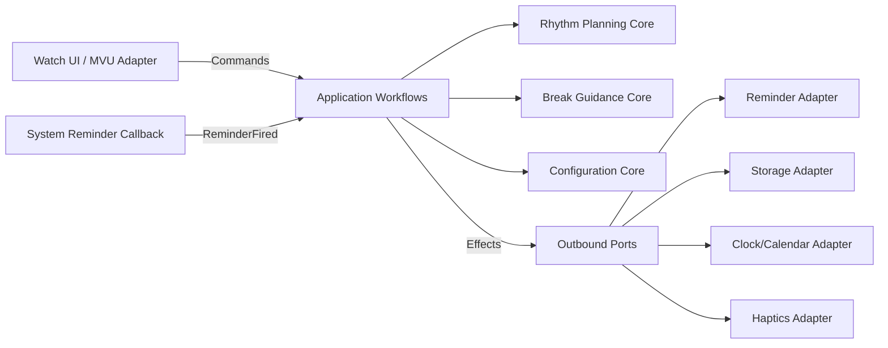
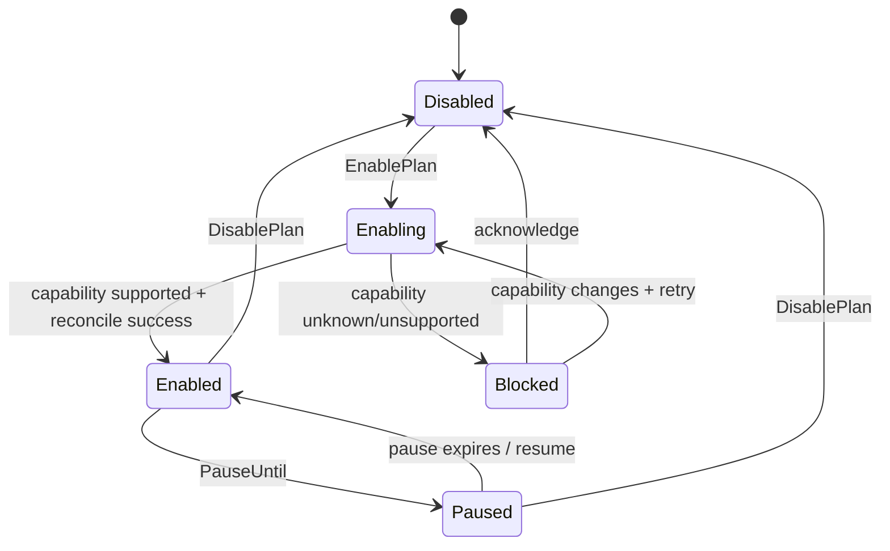
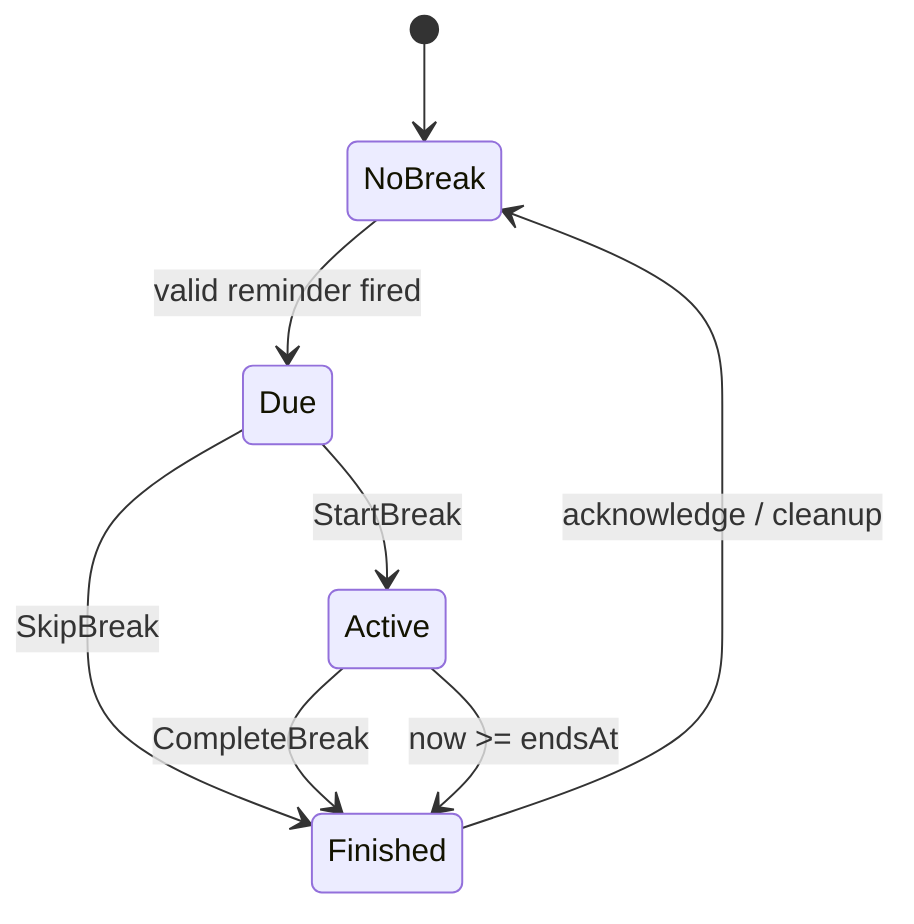
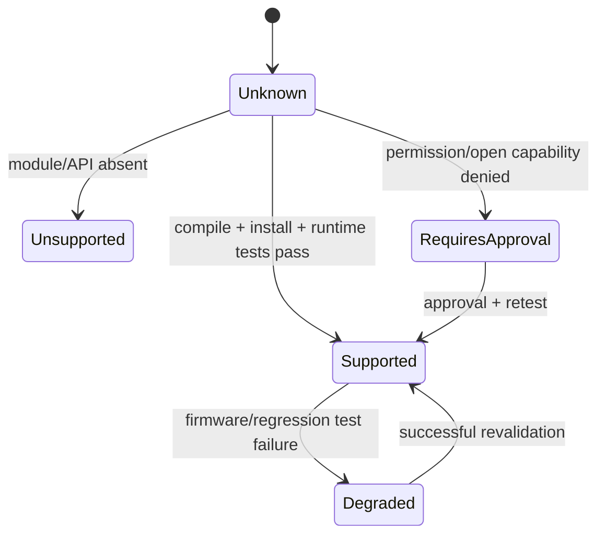
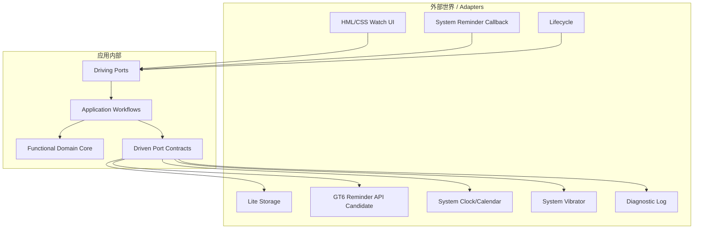

# Move25 GT6：FUNAR × Functional DDD × Hexagonal Architecture 开发总册

> 本文件由分册自动合并。分册是维护事实源。  
> 版本：v2.0；日期：2026-08-05。


---

<!-- source: README.md -->

# Move25 FUNAR 开发文档体系

> 文档体系：FUNAR × Functional DDD × Hexagonal Architecture  
> 项目：Move25 for HUAWEI WATCH GT 6  
> 版本：v2.0  
> 编制日期：2026-08-05  
> 状态：架构基线；后台提醒能力仍需 GT6 真机探针确认

## 1. 文档目的

本仓库不是传统的“页面—服务—数据库”式设计说明，而是一套以 **Functional Software Architecture（FUNAR）**、**Functional DDD** 与 **Hexagonal Architecture（Ports & Adapters）** 为核心的可执行架构规范。

Move25 的业务看似简单，但包含一个决定成败的技术不确定性：HUAWEI WATCH GT 6 的 Lite Wearable 普通第三方应用，是否拥有在息屏、应用退出和手机断连后仍能触发的系统级提醒能力。因此，本体系同时解决两类问题：

1. 把 25 分钟工作、5 分钟活动、工作时段、暂停和跳过等规则建模为可验证的纯函数领域；
2. 把提醒、振动、存储、系统时间和页面生命周期隔离为可替换适配器，并通过能力探针决定产品是否可以兑现“纯手表后台提醒”。

## 2. 架构核心句

> **不可变数据描述事实；纯函数产生决策；工作流组合函数；端口描述效果；适配器解释效果；系统能力以数据进入领域，而不是以隐式全局依赖渗入领域。**

> **必须参考`轻量级智能穿戴应用开发-穿戴-多端设备体验提升 - 华为HarmonyOS开发者.html`&`轻量级智能穿戴应用开发-穿戴-多端设备体验提升 - 华为HarmonyOS开发者_files`**

## 3. 项目架构定位

- **部署形态**：一个 Lite Wearable HAP；不是微服务。
- **逻辑形态**：模块化单体，由一个核心域和若干支持/通用子域组成。
- **领域内核**：无系统 API、无 UI、无文件 I/O、无全局可变状态、无后台计时器。
- **效果边界**：提醒、存储、时钟、振动和日志全部通过端口调用。
- **前端模式**：Model–View–Update（MVU）；`update` 为纯函数。
- **后台策略**：系统代理调度优先；禁止用长时间 `setTimeout`/`setInterval` 冒充可靠后台能力。
- **技术门禁**：提醒端口的真实适配器未通过 GT6 真机测试前，产品不得宣称可靠后台提醒。

## 4. 文档地图

| 目录 | 内容 |
|---|---|
| `product/` | 产品愿景、质量属性、PRD、验收边界 |
| `domain/` | 统一语言、上下文地图、代数数据模型、不变量、工作流、状态机、调度代数 |
| `architecture/` | 六边形架构、端口、适配器、函数式核心、MVU、持久化、能力门禁、低功耗、错误恢复 |
| `delivery/` | 华为技术事实、能力探针、测试、架构适应度函数、隐私、发布、仓库规范、Vibe Coding、实施路线 |
| `adr/` | 关键架构决策记录 |
| `templates/` | 环境、探针、端口契约、发布与 ADR 模板 |
| `references/` | 来源索引与需求—设计—测试追踪矩阵 |

## 5. 推荐阅读顺序

0. **`轻量级智能穿戴应用开发-穿戴-多端设备体验提升 - 华为HarmonyOS开发者.html`**
1. `00_ARCHITECTURE_CHARTER.md`
2. `product/01_PRODUCT_VISION_AND_QUALITY_ATTRIBUTES.md`
3. `domain/03_UBIQUITOUS_LANGUAGE.md`
4. `domain/05_FUNCTIONAL_DOMAIN_MODEL.md`
5. `architecture/10_HEXAGONAL_ARCHITECTURE.md`
6. `architecture/13_FUNCTIONAL_CORE_AND_EFFECT_SHELL.md`
7. `architecture/16_CAPABILITY_GATED_ARCHITECTURE.md`
8. `delivery/20_CAPABILITY_PROBE_PLAN.md`
9. `delivery/26_VIBE_CODING_PLAYBOOK.md`
10. `delivery/27_IMPLEMENTATION_ROADMAP.md`

## 6. 证据等级

| 等级 | 含义 | 处理规则 |
|---|---|---|
| `OFFICIAL_CONFIRMED` | 华为或架构原始资料明确确认 | 可写入正式设计 |
| `SDK_CONFIRMED` | 在当前安装 SDK 声明中找到并可编译 | 可进入适配器实现 |
| `DEVICE_CONFIRMED` | 已在目标 GT6 真机验证 | 可写入产品承诺 |
| `INFERRED` | 基于公开事实推断 | 必须标注，不能作为验收依据 |
| `UNKNOWN` | 尚无足够证据 | 必须通过探针或工单消除 |

## 7. 当前最重要结论

- GT6 的正式应用安装可以经华为运动健康应用市场覆盖 Android、iOS 和 HarmonyOS 配对生态。[H2]
- “柠檬喝水”证明 GT 系列存在手表端配置和提醒类产品，但官方说明其数据同步仅支持华为手机；它是产品标杆，不是公开提醒 API 的技术证明。[H3]
- 华为公开的 Lite Wearable 调试设备注册流程使用华为手机、HUAWEI Health 与 HUAWEI DevEco Assistant 获取 UDID。[H4]
- 标准 HarmonyOS 代理提醒能在应用后台或进程终止后由系统代理触发，但其 ArkTS API 和开放能力限制不能直接等同于 GT6 Lite Wearable 可用性。[H5]

完整来源见 `references/30_SOURCES.md`。


---

<!-- source: 00_ARCHITECTURE_CHARTER.md -->

# 架构宪章

> 文档体系：FUNAR × Functional DDD × Hexagonal Architecture  
> 项目：Move25 for HUAWEI WATCH GT 6  
> 版本：v2.0  
> 编制日期：2026-08-05  
> 状态：架构基线；后台提醒能力仍需 GT6 真机探针确认

## 1. 架构使命

Move25 的架构必须在极低资源和不确定平台能力下，提供可解释、可验证、低耗电的工作—活动节律提醒。架构的首要目标不是“代码能跑”，而是避免以下两类欺骗：

- **业务欺骗**：把“每 25 分钟提醒”错误实现成每 25 分钟开始下一次工作，而忽略 5 分钟活动，造成周期漂移；
- **技术欺骗**：用前台 JavaScript 定时器模拟后台提醒，在息屏或进程被回收时静默失效。

## 2. FUNAR 原则在本项目中的落地

FUNAR 强调不可变数据、纯函数、组合、类型/数据分析、组合子模型、代数结构、工作流、事件和 MVU。[A1][A2] 本项目采用以下对应关系：

| FUNAR 概念 | Move25 实践 |
|---|---|
| 不可变值 | 设置、领域状态、提醒计划均按值传递，不原地修改 |
| 纯函数 | 规则验证、日程生成、状态转换、计划差异计算 |
| 类型驱动设计 | 用带标签记录和智能构造器表达 `Result`、状态联合、命令、事件 |
| 组合子模型 | 工作块计划、工作日计划、周计划逐级组合 |
| 代数结构 | `ReminderPlan` 的“排序去重合并＋空计划”形成可组合结构 |
| 工作流 | 命令经过验证、决策、效果解释和结果回写 |
| 事件 | 状态演化与诊断使用显式领域事件 |
| MVU | 手表页面以 `Model + Msg -> Model + Effect` 驱动 |

## 3. Functional DDD 原则

- 先识别业务事件、语言和边界，再设计数据结构；
- 用值和函数表达领域，而不是以持久化表或 UI 页面反推领域；
- 通过智能构造器阻止非法值进入核心；
- 所有预期失败都进入显式 `Result`，不依赖异常作为正常控制流；
- 业务工作流是函数管道，不是带可变字段的“服务对象”；
- “让非法状态不可表示”在动态 Lite JavaScript 中降级为：构造器封闭、带标签联合、冻结约定、入口校验和测试保证。[A4]

## 4. Hexagonal Architecture 原则

Cockburn 的核心区分是“内部与外部”，而非 UI 层、业务层、数据层的上下堆叠。[A3]

- 领域内核不知道 HML、系统存储、振动 API 或提醒 API；
- 驱动端口接收用户动作、系统提醒回调和生命周期事件；
- 被驱动端口描述时钟、存储、提醒、振动和诊断能力；
- 真实适配器、模拟适配器和测试适配器遵守相同语义契约；
- 系统 API 的变化只能影响适配器，不应改变领域规则。

## 5. 非目标

- 不做云端、账号、跨设备同步、社交、排行榜；
- 不做持续传感器久坐识别；
- 不做医学诊断或治疗建议；
- 不为了“DDD”创建微服务、仓储类、实体类和多层 DTO；
- 不为了“函数式”引入 Lite 运行时不支持的大型 FP 库；
- 不在后台保持秒级倒计时或常亮动画。

## 6. 架构不可违背规则

1. `domain/` 实现不得导入任何 `@system.*`、`@ohos.*` 或 UI 模块。
2. 领域函数不得直接读取当前时间；时间必须作为值传入。
3. 领域函数不得直接写存储、振动或注册提醒；只能返回效果描述。
4. 长期提醒不得由 JavaScript 定时器承担。
5. 没有 `DEVICE_CONFIRMED` 证据，不得宣称提醒在息屏、杀进程或断开手机后可靠。
6. 任何降级模式必须显式展示，禁止静默从系统提醒退化为不可靠前台计时。
7. 所有提醒注册必须可重入、可对账、可修复。


---

<!-- source: product/01_PRODUCT_VISION_AND_QUALITY_ATTRIBUTES.md -->

# 产品愿景与质量属性

> 文档体系：FUNAR × Functional DDD × Hexagonal Architecture  
> 项目：Move25 for HUAWEI WATCH GT 6  
> 版本：v2.0  
> 编制日期：2026-08-05  
> 状态：架构基线；后台提醒能力仍需 GT6 真机探针确认

## 1. 产品愿景

为长时间办公的个人用户提供一个克制的腕上节律助手：在预设工作时间内，每完成一段专注工作后，以最小干扰提醒用户起身活动、伸展身体并远眺放松眼睛。

## 2. 产品承诺

- 默认节律：工作 25 分钟，活动 5 分钟；完整周期为 30 分钟。
- 日常核心功能尽可能完全在 GT6 上运行。
- 不要求配对手机安装 Move25 手机端应用。
- 不联网、不登录、不上传健康或行为数据。
- 不用持续传感器和后台轮询换取“智能感”。
- 用户看见的每个“已启用”都必须对应真实可验证的系统能力。

## 3. 质量属性场景

### QA-REL-01 后台提醒可靠性

- **刺激**：活动开始时间到达。
- **环境**：手表息屏、应用不在前台、手机蓝牙断开。
- **响应**：手表本地触发可感知提醒。
- **度量**：目标 GT6 真机连续三天无漏报；单次误差阈值由探针实测确定。
- **门禁**：未通过能力探针时，本场景标记为不可承诺。

### QA-POW-01 低功耗

- 平时无常驻 JS 执行、无持续网络、无持续传感器；
- 页面熄灭后不维持每秒刷新；
- 长期提醒委托给系统调度；
- 目标：在同等佩戴条件下，相对基线的额外耗电可接受，具体阈值通过 A/B 实测确定。

### QA-COMP-01 手机生态独立

正式安装后，Android 9+、iOS 13+ 与支持的 HarmonyOS 手机均可通过运动健康应用市场使用 GT6 应用市场。[H2]

### QA-MOD-01 可替换提醒实现

当提醒 API、权限或 GT6 固件能力变化时，仅替换 `ReminderSchedulerPort` 适配器；领域模型、日程算法和 UI 状态机不重写。

### QA-TEST-01 可测试性

至少 90% 的业务分支应由宿主环境中的纯函数测试覆盖；所有系统适配器有契约测试和 GT6 真机测试。

### QA-UX-01 低打扰

- 重要信息在圆屏安全区中心；
- 单次提醒正文不超过三行；
- 默认震动、默认无声音；
- 交互路径最多两步完成“开始活动/跳过”。

## 4. 成功与失败定义

### 成功

- 真机后台能力通过；
- 提醒计划不跨越午休和非工作日；
- 设置变更后旧提醒被对账移除；
- 断开手机后仍工作；
- 日常使用无明显续航损害。

### 失败

- 只能在应用前台提醒；
- 使用 `setInterval` 维持周期；
- 配对手机更换后核心功能失效；
- 系统提醒注册失败但 UI 仍显示“已启用”；
- 日程与系统注册状态无法对账。


---

<!-- source: product/02_PRD_AND_ACCEPTANCE.md -->

# 产品需求文档与验收标准

> 文档体系：FUNAR × Functional DDD × Hexagonal Architecture  
> 项目：Move25 for HUAWEI WATCH GT 6  
> 版本：v2.0  
> 编制日期：2026-08-05  
> 状态：架构基线；后台提醒能力仍需 GT6 真机探针确认

## 1. 用户故事

### US-01 配置工作节律

作为用户，我可以设置工作日、一个或多个工作时间块、工作分钟和活动分钟，使提醒符合我的作息。

**验收**：非法时间块不保存；重叠时间块被拒绝或规范化；保存后产生新的期望提醒计划。

### US-02 启用可靠提醒

作为用户，我启用计划后，可以明确知道系统是否具备可靠后台提醒能力。

**验收**：能力未知或不支持时不得显示“可靠提醒已启用”；错误必须可诊断。

### US-03 收到活动提醒

作为用户，到达活动开始点时，手表提示“起身活动 5 分钟、伸展身体、看看远处”。

### US-04 开始活动

点击开始后，系统记录一个活动会话及其绝对结束时间。屏幕可以正常熄灭；重新打开时根据结束时间重算剩余时间。

### US-05 跳过与暂停

用户可以跳过下一次、暂停一小时或暂停今天。暂停是领域事实，不通过删除 UI 倒计时临时实现。

### US-06 恢复与对账

应用启动、设置改变或系统状态不确定时，应用重新计算“期望提醒集合”，与系统已注册集合比较并修复差异。

## 2. MVP 范围

- 启用/关闭；
- 工作日选择；
- 上午与下午工作块，架构支持扩展到多个块；
- 默认 25/5，可选少量预设；
- 下一次活动时间；
- 跳过下一次、暂停一小时、暂停今天；
- 活动开始、提前完成；
- 走动、肩颈、髋部、眼睛四类简短建议；
- 本地持久化；
- 提醒能力诊断页。

## 3. 明确排除

- 云同步和手机伴随应用；
- 自动读取日历；
- 节假日在线服务；
- 持续加速度计检测；
- 完成率排行榜和复杂统计；
- 自定义音频作为 MVP 强依赖；
- 通知中的双自定义按钮作为强依赖。

## 4. 业务验收样例

给定工作块 `09:00–12:00`、节律 `25+5`，活动开始点为：

`09:25, 09:55, 10:25, 10:55, 11:25, 11:55`

最后一个点允许存在，因为 11:30 开始下一段工作不是必要条件；规则是“完整的 25 分钟工作段可在工作块结束前完成”。活动结束可能与块结束相同。

给定工作块 `09:00–09:20`，不生成提醒，因为完整工作段无法完成。

给定暂停截止 `10:10`，`09:55` 提醒被抑制，`10:25` 保留。


---

<!-- source: domain/03_UBIQUITOUS_LANGUAGE.md -->

# 统一语言

> 文档体系：FUNAR × Functional DDD × Hexagonal Architecture  
> 项目：Move25 for HUAWEI WATCH GT 6  
> 版本：v2.0  
> 编制日期：2026-08-05  
> 状态：架构基线；后台提醒能力仍需 GT6 真机探针确认

## 1. 核心术语

| 中文 | 英文/代码名 | 精确定义 |
|---|---|---|
| 节律 | `Rhythm` | 一段工作时长与一段活动时长的组合 |
| 工作段 | `FocusSegment` | 从周期起点开始的专注工作区间 |
| 活动段 | `BreakSegment` | 工作段结束后的活动区间 |
| 周期 | `Cycle` | `FocusSegment + BreakSegment` |
| 工作块 | `WorkBlock` | 一天中允许生成周期的半开区间 `[start, end)` |
| 工作日规则 | `WorkWeek` | 哪些星期允许生成计划 |
| 活动开始点 | `BreakStart` | 工作段结束时的领域时间点 |
| 提醒意图 | `ReminderIntent` | 领域希望系统在某时间触发的语义请求，不是系统通知对象 |
| 提醒计划 | `ReminderPlan` | 有序、去重的提醒意图集合 |
| 期望计划 | `DesiredPlan` | 依据当前设置、日期、暂停状态生成的领域计划 |
| 已注册计划 | `RegisteredPlan` | 系统适配器报告的实际注册集合 |
| 对账 | `Reconcile` | 计算期望集合与实际集合的差异并发出注册/取消效果 |
| 跳过下一次 | `SkipNext` | 抑制当前计划中的第一个未来活动开始点 |
| 暂停 | `Pause` | 在指定时间之前抑制活动提醒 |
| 活动会话 | `BreakSession` | 用户确认开始活动后形成的有限状态过程 |
| 能力 | `Capability` | 平台可验证的系统行为，例如后台精确定时、重启后保留 |
| 降级 | `DegradedMode` | 明确标注可靠性降低的运行方式，禁止静默启用 |

## 2. 禁用语言

下列词语容易掩盖真实语义，应避免：

- “后台保活”：本项目不追求保活，而追求系统代理调度；
- “计时器一直运行”：长期业务用绝对时间和系统提醒表达；
- “服务层”：必须说明是工作流函数、端口或适配器；
- “提醒对象”：区分领域 `ReminderIntent` 与平台请求结构；
- “每 25 分钟提醒”：准确说法是每个 30 分钟周期的第 25 分钟提醒；
- “支持”：必须附证据等级，例如 `SDK_CONFIRMED` 或 `DEVICE_CONFIRMED`。

## 3. 领域事件语言

事件使用已经发生的过去式：

- `ScheduleConfigured`
- `PlanEnabled`
- `PlanPausedUntil`
- `NextReminderSkipped`
- `ReminderPlanComputed`
- `ReminderRegistrationFailed`
- `BreakBecameDue`
- `BreakStarted`
- `BreakCompleted`
- `BreakSkipped`
- `CapabilityObserved`

事件不是 UI 点击日志，也不是任意调试字符串。


---

<!-- source: domain/04_CONTEXT_MAP.md -->

# 子域、限界上下文与上下文地图

> 文档体系：FUNAR × Functional DDD × Hexagonal Architecture  
> 项目：Move25 for HUAWEI WATCH GT 6  
> 版本：v2.0  
> 编制日期：2026-08-05  
> 状态：架构基线；后台提醒能力仍需 GT6 真机探针确认

## 1. 战略设计

Move25 是一个单用户、单设备、离线应用。DDD 的边界用于维护语义，而不是拆成网络服务。

### 核心域：Rhythm Planning

负责：

- 工作日与工作块规则；
- 节律合法性；
- 活动开始点生成；
- 暂停、跳过对计划的影响；
- 期望提醒计划与对账差异。

这是产品差异化和正确性的核心。

### 支持子域：Break Guidance

负责：

- 活动会话状态；
- 动作建议轮换；
- 活动结束计算；
- 完成/跳过语义。

### 支持子域：Configuration

负责：

- 输入校验；
- 设置快照；
- 配置版本迁移。

### 通用子域：Platform Integration

提醒、存储、时钟、振动、日志、导航和生命周期均属于外部技术能力，不进入核心域。

## 2. 上下文关系



## 3. 边界规则

- `Rhythm Planning` 不知道页面、通知标题或 HAP；
- `Break Guidance` 不负责决定系统是否支持结束提醒；它只产生意图；
- `Configuration` 不直接保存数据；保存是效果；
- 平台适配器不得重新实现工作块、暂停或跳过规则；
- UI 不直接读写存储或注册提醒。

## 4. 为什么不采用多服务

该系统没有独立伸缩、独立部署、团队自治或网络隔离需求。将限界上下文实现为同一 HAP 内的纯函数模块，可以保留 DDD 语义而避免分布式复杂性。


---

<!-- source: domain/05_FUNCTIONAL_DOMAIN_MODEL.md -->

# 函数式领域模型

> 文档体系：FUNAR × Functional DDD × Hexagonal Architecture  
> 项目：Move25 for HUAWEI WATCH GT 6  
> 版本：v2.0  
> 编制日期：2026-08-05  
> 状态：架构基线；后台提醒能力仍需 GT6 真机探针确认

## 1. 建模策略

Lite Wearable 使用 JavaScript，因此不能依赖编译器提供完整代数数据类型。架构文档先用代数形式表达，再用带 `tag` 的不可变记录和智能构造器实现。

## 2. 基础值类型

```text
MinuteOfDay      = integer where 0 <= value < 1440
PositiveMinutes  = integer where 1 <= value <= configuredLimit
LocalDate        = { year, month, day }
Weekday          = Mon | Tue | Wed | Thu | Fri | Sat | Sun
Instant          = epoch milliseconds
SemanticKey      = non-empty string
```

每个值必须由智能构造器创建：

```javascript
function ok(value) { return { tag: 'Ok', value: value }; }
function err(code, details) { return { tag: 'Err', error: { code: code, details: details } }; }

function minuteOfDay(value) {
  if (typeof value !== 'number' || value % 1 !== 0 || value < 0 || value >= 1440) {
    return err('INVALID_MINUTE_OF_DAY', value);
  }
  return ok({ tag: 'MinuteOfDay', value: value });
}
```

构造完成的领域值按不可变约定使用；不得原地修改。

## 3. 复合数据

```text
Rhythm = {
  focusMinutes: PositiveMinutes,
  breakMinutes: PositiveMinutes
}

WorkBlock = {
  start: MinuteOfDay,
  end: MinuteOfDay
}

ScheduleSettings = {
  enabled: Boolean,
  weekdays: Set<Weekday>,
  workBlocks: List<WorkBlock>,
  rhythm: Rhythm,
  version: SchemaVersion
}
```

## 4. 联合类型

### 能力状态

```text
ReminderCapability =
  | Unknown
  | Unsupported(reason)
  | RequiresApproval(details)
  | Supported(features)
  | Degraded(reason)
```

`features` 至少包含：

```text
maxPendingCount
supportsExactTimer
supportsCalendar
supportsRecurring
survivesAppExit
survivesPhoneDisconnect
survivesReboot
supportsActionButtons
supportsCustomSound
```

未知字段不得默认视为 `true`。

### 活动会话

```text
BreakSession =
  | NoBreak
  | Due(reminderKey, dueAt)
  | Active(sessionId, startedAt, endsAt, guidanceId)
  | Finished(sessionId, finishedAt, outcome)

Outcome = Completed | Skipped | Expired
```

### 领域结果

```text
Result<E, A> = Ok(A) | Err(E)
Option<A> = Some(A) | None
```

## 5. 命令、事件与效果

```text
Command =
  | ConfigureSchedule(input)
  | EnablePlan
  | DisablePlan
  | PauseUntil(instant)
  | SkipNext
  | StartBreak(reminderKey)
  | CompleteBreak
  | HandleReminderFired(reminderKey, firedAt)
  | ReconcilePlan(now)

Effect =
  | PersistSnapshot(snapshot)
  | QueryRegisteredReminders
  | RegisterReminders(intents)
  | CancelReminders(keys)
  | Vibrate(pattern)
  | Navigate(route)
  | EmitDiagnostic(entry)
```

## 6. 决策函数

核心形式：

```text
decide : State × Command × Facts -> Result<DomainError, Decision>
evolve : State × DomainEvent -> State
Decision = { events: List<DomainEvent>, effects: List<Effect> }
```

`Facts` 是已经由端口取得的值，例如当前时间、能力快照、已注册提醒；它不是隐式全局依赖。

## 7. 非法状态控制

动态语言中采用四层防线：

1. 所有外部输入先解析为领域值；
2. 领域模块不导出裸记录构造方式；
3. 联合值必须有受控 `tag`；
4. 入口处进行穷尽分支检查，未知 `tag` 直接形成显式错误。


---

<!-- source: domain/06_INVARIANTS_AND_POLICIES.md -->

# 领域不变量与策略

> 文档体系：FUNAR × Functional DDD × Hexagonal Architecture  
> 项目：Move25 for HUAWEI WATCH GT 6  
> 版本：v2.0  
> 编制日期：2026-08-05  
> 状态：架构基线；后台提醒能力仍需 GT6 真机探针确认

## 1. 强不变量

1. `WorkBlock.start < WorkBlock.end`。
2. 同一日的规范化工作块不重叠。
3. `focusMinutes > 0` 且 `breakMinutes > 0`。
4. 只在启用的星期生成提醒。
5. 只有完整工作段能在工作块结束前完成时，才生成活动开始点。
6. 语义键在一个计划内唯一。
7. 暂停截止时间之前的提醒不属于期望计划。
8. `SkipNext` 最多抑制一个未来提醒。
9. `Active.endsAt > Active.startedAt`。
10. 能力不是 `Supported` 时，不允许把计划状态表示为“可靠后台已启用”。

## 2. 策略与机制分离

### 领域策略

- 何时应提醒；
- 哪一条被跳过；
- 暂停如何影响计划；
- 活动建议如何轮换；
- 已注册集合与期望集合的语义差异。

### 平台机制

- 如何调用系统提醒 API；
- 如何震动；
- 如何持久化；
- 如何取得本地时间；
- 如何打开页面。

策略只能存在于纯核心，机制只能存在于适配器。

## 3. 默认业务策略

- 默认工作日：周一至周五；
- 默认工作块：09:00–12:00、13:30–18:00；
- 默认节律：25/5；
- 默认只预注册活动开始提醒；
- 用户开始活动后，若平台能力允许，再注册一次性活动结束提醒；
- 默认不播放声音；
- 提醒建议按确定性序列轮换，避免随机数依赖和不可复现测试。

## 4. 时间策略

- 领域日程以 `LocalDate + MinuteOfDay` 表达；
- 外部 `CalendarPort` 负责解析为 `Instant`；
- 不使用“上次触发时间 + 30 分钟”作为长期事实，以避免漂移；
- 应用启动和设置变化时，从规则重新推导计划；
- 系统时区变化或时间被手动修改后，下次激活执行全量对账。

## 5. 失败策略

- 输入错误：返回全部可定位验证错误；
- 存储错误：不丢弃内存中的旧有效配置；
- 注册部分成功：记录每个语义键的结果，并触发对账；
- 能力不支持：明确阻止启用可靠模式；
- 系统状态不可查询：保守地重建有限窗口内的计划，但必须防重复。


---

<!-- source: domain/07_COMMAND_EVENT_WORKFLOW_CATALOG.md -->

# 命令、事件与工作流目录

> 文档体系：FUNAR × Functional DDD × Hexagonal Architecture  
> 项目：Move25 for HUAWEI WATCH GT 6  
> 版本：v2.0  
> 编制日期：2026-08-05  
> 状态：架构基线；后台提醒能力仍需 GT6 真机探针确认

## 1. 工作流总式

```text
Input Adapter
  -> Parse/Validate
  -> Load Facts through Ports
  -> Pure Decide
  -> Interpret Effects
  -> Persist/Observe Results
  -> Reconcile if needed
  -> Render Model
```

## 2. ConfigureSchedule

**输入**：原始星期、工作块、节律。  
**纯步骤**：解析值 → 累积验证错误 → 规范化工作块 → 生成 `ScheduleConfigured`。  
**效果**：保存快照；如已启用，触发 `ReconcilePlan`。  
**错误**：无工作日、时间块重叠、非法分钟、持续时间越界。

## 3. EnablePlan

1. 读取能力快照；
2. 若不是 `Supported`，返回 `CAPABILITY_NOT_CONFIRMED`；
3. 产生 `PlanEnabled`；
4. 保存状态；
5. 计算有限调度窗口；
6. 对账系统提醒。

启用不是 UI 布尔值切换，而是一个需要能力前置条件的领域命令。

## 4. ReconcilePlan

输入：设置、暂停/跳过状态、当前日期范围、系统能力、已注册集合。  
输出：

```text
PlanDiff = {
  toRegister: ReminderIntent[],
  toCancel: SemanticKey[],
  unchanged: SemanticKey[]
}
```

对账函数必须满足幂等性：同一输入重复执行，第二次差异为空。

## 5. HandleReminderFired

- 通过语义键识别提醒；
- 验证它仍属于当前期望计划；
- 过期或已被暂停的回调只记录诊断，不启动活动会话；
- 有效回调产生 `BreakBecameDue` 和震动/导航效果；
- 不直接把系统通知对象写入领域状态。

## 6. StartBreak

- 从 `Due` 转为 `Active`；
- `endsAt = startedAt + breakDuration`；
- 选择确定性的指导内容；
- 持久化活动会话；
- 若能力支持一次性结束提醒，产生注册效果；
- UI 每次激活根据 `endsAt - now` 显示剩余时间。

## 7. PauseUntil / SkipNext

- 暂停以绝对时间表达；
- 跳过以目标语义键表达，不能只保存布尔值；
- 两者变化后重新生成期望计划并对账；
- 过去的暂停和跳过标记在演化时清理。

## 8. 效果解释顺序

首选顺序：

1. 保存新的领域快照；
2. 执行外部效果；
3. 保存外部结果摘要；
4. 如中途崩溃，下次启动依靠对账恢复。

系统提醒注册和本地存储无法形成真正原子事务，因此架构以幂等语义键和最终对账保证一致性。


---

<!-- source: domain/08_STATE_MACHINES.md -->

# 领域状态机

> 文档体系：FUNAR × Functional DDD × Hexagonal Architecture  
> 项目：Move25 for HUAWEI WATCH GT 6  
> 版本：v2.0  
> 编制日期：2026-08-05  
> 状态：架构基线；后台提醒能力仍需 GT6 真机探针确认

## 1. 计划生命周期



`Enabling` 是必要状态，防止 UI 在系统注册尚未完成时提前显示“已启用”。

## 2. 活动会话状态机



## 3. 能力状态机



## 4. 状态机规则

- 系统 API 错误不能直接改变业务状态，必须先映射为领域事件；
- 未知状态不是支持状态；
- 任何状态迁移都要有命令或事件来源；
- 重启恢复时，从持久化快照和当前时间重新归约状态；
- 过期的 `Active` 会话恢复为 `Finished(Expired)`，而不是重新启动 5 分钟。


---

<!-- source: domain/09_SCHEDULING_ALGEBRA.md -->

# 提醒调度代数与组合子模型

> 文档体系：FUNAR × Functional DDD × Hexagonal Architecture  
> 项目：Move25 for HUAWEI WATCH GT 6  
> 版本：v2.0  
> 编制日期：2026-08-05  
> 状态：架构基线；后台提醒能力仍需 GT6 真机探针确认

## 1. 核心函数

```text
generateBlockPlan : LocalDate × WorkBlock × Rhythm -> ReminderPlan
generateDayPlan   : LocalDate × List<WorkBlock> × Rhythm -> ReminderPlan
generateRangePlan : DateRange × ScheduleSettings -> ReminderPlan
applySuppression  : ReminderPlan × Pause × Skip -> ReminderPlan
diffPlans         : DesiredPlan × RegisteredPlan -> PlanDiff
```

这些函数均为纯函数。

## 2. 工作块算法

```text
cycle = focus + break
cycleStart = block.start
while cycleStart + focus <= block.end:
    emit BreakStart(cycleStart + focus)
    cycleStart = cycleStart + cycle
```

使用分钟代数完成本地日程推导，不在循环中读取系统时间。

## 3. `ReminderPlan` 的组合

定义：

```text
emptyPlan = []
combine(a, b) = sortByTime(uniqueBySemanticKey(a ++ b))
```

它满足工程上需要的性质：

- 结合律：工作块组合顺序不影响最终计划；
- 单位元：与空计划组合不改变结果；
- 幂等去重：同一计划重复组合不产生重复提醒。

因此上午、下午、每日和每周计划可以使用同一个组合器逐级构建。这里使用代数是为了降低规则复杂度，不是为了追求术语。

## 4. 语义键

建议格式：

```text
break-start:<scheduleVersion>:<localDate>:<minuteOfDay>
break-end:<sessionId>
```

语义键用于：

- 防重复注册；
- 系统回调映射；
- 跳过下一次；
- 计划差异计算；
- 诊断。

不得以系统返回的临时 reminderId 作为唯一领域身份；系统 ID 只存于适配器映射。

## 5. 能力驱动的计划策略

```text
chooseSchedulingStrategy(capability, desiredPlan) -> Result<StrategyError, RegistrationStrategy>
```

可能策略：

- `RecurringCalendarStrategy`：平台明确支持按星期重复；
- `RollingWindowStrategy(days)`：按最大待处理数量选择 1–N 天窗口；
- `SingleNextStrategy`：只有系统保证回调执行和续链可靠时才允许；
- `UnsupportedStrategy`：拒绝启用可靠模式。

标准 HarmonyOS 代理提醒文档提到普通应用的有效未过期提醒数量上限为 30，但该限制不能直接套用到 GT6 Lite；能力探针必须记录实际限制。[H5]

## 6. 性质测试

- 生成点严格递增；
- 所有点都位于工作块内；
- 相邻点间隔等于完整周期；
- 组合满足结合律和单位元；
- `diffPlans(p, p)` 为空；
- 对 `diff` 应用后再次对账为空；
- 暂停和跳过只删除，不新增提醒。


---

<!-- source: architecture/10_HEXAGONAL_ARCHITECTURE.md -->

# 六边形架构总览

> 文档体系：FUNAR × Functional DDD × Hexagonal Architecture  
> 项目：Move25 for HUAWEI WATCH GT 6  
> 版本：v2.0  
> 编制日期：2026-08-05  
> 状态：架构基线；后台提醒能力仍需 GT6 真机探针确认

## 1. 内外边界



## 2. 驱动端口

- `ConfigurationCommandPort`
- `PlanControlPort`
- `BreakSessionPort`
- `ReminderCallbackPort`
- `LifecyclePort`
- `CapabilityProbePort`

它们是语义函数，而不是框架控制器类。

## 3. 被驱动端口

- `ClockPort`
- `CalendarPort`
- `SettingsStorePort`
- `ReminderSchedulerPort`
- `HapticsPort`
- `DiagnosticPort`
- `NavigationPort`

## 4. 依赖方向

- 适配器依赖端口契约；
- 工作流依赖领域函数和端口参数；
- 领域函数不依赖工作流或适配器；
- 不允许核心通过 `require` 动态寻找系统 API；
- 系统模块是否存在应在独立构建探针或适配器构建中确认。

## 5. 运行组合根

应用启动时的唯一组合根负责构造适配器并注入工作流：

```javascript
function createApplication(deps) {
  return {
    handleCommand: createCommandHandler(deps),
    handleReminder: createReminderHandler(deps),
    reconcile: createReconcileWorkflow(deps)
  };
}
```

`deps` 是普通记录，不使用服务定位器和隐藏单例。

## 6. 测试替换

同一端口可以连接：

- 内存存储适配器；
- 固定时钟适配器；
- 记录调用的提醒假适配器；
- 真实 GT6 适配器。

这正是 Ports & Adapters 允许应用脱离 UI 和设备进行回归测试的目标。[A3]


---

<!-- source: architecture/11_PORT_CONTRACTS.md -->

# 端口契约

> 文档体系：FUNAR × Functional DDD × Hexagonal Architecture  
> 项目：Move25 for HUAWEI WATCH GT 6  
> 版本：v2.0  
> 编制日期：2026-08-05  
> 状态：架构基线；后台提醒能力仍需 GT6 真机探针确认

## 1. 契约原则

端口定义业务需要的最小语义，不复制平台 API 的形状。每个端口必须说明：输入、输出、幂等性、错误、时序、容量和证据等级。

## 2. `ClockPort`

```text
now() -> Result<ClockError, Instant>
```

- 必须单调地反映当前墙上时间，但领域不假设连续调用严格递增；
- 测试适配器可固定时间；
- 不在核心直接使用 `Date.now()`。

## 3. `CalendarPort`

```text
today(instant) -> LocalDate
weekday(localDate) -> Weekday
resolve(localDate, minuteOfDay) -> Result<TimeResolutionError, Instant>
```

处理时区、非法本地时间和系统时间变化。

## 4. `SettingsStorePort`

```text
loadSnapshot() -> Result<StoreError, Option<Snapshot>>
saveSnapshot(expectedRevision, snapshot) -> Result<StoreError, Revision>
```

- 使用版本号防止旧页面覆盖新状态；
- 保存必须是完整快照或可验证的原子替换；
- 适配器负责序列化，领域不接触 JSON 字符串。

## 5. `ReminderSchedulerPort`

```text
probeCapabilities() -> Result<ReminderError, ReminderCapability>
listRegistered(namespace) -> Result<ReminderError, RegisteredReminder[]>
register(intents) -> Result<ReminderError, RegistrationReport>
cancel(keys) -> Result<ReminderError, CancellationReport>
```

契约要求：

- 每个意图按语义键幂等；
- 部分成功必须逐项报告；
- 返回系统 ID 与语义键映射；
- 不保证能力的字段必须返回 `Unknown`，不能猜测；
- 适配器不得通过 JavaScript 长计时器实现。

## 6. `HapticsPort`

```text
vibrate(pattern) -> Result<HapticsError, Unit>
```

模式只使用领域语义：`BreakStart`, `BreakEnd`, `Error`。适配器映射到设备支持的具体形式。

## 7. `DiagnosticPort`

```text
append(entry) -> Result<DiagnosticError, Unit>
readRecent(limit) -> Result<DiagnosticError, Entry[]>
```

诊断不得包含健康数据、账号或无关个人信息。

## 8. 契约版本

每个端口有显式版本，例如 `ReminderSchedulerPort/v1`。适配器升级时，优先保持端口不变；确需改变语义时新增版本并记录 ADR。


---

<!-- source: architecture/12_ADAPTER_CATALOG.md -->

# 适配器目录与反腐层

> 文档体系：FUNAR × Functional DDD × Hexagonal Architecture  
> 项目：Move25 for HUAWEI WATCH GT 6  
> 版本：v2.0  
> 编制日期：2026-08-05  
> 状态：架构基线；后台提醒能力仍需 GT6 真机探针确认

## 1. 驱动适配器

### Watch UI Adapter

- 将点击、选择器和页面生命周期转为领域命令；
- 将领域 `ViewModel` 转为 HML 可绑定数据；
- 不包含日程计算和提醒注册。

### Reminder Callback Adapter

- 将平台回调解析为语义键和触发时间；
- 验证来源、格式和版本；
- 调用 `ReminderCallbackPort`；
- 平台对象不得穿透到领域。

### Lifecycle Adapter

在应用启动、恢复和设置页面保存后触发恢复/对账工作流。

## 2. 被驱动适配器

### Lite Storage Adapter

- 负责 JSON 编解码、校验和迁移；
- 采用单快照或双槽写入策略，避免部分写入；
- 不把缺失字段静默填成可能改变业务的默认值。

### Reminder Adapter

这是高风险反腐层：

- 当前 API 名称、权限、请求结构和限制都封装在此；
- 先通过独立构建分支确认模块存在；
- 再通过真机确认后台行为；
- 任何标准 Wearable ArkTS 示例不得直接进入 Lite 适配器。

### Haptics Adapter

只负责把语义模式映射为设备振动调用；免打扰和设备拒绝应返回可诊断结果。

### Clock/Calendar Adapter

把系统日期时间转换为领域 `LocalDate`、`MinuteOfDay` 和 `Instant`。

## 3. 反腐层规则

- 平台枚举不进入领域；
- 平台错误码映射为稳定内部错误码，并保留原始码供诊断；
- 平台 ID 不成为领域身份；
- 平台容量和特性转换为 `ReminderCapability` 数据；
- 所有适配器必须通过端口契约测试。

## 4. 适配器成熟度

| 适配器 | 初始状态 | 升级条件 |
|---|---|---|
| 内存存储 | 可立即实现 | 单元测试通过 |
| Lite 本地存储 | 待 SDK 验证 | 编译 + 模拟器 + 真机 |
| 假提醒适配器 | 可立即实现 | 契约测试通过 |
| GT6 提醒适配器 | `UNKNOWN` | 能力探针全部门禁通过 |
| 振动适配器 | 待 SDK/真机确认 | 权限 + 真机振动 |
| 自定义声音 | 不进入 MVP | 明确能力和功耗测试通过 |


---

<!-- source: architecture/13_FUNCTIONAL_CORE_AND_EFFECT_SHELL.md -->

# 函数式核心与效果外壳

> 文档体系：FUNAR × Functional DDD × Hexagonal Architecture  
> 项目：Move25 for HUAWEI WATCH GT 6  
> 版本：v2.0  
> 编制日期：2026-08-05  
> 状态：架构基线；后台提醒能力仍需 GT6 真机探针确认

## 1. 基本形态

```text
Pure Core:
  validate -> normalize -> decide -> evolve -> plan -> diff -> render model

Effect Shell:
  clock -> storage -> reminder API -> vibration -> navigation -> diagnostics
```

## 2. 效果作为数据

领域不执行副作用，而是返回效果描述：

```javascript
function decision(events, effects) {
  return { events: events, effects: effects };
}

function persistSnapshot(snapshot) {
  return { tag: 'PersistSnapshot', snapshot: snapshot };
}

function registerReminders(intents) {
  return { tag: 'RegisterReminders', intents: intents };
}
```

效果解释器集中处理：

```javascript
function interpret(effect, ports) {
  switch (effect.tag) {
    case 'PersistSnapshot': return ports.store.saveSnapshot(effect.snapshot);
    case 'RegisterReminders': return ports.reminders.register(effect.intents);
    case 'Vibrate': return ports.haptics.vibrate(effect.pattern);
    default: return err('UNKNOWN_EFFECT', effect.tag);
  }
}
```

## 3. 依赖注入

FUNAR 课程把函数工作流、控制流抽象和依赖注入列为宏架构内容。[A2] 本项目通过函数参数注入端口，而不是构造器注入类：

```javascript
function createReconcileWorkflow(ports) {
  return function reconcile(input) {
    // 取得事实 -> 调用纯函数 -> 解释效果
  };
}
```

## 4. 为什么不用 Free Monad 等复杂抽象

Lite JavaScript 运行时和项目规模不需要大型函数式库。效果联合类型加解释器已经提供：

- 可测试性；
- 效果可观察；
- 依赖显式；
- 适配器可替换；
- 控制复杂度可接受。

架构追求函数式语义，不追求语言技巧。

## 5. 故障恢复

外部效果可能部分失败。工作流不得假设“效果列表全部原子成功”。解释器返回逐项报告，应用形成事件：

- `SnapshotPersisted`
- `ReminderRegistered`
- `ReminderRegistrationFailed`
- `PlanReconciliationIncomplete`

下次激活重新对账，恢复到期望状态。


---

<!-- source: architecture/14_MVU_FRONTEND_ARCHITECTURE.md -->

# MVU 前端架构

> 文档体系：FUNAR × Functional DDD × Hexagonal Architecture  
> 项目：Move25 for HUAWEI WATCH GT 6  
> 版本：v2.0  
> 编制日期：2026-08-05  
> 状态：架构基线；后台提醒能力仍需 GT6 真机探针确认

## 1. 模型

```text
UiModel = {
  route,
  planStatus,
  nextBreakText,
  remainingSeconds,
  capabilityBanner,
  currentGuidance,
  errors,
  isBusy
}
```

UI 模型是领域状态的投影，不是业务事实源。

## 2. 消息

```text
Msg =
  | AppOpened(now)
  | StartPressed
  | SkipPressed
  | PauseTodayPressed
  | SettingsSaved(rawInput)
  | TickVisible(now)
  | EffectCompleted(effectId, result)
```

`TickVisible` 只允许在页面可见时更新显示；它不承担后台提醒。

## 3. 更新函数

```text
update : UiModel × Msg -> { model: UiModel, commands: UiCommand[] }
```

- 纯函数；
- 不调用系统 API；
- 不直接保存；
- 不读取全局时间；
- 任何异步结果通过消息返回。

## 4. 页面

### 首页

- 下次活动时间；
- 计划状态；
- 立即活动；
- 暂停今天；
- 设置与诊断入口。

### 活动提醒页

- “该活动了”；
- 三行以内建议；
- 开始 5 分钟；
- 跳过。

### 活动页

- 剩余时间；
- 一组动作建议；
- 提前完成。

### 设置页

使用预设值和有限选择，不在圆屏上实现复杂自由输入。

## 5. 息屏策略

- 记录 `endsAt`；
- 页面可见时计算 `max(0, endsAt - now)`；
- 页面隐藏后停止刷新；
- 不请求活动全程常亮；
- 结束提醒由系统能力决定。

## 6. 错误呈现

- 能力未确认：黄色/中性提示，不显示“已启用”；
- 注册失败：显示简短错误和“重试/诊断”；
- 不把底层错误码直接作为主文案；诊断页保留原始信息。


---

<!-- source: architecture/15_PERSISTENCE_AND_MIGRATION.md -->

# 持久化、快照与迁移

> 文档体系：FUNAR × Functional DDD × Hexagonal Architecture  
> 项目：Move25 for HUAWEI WATCH GT 6  
> 版本：v2.0  
> 编制日期：2026-08-05  
> 状态：架构基线；后台提醒能力仍需 GT6 真机探针确认

## 1. 数据所有权

本地快照是领域配置和运行意图的事实源；系统提醒集合是可重建投影。

## 2. 快照结构

```text
Snapshot = {
  schemaVersion,
  revision,
  settings,
  planLifecycle,
  pause,
  skip,
  breakSession,
  capabilityObservation,
  reminderIdMap,
  diagnosticsCursor
}
```

`reminderIdMap` 属于适配器数据，可与领域快照分区存储；领域只依赖语义键。

## 3. 保存策略

- 每次保存完整、已验证快照；
- 写入临时槽，校验后切换活动槽；
- 保存失败时保留上一个有效版本；
- 读取时先解析，再迁移，再验证；
- 不允许“解析失败后全部恢复默认”而不告知用户。

## 4. 迁移函数

```text
migrate : RawSnapshot -> Result<MigrationError, CurrentSnapshot>
```

迁移是纯函数，按版本逐级执行：`v1 -> v2 -> v3`。每级有固定测试样本。

## 5. 重启恢复

1. 读取并验证快照；
2. 获取当前时间；
3. 归约过期暂停、跳过和活动会话；
4. 重新生成期望计划；
5. 与系统投影对账；
6. 更新 UI 模型。

## 6. 数据最小化

只保存应用运行所需设置、少量诊断和当前状态；默认不保存长期行为历史。若以后增加统计，应单独进行隐私和功耗决策。


---

<!-- source: architecture/16_CAPABILITY_GATED_ARCHITECTURE.md -->

# 能力门禁架构

> 文档体系：FUNAR × Functional DDD × Hexagonal Architecture  
> 项目：Move25 for HUAWEI WATCH GT 6  
> 版本：v2.0  
> 编制日期：2026-08-05  
> 状态：架构基线；后台提醒能力仍需 GT6 真机探针确认

## 1. 问题

产品依赖一个尚未确认的能力：GT6 Lite Wearable 普通三方应用能否在息屏、应用退出、手机断连后由系统触发提醒。把它隐藏在实现细节中会导致架构建立在幻觉上。

## 2. 能力即数据

系统能力由适配器探测并转为不可变领域值：

```text
Supported({
  exactness,
  maxPendingCount,
  survivesAppExit,
  survivesPhoneDisconnect,
  survivesReboot,
  recurringModes
})
```

能力数据参与纯策略选择：

```text
chooseMode(capability, settings) -> SupportedMode | BlockedMode | DegradedMode
```

## 3. 门禁层级

### G0 工程基线

Lite 工程可编译、签名、安装和启动。

### G1 模块可见

目标提醒模块在当前 Lite SDK 中可静态导入；不能靠运行时 `try/catch require()` 探测不存在模块。

### G2 权限与开放能力

调用不因权限、签名或开放能力被拒绝。

### G3 前台触发

60 秒提醒在应用前台触发。

### G4 后台触发

返回表盘和息屏后触发。

### G5 进程独立

应用被移出最近任务或进程终止后触发。

### G6 手机独立

断开手机蓝牙后触发。

### G7 重启与容量

确认重启保留语义、最大数量、重复规则和误差。

只有 G0–G6 全部通过，才能进入 Standalone MVP。

## 4. 降级规则

- G1 失败：停止正式 UI 开发，提交华为工单；
- G2 失败：申请开放能力并保留探针；
- G4/G5 失败：不得使用长 JS 定时器替代；
- G6 失败：架构不再满足跨手机独立目标，需要重新决策；
- 任何降级模式必须向用户显示“仅前台有效”等准确状态。

## 5. “柠檬喝水”的正确使用方式

官方说明它能在手表内设置喝水量并由手表提醒，但数据同步仅支持华为手机。[H3] 因此：

- 可参考其极简提醒产品形态；
- 不可据此推断它使用公开 Lite 提醒 API；
- 不可据此推断所有功能完全不依赖手机；
- 必须以自己的 SDK 和 GT6 探针结果为准。


---

<!-- source: architecture/17_LOW_POWER_ARCHITECTURE.md -->

# 低功耗架构

> 文档体系：FUNAR × Functional DDD × Hexagonal Architecture  
> 项目：Move25 for HUAWEI WATCH GT 6  
> 版本：v2.0  
> 编制日期：2026-08-05  
> 状态：架构基线；后台提醒能力仍需 GT6 真机探针确认

## 1. 功耗预算原则

功耗是架构约束，不是发布前优化。每项功能都必须说明唤醒、CPU、屏幕、传感器、无线和存储写入成本。

## 2. 允许的运行时活动

- 用户打开页面时执行；
- 设置保存和计划对账时短时执行；
- 系统提醒回调时执行；
- 活动页可见时低频更新显示；
- 必要的少量本地写入。

## 3. 禁止模式

- 后台秒级或分钟级轮询；
- 持续 `setInterval`/长 `setTimeout`；
- 为判断是否久坐而持续读取加速度计；
- 网络心跳；
- 活动 5 分钟期间强制常亮；
- 长动画、复杂粒子和高频进度重绘；
- 每次可见倒计时跳动都写入存储。

## 4. 提醒数量优化

调度策略由能力决定：

- 若支持周重复，注册固定时间规则；
- 若有数量限制，注册滚动窗口；
- 默认不预注册所有活动结束提醒；
- 用户开始活动后才注册一次结束提醒；
- 通过语义键避免重复注册。

## 5. UI 功耗

- OLED 友好深色背景，但不把“黑色”当作唯一优化；
- 内容集中在圆屏安全区；
- 静态文本优先；
- 屏幕熄灭后停止可见计时更新；
- 不使用常亮显示作为核心功能。

## 6. 评测方法

- 同一手表、相同电量区间、相同佩戴和通知条件；
- A：未安装/禁用 Move25；B：启用标准工作日计划；
- 至少各运行三个工作日；
- 记录起止电量、实际提醒次数、屏幕主动查看次数和异常；
- 报告差异和环境，不使用单日偶然值下结论。

华为 Lite Wearable 模拟器可模拟屏幕、电池和部分传感器状态，但功耗结论必须来自真机。[H6]


---

<!-- source: architecture/18_ERROR_MODEL_AND_RESILIENCE.md -->

# 错误模型、一致性与恢复

> 文档体系：FUNAR × Functional DDD × Hexagonal Architecture  
> 项目：Move25 for HUAWEI WATCH GT 6  
> 版本：v2.0  
> 编制日期：2026-08-05  
> 状态：架构基线；后台提醒能力仍需 GT6 真机探针确认

## 1. 错误分类

```text
DomainError
  - InvalidSchedule
  - CapabilityNotConfirmed
  - InvalidTransition
  - ReminderNoLongerExpected

PortError
  - ClockUnavailable
  - StoreReadFailed / StoreWriteFailed
  - ReminderPermissionDenied
  - ReminderCapacityExceeded
  - ReminderUnsupported
  - HapticsRejected

IntegrationError
  - PlatformPayloadInvalid
  - UnknownSystemCode
  - PartialRegistration
```

## 2. Result 管道

预期错误通过 `Result` 传播：

```text
parse -> validate -> decide -> execute -> reconcile
```

异常只用于程序缺陷或运行时不可恢复故障，并在适配器边界转换为稳定错误。

## 3. 一致性模型

本地快照与系统提醒无法原子提交，采用：

- 语义键；
- 幂等注册/取消；
- 逐项结果；
- 启动对账；
- 有界重试；
- 失败可见。

## 4. 重试策略

- 输入/权限错误不自动重试；
- 暂时性系统错误可在本次会话有限重试；
- 不在后台创建无限重试循环；
- 重试使用相同语义键；
- 超过阈值后进入 `Degraded` 并要求用户打开诊断页。

## 5. 时间异常

- 回调早于预期：记录并按容差策略决定；
- 回调明显迟到：若已超出活动窗口，只记录过期；
- 系统时间回拨：下次激活全量重算；
- 时区变化：重新解析未来本地计划；
- 重复回调：按语义键和会话状态幂等处理。


---

<!-- source: delivery/19_TECHNICAL_FEASIBILITY_AND_EVIDENCE.md -->

# 技术可行性与华为证据基线

> 文档体系：FUNAR × Functional DDD × Hexagonal Architecture  
> 项目：Move25 for HUAWEI WATCH GT 6  
> 版本：v2.0  
> 编制日期：2026-08-05  
> 状态：架构基线；后台提醒能力仍需 GT6 真机探针确认

## 1. 已确认事实

### E-HW-01 跨手机应用市场

华为 GT6 兼容性清单显示，HarmonyOS、Android 9+ 和 iOS 13+ 配对场景均支持运动健康 App 中的应用市场。[H2]

### E-HW-02 GT 系列应用安装路径

GT 系列手表侧不直接安装华为应用市场；用户通过运动健康 App 的设备详情页进入应用市场安装。[H3]

### E-HW-03 柠檬喝水

官方说明可在手表应用内设置喝水量并由手表提醒；手表与运动健康正常连接时可同步数据，且该同步功能仅华为手机支持。[H3]

### E-HW-04 Lite Wearable 调试设备注册

华为官方 AGC 文档要求在华为手机上使用 HUAWEI DevEco Assistant 和 HUAWEI Health 配对运动手表，随后读取型号和 UDID。[H4]

### E-HW-05 Lite Wearable 模拟器

DevEco Studio 提供 Huawei Lite Wearable Simulator，可运行/调试 Lite HAP 并模拟屏幕、电池和部分传感器状态。[H6]

### E-HW-06 标准代理提醒

标准 HarmonyOS Agent-powered Reminder 可在应用后台或进程终止后由系统发送提醒，并有场景、权限和数量管控。[H5]

## 2. 未确认事实

- `@ohos.reminderAgentManager` 或 `@kit.BackgroundTasksKit` 是否能在 GT6 Lite JS FA 工程中编译；
- 普通开发者是否能获得对应开放能力；
- GT6 是否支持应用退出、断手机后的本地提醒；
- 最大提醒数和重复规则；
- 重启后是否保留；
- 自定义震动、提示音、通知按钮和全屏跳转能力。

## 3. 技术路线

```text
DevEco Studio
  + [Lite] Empty Ability
  + Lite Wearable JS/类 Web UI 工程
  + config.json
  + HUAWEI DevEco Assistant 真机安装链路
```

具体 SDK 版本不得从手表“6.1.0”文本直接推导，必须记录实际安装的 Compatible SDK 和模板。

## 4. 可行性结论

- 纯手表产品方向：合理；
- 跨配对手机日常安装：官方支持；
- 纯手表可靠后台提醒：仍为技术门禁；
- 在门禁通过前，项目可完成全部纯领域、UI 原型、存储和假适配器，但不能承诺产品最终可用。


---

<!-- source: delivery/20_CAPABILITY_PROBE_PLAN.md -->

# GT6 能力探针计划

> 文档体系：FUNAR × Functional DDD × Hexagonal Architecture  
> 项目：Move25 for HUAWEI WATCH GT 6  
> 版本：v2.0  
> 编制日期：2026-08-05  
> 状态：架构基线；后台提醒能力仍需 GT6 真机探针确认

## 1. 探针原则

每个实验只改变一个变量。不得把通知、代理提醒、振动、权限和完整 UI 混入同一 HAP，以免无法判断失败层级。

## 2. Probe 0：基线工程

目标：

- `[Lite] Empty Ability` 编译；
- HAP 签名和安装；
- 页面启动；
- 日志读取；
- 本地存储和振动分别验证。

输出：环境记录、HAP、日志、真机截图、结果模板。

## 3. Probe 1：模块编译

从基线建立独立分支，只加入一个静态导入候选。不存在模块时，构建失败本身就是结论；运行时 `try/catch require()` 不能捕获编译期模块解析失败。

候选模块必须来自当前 SDK 搜索结果，不能由 AI 猜测。

## 4. Probe 2：权限/开放能力

模块可编译且 HAP 可安装后：

- 声明最小权限；
- 在 AGC 申请所需开放能力；
- 注册最简单的 60 秒提醒；
- 不加入按钮、自定义音频和全屏跳转。

## 5. Probe 3：行为矩阵

| 场景 | 通过标准 |
|---|---|
| 应用前台 | 到点触发 |
| 返回表盘 | 到点触发 |
| 手表息屏 | 到点唤醒/震动，按系统策略显示 |
| 应用退出 | 不依赖应用进程仍触发 |
| 手机蓝牙断开 | 本地仍触发 |
| 手表重启 | 明确记录保留或不保留 |
| 免打扰 | 记录系统抑制语义，不错误归因 |
| 低电量模式 | 记录误差和是否触发 |

## 6. Probe 4：容量与精度

- 分别注册 1、5、15、30 及设备允许的更多提醒；
- 记录最大成功数、错误码、误差；
- 验证重复时间、取消、更新和重启；
- 不将标准 HarmonyOS 文档的 30 条上限直接视为 GT6 事实。[H5]

## 7. 决策输出

```text
CapabilityVerdict =
  | StandaloneApproved
  | ApprovalRequired
  | ForegroundOnly
  | PhoneDependent
  | Unsupported
```

只有 `StandaloneApproved` 进入正式 MVP。

## 8. 开发设备

官方运动手表注册路径使用华为手机上的 HUAWEI DevEco Assistant 与 HUAWEI Health。[H4] vivo X200 可以继续日常配对，但开发阶段应准备兼容该流程的华为手机。


---

<!-- source: delivery/21_TEST_STRATEGY.md -->

# 测试策略

> 文档体系：FUNAR × Functional DDD × Hexagonal Architecture  
> 项目：Move25 for HUAWEI WATCH GT 6  
> 版本：v2.0  
> 编制日期：2026-08-05  
> 状态：架构基线；后台提醒能力仍需 GT6 真机探针确认

## 1. 测试金字塔

### 纯领域测试

- 智能构造器；
- 工作块规范化；
- 日程生成；
- 暂停/跳过；
- 状态机；
- 计划差异；
- 快照迁移。

### 工作流测试

使用固定时钟、内存存储和记录型提醒适配器，验证命令产生的事件、效果顺序和恢复行为。

### 端口契约测试

所有适配器必须运行相同契约套件。例如提醒端口必须证明语义键幂等、部分失败可见、取消后列表一致。

### 模拟器测试

页面、路由、存储、不同分辨率、屏幕开关和基本生命周期。模拟器不能证明真实后台调度和功耗。[H6]

### GT6 真机测试

后台、息屏、断连、重启、低电量、免打扰、容量和功耗。

## 2. 性质测试

即使 Lite 环境没有现成 property-testing 库，也可在宿主 Node/JavaScript 测试环境生成大量输入：

- 计划排序性；
- 计划范围性；
- 合并结合律；
- 空计划单位元；
- 去重幂等；
- 对账收敛；
- 暂停单调删除；
- 快照迁移保持业务语义。

## 3. 模型测试

为 `PlanLifecycle` 和 `BreakSession` 编写参考状态机，随机生成命令序列；任何非法迁移必须返回显式错误，不能产生不可识别状态。

## 4. 时间边界用例

- 工作块短于工作时长；
- 刚好等于工作时长；
- 活动结束刚好等于工作块结束；
- 跨午休；
- 周五到周六；
- 闰日；
- 手动改时间；
- 时区变化；
- 重复回调；
- 延迟回调。

## 5. 验收门禁

- 纯核心测试全部通过；
- 架构适应度函数通过；
- Probe G0–G6 通过；
- 连续三工作日无漏报；
- 注册失败不会显示已启用；
- 功耗报告已记录且可接受。


---

<!-- source: delivery/22_ARCHITECTURE_FITNESS_FUNCTIONS.md -->

# 架构适应度函数

> 文档体系：FUNAR × Functional DDD × Hexagonal Architecture  
> 项目：Move25 for HUAWEI WATCH GT 6  
> 版本：v2.0  
> 编制日期：2026-08-05  
> 状态：架构基线；后台提醒能力仍需 GT6 真机探针确认

## 1. 目的

架构规则必须自动检查，不能只依赖代码评审承诺。

## 2. 静态边界检查

### FF-01 核心禁止系统依赖

检查 `src/core` 和 `src/domain` 中不得出现：

```text
@system.
@ohos.
@kit.
Date.now(
setInterval(
setTimeout(
```

短前台 UI 定时可存在于 UI 适配器，但需明确标记且不得影响提醒正确性。

### FF-02 适配器依赖方向

核心模块不能导入 `adapters/`；适配器可导入端口和纯类型。

### FF-03 无全局可变领域状态

禁止在模块顶层保存可变业务状态；状态必须通过函数参数和快照传递。

## 3. 行为适应度

- 相同输入的纯函数结果深度相等；
- `reconcile` 重复执行收敛；
- 语义键稳定；
- 适配器部分失败不丢失成功项；
- 能力未知时启用命令必定失败。

## 4. 平台适应度

- HAP 包中无网络权限；
- 无传感器权限；
- 无不必要系统权限；
- 提醒适配器构建必须记录 SDK 版本；
- 真机回归矩阵在固件或 SDK 变化后重跑。

## 5. 文档适应度

- 每个产品需求映射到领域规则、端口和测试；
- 每个未知平台能力映射到探针；
- 每个架构例外必须有 ADR；
- 任何 API 名称必须在来源或 SDK 证据中出现。


---

<!-- source: delivery/23_SECURITY_PRIVACY_AND_PERMISSIONS.md -->

# 安全、隐私与权限

> 文档体系：FUNAR × Functional DDD × Hexagonal Architecture  
> 项目：Move25 for HUAWEI WATCH GT 6  
> 版本：v2.0  
> 编制日期：2026-08-05  
> 状态：架构基线；后台提醒能力仍需 GT6 真机探针确认

## 1. 数据分类

Move25 默认只处理：

- 工作时间设置；
- 暂停/跳过状态；
- 当前活动会话；
- 最小诊断信息。

这些数据保存在手表本地，不上传。

## 2. 权限最小化

- 只在适配器编译和真机需求明确后声明权限；
- 基线探针不预先加入代理提醒权限；
- 不申请网络、定位、健康、传感器、联系人或通知管理类高权限；
- 发布前核对最终 HAP 权限清单。

## 3. 威胁与控制

| 威胁 | 控制 |
|---|---|
| 损坏快照导致错误计划 | 校验、版本、双槽写入、恢复提示 |
| 伪造/陈旧提醒回调 | 语义键、计划版本和期望计划校验 |
| 重复回调 | 幂等状态机 |
| 诊断泄露 | 不记录用户内容和长期行为历史 |
| 过度权限 | 构建适应度函数与发布清单 |
| AI 引入未知 API | SDK 证据门禁和静态导入探针 |

## 4. 隐私声明基线

- 无账号；
- 无网络传输；
- 无广告；
- 无第三方分析；
- 无健康数据读取；
- 用户可通过卸载清除全部本地数据。

若未来加入同步或统计，必须新增 ADR、数据流图和隐私评审。


---

<!-- source: delivery/24_RELEASE_OPERATIONS_AND_OBSERVABILITY.md -->

# 发布、运维与可观察性

> 文档体系：FUNAR × Functional DDD × Hexagonal Architecture  
> 项目：Move25 for HUAWEI WATCH GT 6  
> 版本：v2.0  
> 编制日期：2026-08-05  
> 状态：架构基线；后台提醒能力仍需 GT6 真机探针确认

## 1. 发布阶段

1. 本地纯核心测试；
2. Lite 模拟器；
3. GT6 调试签名 HAP；
4. 内部/邀请测试；
5. 自用稳定性运行；
6. 应用市场发布。

## 2. 发布门禁

- 目标 GT6 和完整固件版本已记录；
- SDK、DevEco Studio、签名 Profile 已记录；
- 后台能力结论为 `DEVICE_CONFIRMED`；
- 连续三工作日后台矩阵通过；
- 功耗报告完成；
- 权限与隐私声明一致；
- 无未经确认的平台 API；
- 恢复和迁移测试通过。

## 3. 本地可观察性

无服务器时，使用有界环形诊断日志：

```text
Timestamp
EventCode
SemanticKey (optional)
Adapter
StableErrorCode
RawPlatformCode (optional)
Firmware/SDK metadata
```

最多保留固定条数，避免无限增长。

## 4. 诊断页面

显示：

- 应用版本；
- 配置版本；
- 能力状态；
- 最近对账时间；
- 期望/已注册提醒数；
- 最近错误；
- 导出或人工抄录所需的简化信息。

## 5. 兼容性回归

下列变化触发完整探针：

- GT6 固件升级；
- Lite SDK 升级；
- DevEco Studio 升级；
- 提醒开放能力或权限变化；
- 适配器实现变化。


---

<!-- source: delivery/25_REPOSITORY_AND_CODE_CONVENTIONS.md -->

# 仓库与代码组织规范

> 文档体系：FUNAR × Functional DDD × Hexagonal Architecture  
> 项目：Move25 for HUAWEI WATCH GT 6  
> 版本：v2.0  
> 编制日期：2026-08-05  
> 状态：架构基线；后台提醒能力仍需 GT6 真机探针确认

## 1. 推荐目录

```text
entry/src/main/js/MainAbility/
  app/
    composition-root.js
    command-handler.js
    effect-interpreter.js
  domain/
    values.js
    schedule.js
    plan.js
    commands.js
    events.js
    state.js
    decisions.js
    errors.js
  workflows/
    configure-schedule.js
    enable-plan.js
    reconcile-plan.js
    handle-reminder.js
    break-session.js
  ports/
    clock-port.js
    calendar-port.js
    store-port.js
    reminder-port.js
    haptics-port.js
    diagnostic-port.js
  adapters/
    ui/
    storage/
    reminder/
    haptics/
    time/
    diagnostics/
  pages/
    home/
    break/
    settings/
    diagnostics/
  tests-host/
```

具体路径以 DevEco Lite 模板为准，但依赖方向保持不变。

## 2. 编码风格

- 优先小函数和普通记录；
- 不创建仅包装数据的类；
- 不原地修改输入数组和对象；
- 所有联合值使用 `tag`；
- 所有预期失败返回 `Result`；
- 不用 `null` 同时表示多个语义；
- 不在核心中使用系统时间和随机数；
- 不将 UI 文案作为领域状态。

## 3. 兼容性约束

Lite JavaScript 语法和运行时能力必须以当前 SDK/模拟器/真机为准。Vibe Coding 工具不得默认使用 Node.js、浏览器或现代 TypeScript 全部特性。

## 4. Git 分支

- `main`：通过门禁的稳定架构；
- `probe/*`：每个能力一个独立实验；
- `feature/*`：业务功能；
- `adapter/*`：平台适配器；
- `adr/*`：架构决策。

## 5. 提交约定

```text
feat(domain): add pause suppression policy
probe(reminder): test static import in SDK x.y
fix(adapter): preserve semantic key on partial failure
docs(adr): decide rolling reminder window
```

## 6. 禁止提交

- 私钥、证书密码、签名材料；
- 手表 UDID；
- 含个人数据的日志；
- 未注明来源的大段 AI 生成平台 API；
- 构建产物进入源码目录。


---

<!-- source: delivery/26_VIBE_CODING_PLAYBOOK.md -->

# Vibe Coding 架构护栏与提示词

> 文档体系：FUNAR × Functional DDD × Hexagonal Architecture  
> 项目：Move25 for HUAWEI WATCH GT 6  
> 版本：v2.0  
> 编制日期：2026-08-05  
> 状态：架构基线；后台提醒能力仍需 GT6 真机探针确认

## 1. AI 角色约束

将以下内容作为每次会话的系统级项目上下文：

```text
你正在实现 HUAWEI WATCH GT 6 的 Lite Wearable 应用 Move25。
架构采用 FUNAR、Functional DDD、Hexagonal Architecture 和 MVU。
领域核心由不可变数据、纯函数、带标签联合和显式 Result 构成。
系统 API 只能出现在 adapters 目录。
任何提醒 API 必须先从当前 Lite SDK 中确认，不能凭标准 Wearable/ArkTS 文档猜测。
禁止用 setInterval 或长 setTimeout 实现后台提醒。
禁止创建网络、账号、云端、传感器常驻功能。
```

## 2. 阶段 Prompt：领域模型

```text
只实现 domain/。不要导入任何平台、UI、存储或时间 API。
先列出值类型、智能构造器、不变量、命令、事件、状态联合和错误。
使用 ES 兼容的普通函数与带 tag 记录；不使用 class，不使用 any，不使用共享可变单例。
为每个函数先写输入输出示例和性质测试，再写实现。
```

## 3. 阶段 Prompt：调度代数

```text
实现 generateBlockPlan、combinePlans、applySuppression、diffPlans。
输入时间使用 LocalDate、MinuteOfDay 或显式 Instant，不读取 Date.now。
证明/测试：排序、范围、周期间隔、结合律、单位元、去重幂等和对账收敛。
```

## 4. 阶段 Prompt：端口

```text
根据 docs/architecture/11_PORT_CONTRACTS.md 定义最小端口。
端口必须使用领域语义，不复制华为平台请求对象。
说明幂等性、部分失败、容量和错误模型。
不要实现真实适配器。
```

## 5. 阶段 Prompt：能力探针

```text
先检查当前 Lite Wearable SDK 的声明和工程模板。
每个候选系统模块创建独立 probe 分支，使用静态导入。
模块不存在时保留完整编译错误作为证据；不要用 try/catch require 探测。
先做 60 秒最小提醒，不加入双按钮、自定义声音或完整 UI。
输出环境、权限、开放能力、编译、安装和真机矩阵结果。
```

## 6. 阶段 Prompt：提醒适配器

```text
仅在探针 G0-G6 通过后实现 ReminderSchedulerPort 适配器。
平台 ID 与领域 SemanticKey 必须双向映射。
register/cancel 必须逐项报告，支持幂等和对账。
平台错误映射为稳定内部错误，同时保留原始错误码到诊断。
```

## 7. 阶段 Prompt：MVU

```text
实现 Model、Msg、update、view projection。
update 必须纯；异步和系统调用返回 Effect/Command，由外壳执行后以 Msg 回传。
可见倒计时使用绝对 endsAt 重算；页面隐藏后停止刷新。
```

## 8. AI 输出验收问题

每次合并前必须回答：

1. 新代码属于领域、工作流、端口还是适配器？
2. 是否引入隐式时间、I/O 或共享可变状态？
3. 是否引用了当前 SDK 未确认的 API？
4. 是否把平台对象泄漏进领域？
5. 是否有针对不变量和失败路径的测试？
6. 是否改变架构决策，需要 ADR？
7. 是否增加功耗或权限？

## 9. 禁止指令

- “一次生成完整 App”；
- “根据经验选择一个提醒 API”；
- “先用 setInterval 跑起来以后再改”；
- “把所有逻辑放进 index.js”；
- “创建 Manager/Service 单例管理状态”；
- “捕获所有异常后忽略”。


---

<!-- source: delivery/27_IMPLEMENTATION_ROADMAP.md -->

# 实施路线图与工作分解

> 文档体系：FUNAR × Functional DDD × Hexagonal Architecture  
> 项目：Move25 for HUAWEI WATCH GT 6  
> 版本：v2.0  
> 编制日期：2026-08-05  
> 状态：架构基线；后台提醒能力仍需 GT6 真机探针确认

## Phase 0：证据与环境

- 记录 GT6 完整固件；
- 安装 DevEco Studio 和 Lite SDK；
- 准备华为调试手机、HUAWEI Health、DevEco Assistant；
- 创建 AGC 应用、设备、证书和 Profile；
- 填写环境模板。

**退出条件**：基线 HAP 可安装运行。

## Phase 1：纯领域内核

- 值类型和智能构造器；
- 工作块规范化；
- 调度代数；
- 命令、事件、状态机；
- 暂停和跳过；
- 性质测试。

**退出条件**：不依赖设备的全部业务测试通过。

## Phase 2：端口与假适配器

- 端口契约；
- 内存存储；
- 固定时钟；
- 记录型提醒适配器；
- 工作流和效果解释器；
- 对账测试。

## Phase 3：能力探针

按 G0–G7 执行。此阶段是产品 Go/No-Go 门禁。

## Phase 4：Lite 平台适配器

仅实现已确认能力：

- 存储；
- 时钟；
- 振动；
- 提醒；
- 诊断。

每个适配器运行契约测试。

## Phase 5：MVU UI

首页、提醒页、活动页、设置页、诊断页。先静态模型，再接入工作流。

## Phase 6：恢复、迁移和功耗

- 重启恢复；
- 系统时间变化；
- 部分注册失败；
- 快照损坏；
- 三日功耗 A/B；
- 后台行为矩阵。

## Phase 7：发布

- 权限和隐私审查；
- 邀请测试；
- 文档、截图、版本说明；
- 正式发布或个人长期自用。

## 风险优先顺序

1. 后台提醒不可用；
2. 开放能力/签名限制；
3. 提醒容量不足；
4. 重启不保留且无自动续期入口；
5. Lite JS 运行时语法限制；
6. 功耗超标；
7. UI 细节。

不要反过来先打磨视觉。


---

<!-- source: adr/ADR_INDEX.md -->

# ADR 索引

> 文档体系：FUNAR × Functional DDD × Hexagonal Architecture  
> 项目：Move25 for HUAWEI WATCH GT 6  
> 版本：v2.0  
> 编制日期：2026-08-05  
> 状态：架构基线；后台提醒能力仍需 GT6 真机探针确认

| ADR | 决策 | 状态 |
|---|---|---|
| ADR-0001 | Standalone-first | 接受，受能力门禁约束 |
| ADR-0002 | Lite Wearable 技术基线 | 接受 |
| ADR-0003 | 函数式核心与六边形边界 | 接受 |
| ADR-0004 | 提醒能力门禁 | 接受 |
| ADR-0005 | 绝对时间、禁止长 JS 定时器 | 接受 |
| ADR-0006 | MVU 前端 | 接受 |
| ADR-0007 | 无网络、无持续传感器 | 接受 |
| ADR-0008 | JavaScript 运行时 ADT | 接受 |
| ADR-0009 | 单 HAP 模块化单体 | 接受 |


---

<!-- source: references/30_SOURCES.md -->

# 来源索引

> 文档体系：FUNAR × Functional DDD × Hexagonal Architecture  
> 项目：Move25 for HUAWEI WATCH GT 6  
> 版本：v2.0  
> 编制日期：2026-08-05  
> 状态：架构基线；后台提醒能力仍需 GT6 真机探针确认

## 架构来源

### [A1] iSAQB：FUNAR 模块主页

- 说明函数式架构使用不可变数据、组合子和数学抽象，并覆盖函数式基础、技术、建模和宏架构。
- https://www.isaqb.org/certifications/cpsa-certifications/cpsa-advanced-level/funar-functional-software-architecture/

### [A2] iSAQB：FUNAR Curriculum 2023.1

- 详细列出纯函数、不可变值、类型、模块、组合子模型、代数结构、DDD、工作流、事件和 MVU。
- https://public.isaqb.org/curriculum-funar/curriculum-funar-en.html

### [A3] Alistair Cockburn：Hexagonal Architecture 原始文章

- 定义内外边界、端口和适配器，以及脱离 UI/数据库测试应用的目标。
- https://alistair.cockburn.us/hexagonal-architecture

### [A4] Scott Wlaschin：Domain Modeling Made Functional

- 以类型表达业务、让非法状态不可表示、组合小函数为工作流，并说明 Functional DDD 自然导向 Hexagonal Architecture。
- https://pragprog.com/titles/swdddf/domain-modeling-made-functional/

## 华为来源

### [H1] 华为穿戴开发入口

- 区分智能与轻量级穿戴开发入口。
- https://developer.huawei.com/consumer/en/multidevice/wearables/get-started/

### [H2] WATCH GT6 跨手机兼容性清单

- 应用市场在 HarmonyOS、Android 9+、iOS 13+ 配对场景均标记支持。
- https://consumer.huawei.com/cn/support/content/zh-cn16066413/

### [H3] WATCH GT 系列应用市场支持列表

- 说明安装路径、iOS 三方应用限制及“柠檬喝水”的手表提醒/华为手机同步说明。
- https://consumer.huawei.com/cn/support/content/zh-cn15878302/

### [H4] AGC 注册运动手表调试设备

- 使用华为手机、HUAWEI DevEco Assistant 和 HUAWEI Health 配对并读取 UDID。
- https://developer.huawei.com/consumer/en/doc/app/agc-help-add-device-0000002283189937

### [H5] Agent-powered Reminder

- 标准 HarmonyOS 的后台代理提醒、场景限制、开放能力和数量限制。仅作为候选能力，不证明 GT6 Lite JS FA 可用。
- https://developer.huawei.com/consumer/en/doc/harmonyos-guides/agent-powered-reminder

### [H6] Huawei Lite Wearable Simulator

- 说明 Lite Wearable 模拟器运行方式及屏幕、电池和传感器模拟能力。
- https://developer.huawei.com/consumer/cn/doc/harmonyos-guides/ide-run-simulator

## 使用规则

- 架构论断优先引用 A1–A4；
- 平台事实优先引用 H1–H6；
- 任何社区项目只能作为辅助线索，不能取代当前 SDK 和 GT6 真机证据；
- 文档访问日期：2026-08-05。


---

<!-- source: references/31_TRACEABILITY_MATRIX.md -->

# 需求—领域—端口—测试追踪矩阵

> 文档体系：FUNAR × Functional DDD × Hexagonal Architecture  
> 项目：Move25 for HUAWEI WATCH GT 6  
> 版本：v2.0  
> 编制日期：2026-08-05  
> 状态：架构基线；后台提醒能力仍需 GT6 真机探针确认

| 需求 | 领域规则/工作流 | 端口 | 测试/门禁 |
|---|---|---|---|
| 工作时段内按 25/5 提醒 | `generateBlockPlan`, `Rhythm`, `WorkBlock` | Calendar, Reminder | 调度性质测试、真机 G3–G6 |
| 活动 5 分钟 | `BreakSession.Active.endsAt` | Clock, optional Reminder | 状态机、息屏恢复 |
| 伸展和护眼提示 | Break Guidance 组合/轮换 | UI | ViewModel 快照测试 |
| 跨 vivo/iPhone/鸿蒙 | Standalone ADR | 应用市场安装链路 | 官方兼容性证据、发布测试 |
| 低功耗 | 绝对时间、系统调度 | Reminder, Haptics | 适应度函数、三日功耗 A/B |
| 暂停/跳过 | `applySuppression` | Store, Reminder | 性质测试、对账测试 |
| 设置持久化 | Snapshot/Migration | Store | 契约、损坏恢复、迁移 |
| 应用退出仍提醒 | CapabilityGate | Reminder | G5 |
| 手机断开仍提醒 | CapabilityGate | Reminder | G6 |
| 更换 API 不改领域 | Hexagonal ports | all | 假/真实适配器契约 |
| 失败不误导用户 | PlanLifecycle.Blocked/Degraded | Diagnostic, UI | 状态机、错误注入 |
