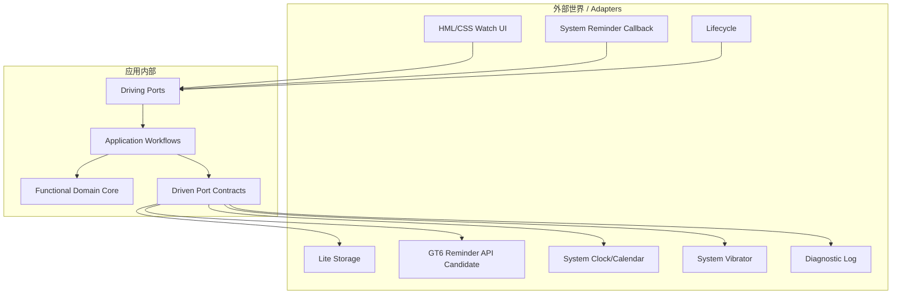

# 六边形架构总览

> 文档体系：FUNAR × Functional DDD × Hexagonal Architecture  
> 项目：Move25 for HUAWEI WATCH GT 6  
> 版本：v2.0  
> 编制日期：2026-08-05  
> 状态：架构基线；后台提醒能力仍需 GT6 真机探针确认

## 1. 内外边界



## 2. 驱动端口

- `ConfigurationCommandPort`
- `PlanControlPort`
- `BreakSessionPort`
- `ReminderCallbackPort`
- `LifecyclePort`
- `CapabilityProbePort`

它们是语义函数，而不是框架控制器类。

## 3. 被驱动端口

- `ClockPort`
- `CalendarPort`
- `SettingsStorePort`
- `ReminderSchedulerPort`
- `HapticsPort`
- `DiagnosticPort`
- `NavigationPort`

## 4. 依赖方向

- 适配器依赖端口契约；
- 工作流依赖领域函数和端口参数；
- 领域函数不依赖工作流或适配器；
- 不允许核心通过 `require` 动态寻找系统 API；
- 系统模块是否存在应在独立构建探针或适配器构建中确认。

## 5. 运行组合根

应用启动时的唯一组合根负责构造适配器并注入工作流：

```javascript
function createApplication(deps) {
  return {
    handleCommand: createCommandHandler(deps),
    handleReminder: createReminderHandler(deps),
    reconcile: createReconcileWorkflow(deps)
  };
}
```

`deps` 是普通记录，不使用服务定位器和隐藏单例。

## 6. 测试替换

同一端口可以连接：

- 内存存储适配器；
- 固定时钟适配器；
- 记录调用的提醒假适配器；
- 真实 GT6 适配器。

这正是 Ports & Adapters 允许应用脱离 UI 和设备进行回归测试的目标。[A3]
