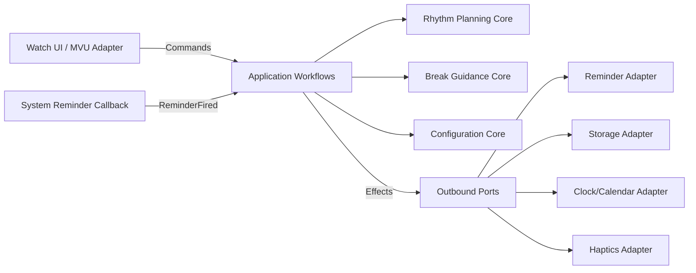

# 子域、限界上下文与上下文地图

> 文档体系：FUNAR × Functional DDD × Hexagonal Architecture  
> 项目：Move25 for HUAWEI WATCH GT 6  
> 版本：v2.0  
> 编制日期：2026-08-05  
> 状态：架构基线；后台提醒能力仍需 GT6 真机探针确认

## 1. 战略设计

Move25 是一个单用户、单设备、离线应用。DDD 的边界用于维护语义，而不是拆成网络服务。

### 核心域：Rhythm Planning

负责：

- 工作日与工作块规则；
- 节律合法性；
- 活动开始点生成；
- 暂停、跳过对计划的影响；
- 期望提醒计划与对账差异。

这是产品差异化和正确性的核心。

### 支持子域：Break Guidance

负责：

- 活动会话状态；
- 动作建议轮换；
- 活动结束计算；
- 完成/跳过语义。

### 支持子域：Configuration

负责：

- 输入校验；
- 设置快照；
- 配置版本迁移。

### 通用子域：Platform Integration

提醒、存储、时钟、振动、日志、导航和生命周期均属于外部技术能力，不进入核心域。

## 2. 上下文关系

## 3. 边界规则

- `Rhythm Planning` 不知道页面、通知标题或 HAP；
- `Break Guidance` 不负责决定系统是否支持结束提醒；它只产生意图；
- `Configuration` 不直接保存数据；保存是效果；
- 平台适配器不得重新实现工作块、暂停或跳过规则；
- UI 不直接读写存储或注册提醒。

## 4. 为什么不采用多服务

该系统没有独立伸缩、独立部署、团队自治或网络隔离需求。将限界上下文实现为同一 HAP 内的纯函数模块，可以保留 DDD 语义而避免分布式复杂性。
