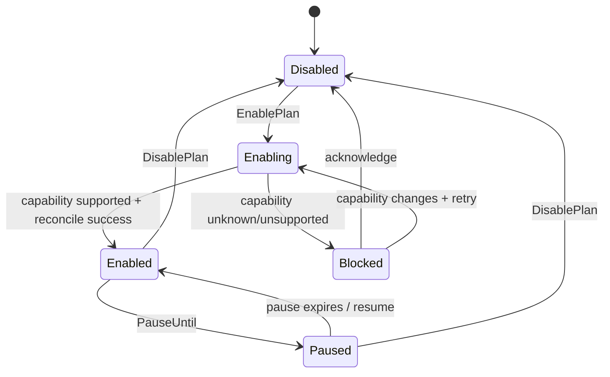
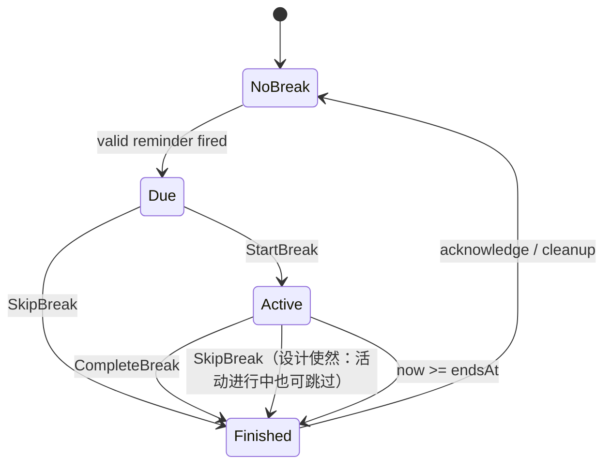
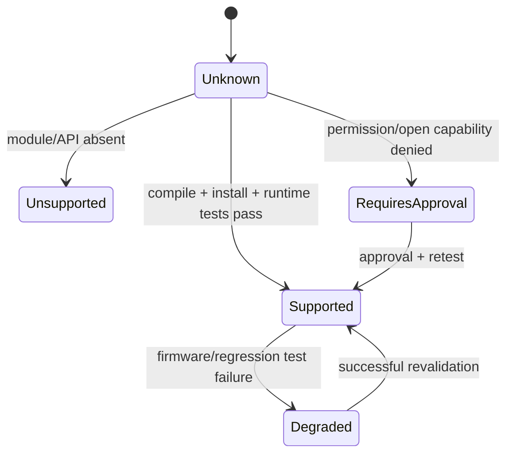

# 领域状态机

> 文档体系：FUNAR × Functional DDD × Hexagonal Architecture  
> 项目：Move25 for HUAWEI WATCH GT 6  
> 版本：v2.0  
> 编制日期：2026-08-05  
> 状态：架构基线；后台提醒能力仍需 GT6 真机探针确认

## 1. 计划生命周期

`Enabling` 是必要状态，防止 UI 在系统注册尚未完成时提前显示“已启用”。

## 2. 活动会话状态机

### 2.1 提醒回调幂等规则（2026-08-06 修订）

- `Due` 或 `Active` 期间到达的任意提醒回调（重复回调、跨键重叠回调）**不产生任何状态迁移**，仅记录诊断 `DuplicateReminderIgnored`——一个时间点只允许一个会话，禁止重复回调覆盖当前会话；
- 计划处于 `Disabled`/`Blocked` 时到达的回调（禁用后延迟到达的陈旧回调）同样被忽略，仅记录 `ReminderIgnoredWhileDisabled`，不得弹出提醒；
- `Finished` 会话可被后续到达的有效回调覆盖为新的 `Due`（下一轮提醒优先于旧结果展示），因此"下一轮提醒在上一轮结果未确认时触发"仍可正常工作；
- 回调是否有效以"抑制后计划中是否存在该语义键"为准，不受回调到达时刻影响（同日内延迟回调仍生效，跨日/已跳过/已暂停的键被忽略）。

## 3. 能力状态机

## 4. 状态机规则

- 系统 API 错误不能直接改变业务状态，必须先映射为领域事件；
- 未知状态不是支持状态；
- 任何状态迁移都要有命令或事件来源；
- 重启恢复时，从持久化快照和当前时间重新归约状态；
- 过期的 `Active` 会话恢复为 `Finished(Expired)`，而不是重新启动 5 分钟；
- 提醒回调必须幂等：重复/跨键/禁用后到达的回调不迁移状态（见 §2.1）。
