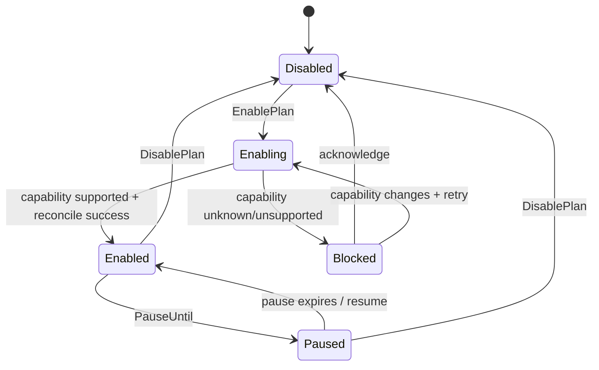
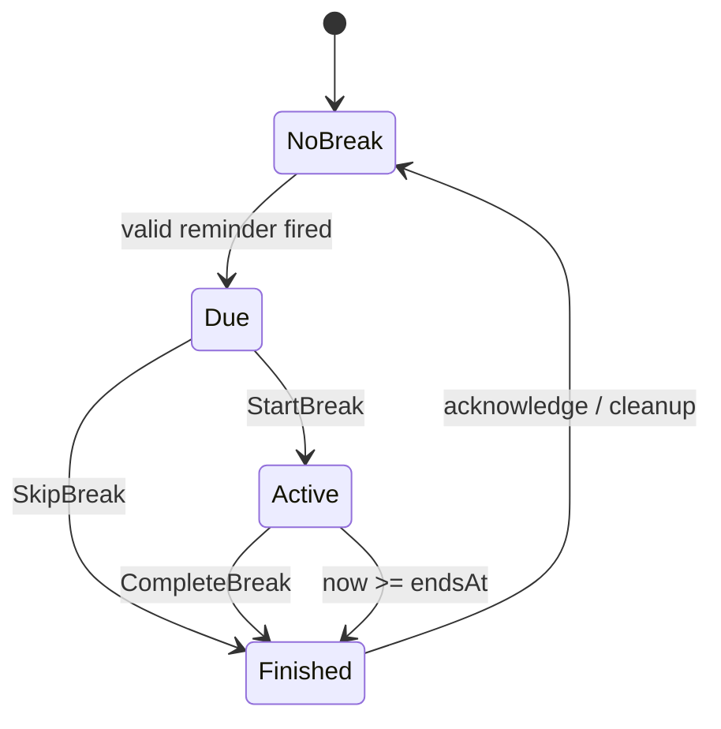
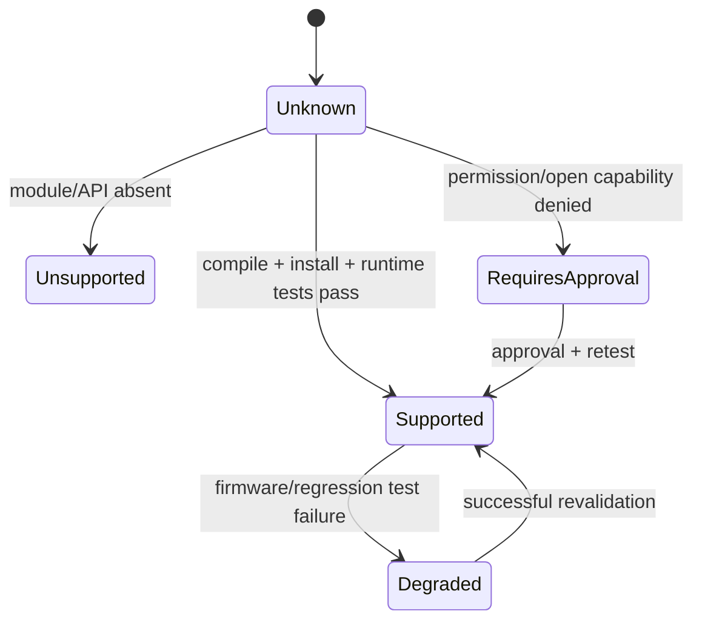

# 领域状态机

> 文档体系：FUNAR × Functional DDD × Hexagonal Architecture  
> 项目：Move25 for HUAWEI WATCH GT 6  
> 版本：v2.0  
> 编制日期：2026-08-05  
> 状态：架构基线；后台提醒能力仍需 GT6 真机探针确认

## 1. 计划生命周期

`Enabling` 是必要状态，防止 UI 在系统注册尚未完成时提前显示“已启用”。

## 2. 活动会话状态机

## 3. 能力状态机

## 4. 状态机规则

- 系统 API 错误不能直接改变业务状态，必须先映射为领域事件；
- 未知状态不是支持状态；
- 任何状态迁移都要有命令或事件来源；
- 重启恢复时，从持久化快照和当前时间重新归约状态；
- 过期的 `Active` 会话恢复为 `Finished(Expired)`，而不是重新启动 5 分钟。
